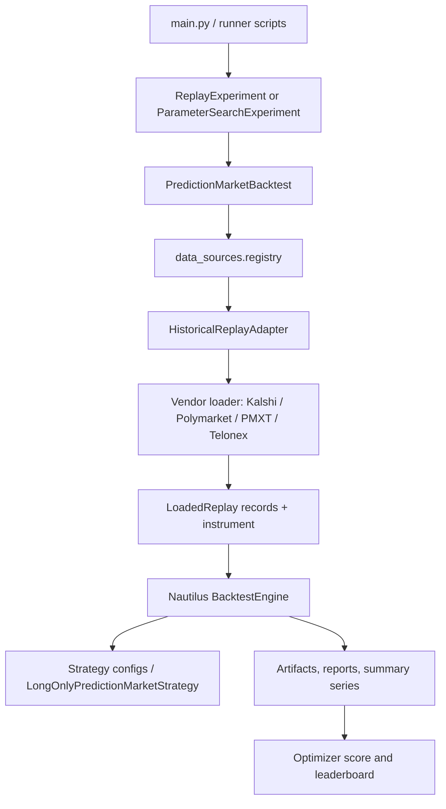

# Codebase UML Inventory

This file is generated from Python AST metadata and excludes `tests/`.
Generated: 2026-04-28T02:15:14+00:00
Modules: 107 | Classes: 159 | Functions/methods: 1354

## Backtesting Data Flow

## Module Inventory

### `backtests/__init__.py`
- Imports: none

### `backtests/_script_helpers.py`
- Imports: `__future__, importlib, pathlib, sys`
- Function L8: `ensure_repo_root(script_path: str | Path) -> Path`
- Function L23: `parse_csv_env(raw: str) -> list[str]`
- Function L27: `parse_bool_env(raw: str, *, default: bool = True) -> bool`

### `backtests/polymarket_book_ema_crossover.py`
- Imports: `__future__, decimal`
- Function L18: `run() -> None`

### `backtests/polymarket_book_ema_optimizer.py`
- Imports: `__future__, decimal`
- Function L18: `run() -> None`

### `backtests/polymarket_book_joint_portfolio_runner.py`
- Imports: `__future__, decimal`
- Function L18: `run() -> None`

### `backtests/polymarket_btc_5m_late_favorite_taker_hold.py`
- Imports: `__future__, datetime, decimal`
- Function L26: `_utc_iso(value: datetime) -> str`
- Function L30: `_btc_5m_windows() -> tuple[tuple[str, datetime, datetime], ...]`
- Function L42: `_btc_5m_replays() -> Any`
- Function L65: `run() -> None`

### `backtests/polymarket_btc_5m_pair_arbitrage.py`
- Imports: `__future__, datetime, decimal`
- Function L24: `_utc_iso(value: datetime) -> str`
- Function L28: `_btc_5m_windows() -> tuple[tuple[str, str, str], ...]`
- Function L40: `_btc_5m_replays() -> Any`
- Function L56: `run() -> None`

### `backtests/polymarket_profile_replay_verification.py`
- Imports: `__future__, decimal, os, typing`
- Function L51: `_env_int(name: str, default: int) -> int`
- Function L61: `_env_float(name: str, default: float) -> float`
- Function L71: `_load_profile_trades() -> Any`
- Function L88: `_initial_cash_for_profile_trades(groups) -> float`
- Function L97: `_build_experiment(groups, *, profile_user: str, lead_seconds: float) -> Any`
- Function L186: `_simulated_net_quantity(fill_events: object) -> float`
- Function L199: `_print_profile_comparison(results: list[dict[str, Any]], groups) -> None`
- Function L232: `run() -> None`

### `backtests/polymarket_telonex_book_joint_portfolio_runner.py`
- Imports: `__future__, decimal`
- Function L18: `run() -> None`

### `backtests/sitecustomize.py`
- Imports: `__future__, importlib, pathlib, sys`

### `main.py`
- Imports: `__future__, ast, asyncio, functools, importlib, inspect, os, pathlib, prediction_market_extensions, re, string, subprocess, sys, time, typing`
- Function L66: `_env_flag_enabled(name: str) -> bool`
- Function L73: `_discoverable_backtest_paths(backtests_root: Path) -> list[Path]`
- Function L91: `_warn(message: str) -> None`
- Function L95: `_literal_string(node: ast.AST | None) -> str | None`
- Function L105: `_assignment_targets(node: ast.Assign | ast.AnnAssign) -> list[str]`
- Function L113: `_has_assignment(module_ast: ast.Module, target_name: str) -> bool`
- Function L122: `_call_name(node: ast.AST) -> str | None`
- Function L130: `_literal_runner_kwargs(call: ast.Call) -> dict[str, str]`
- Function L140: `_experiment_constructor_kwargs(module_ast: ast.Module) -> dict[str, str] | None`
- Function L163: `_has_run_entrypoint(module_ast: ast.Module) -> bool`
- Function L170: `_load_runner_metadata(path: Path) -> dict[str, Any] | None`
- Function L212: `discover() -> list[dict]`
- Function L225: `_relative_parts(backtest: dict[str, Any]) -> tuple[str, ...]`
- Function L234: `_relative_runner_path(backtest: dict[str, Any]) -> Path`
- Function L238: `_runner_stem(backtest: dict[str, Any]) -> str`
- Function L242: `_menu_label(backtest: dict[str, Any]) -> str`
- Function L246: `_textual_menu_label(backtest: dict[str, Any], shortcut: str | None) -> str`
- Function L253: `_runner_search_text(backtest: dict[str, Any]) -> str`
- Function L265: `_filter_backtests(backtests: list[dict[str, Any]], query: str) -> list[int]`
- Function L276: `_shortcut_candidates(backtest: dict[str, Any]) -> list[str]`
- Function L307: `_assign_shortcuts(backtests: list[dict[str, Any]]) -> dict[str, str | None]`
- Function L325: `_runner_file_preview(path: Path) -> str`
- Function L332: `_runner_preview(backtest: dict[str, Any]) -> str`
- Function L580: `_load_runner(backtest: dict[str, Any]) -> Any`
- Function L631: `_supports_textual_menu() -> bool`
- Function L652: `_show_basic_menu(backtests: list[dict[str, Any]]) -> int`
- Function L680: `_show_textual_menu(backtests: list[dict[str, Any]]) -> int`
- Function L690: `_build_menu_tree(backtests: list[dict[str, Any]]) -> dict[str, Any]`
- Function L701: `_render_menu_tree(node: dict[str, Any], *, prefix: str = '') -> list[str]`
- Function L728: `show_menu(backtests: list[dict]) -> int`
- Function L738: `main() -> None`

### `prediction_market_extensions/__init__.py`
- Imports: `__future__`
- Function L8: `install_commission_patch() -> None`

### `prediction_market_extensions/adapters/__init__.py`
- Imports: none

### `prediction_market_extensions/adapters/kalshi/__init__.py`
- Imports: none

### `prediction_market_extensions/adapters/kalshi/config.py`
- Imports: `__future__, nautilus_trader, os`
- Class L22: `KalshiDataClientConfig(LiveDataClientConfig)`
  - Method L58: `resolved_api_key_id(self) -> str | None`
  - Method L62: `resolved_private_key_pem(self) -> str | None`
  - Method L66: `has_credentials(self) -> bool`

### `prediction_market_extensions/adapters/kalshi/data.py`
- Imports: `__future__, asyncio, nautilus_trader, prediction_market_extensions, typing`
- Class L55: `KalshiDataClient(LiveMarketDataClient)`
  - Method L84: `__init__(self, loop: asyncio.AbstractEventLoop, msgbus: MessageBus, cache: Cache, clock: LiveClock, instrument_provider: KalshiInstrumentProvider, config: KalshiDataClientConfig, name: str | None) -> None`
  - Method L105: `async _connect(self) -> None`
  - Method L109: `async _disconnect(self) -> None`
  - Method L112: `_send_all_instruments_to_data_engine(self) -> None`
  - Method L119: `_log_unsupported(self, action: str) -> None`
  - Method L124: `async _subscribe_order_book_deltas(self, command: SubscribeOrderBook) -> None`
  - Method L127: `async _subscribe_quote_ticks(self, command: SubscribeQuoteTicks) -> None`
  - Method L130: `async _subscribe_trade_ticks(self, command: SubscribeTradeTicks) -> None`
  - Method L133: `async _subscribe_bars(self, command: SubscribeBars) -> None`
  - Method L136: `async _subscribe_instrument_status(self, command: SubscribeInstrumentStatus) -> None`
  - Method L139: `async _subscribe_instrument_close(self, command: SubscribeInstrumentClose) -> None`
  - Method L142: `async _unsubscribe_order_book_deltas(self, command: UnsubscribeOrderBook) -> None`
  - Method L145: `async _unsubscribe_quote_ticks(self, command: UnsubscribeQuoteTicks) -> None`
  - Method L148: `async _unsubscribe_trade_ticks(self, command: UnsubscribeTradeTicks) -> None`
  - Method L151: `async _unsubscribe_bars(self, command: UnsubscribeBars) -> None`
  - Method L154: `async _unsubscribe_instrument_status(self, command: UnsubscribeInstrumentStatus) -> None`
  - Method L157: `async _unsubscribe_instrument_close(self, command: UnsubscribeInstrumentClose) -> None`
  - Method L160: `async _request_instrument(self, request: RequestInstrument) -> None`
  - Method L168: `async _request_instruments(self, request: RequestInstruments) -> None`
  - Method L178: `async _request_quote_ticks(self, request: RequestQuoteTicks) -> None`
  - Method L181: `async _request_trade_ticks(self, request: RequestTradeTicks) -> None`
  - Method L184: `async _request_bars(self, request: RequestBars) -> None`

### `prediction_market_extensions/adapters/kalshi/factories.py`
- Imports: `__future__, asyncio, nautilus_trader, prediction_market_extensions, typing`
- Class L31: `KalshiLiveDataClientFactory(LiveDataClientFactory)`
  - Method L37: `create(loop: asyncio.AbstractEventLoop, name: str, config: KalshiDataClientConfig, msgbus: MessageBus, cache: Cache, clock: LiveClock) -> KalshiDataClient`

### `prediction_market_extensions/adapters/kalshi/fee_model.py`
- Imports: `__future__, datetime, decimal, nautilus_trader, prediction_market_extensions`
- Class L31: `KalshiProportionalFeeModelConfig(FeeModelConfig)`
- Class L45: `KalshiProportionalFeeModel(FeeModel)`
  - Method L97: `__init__(self, fee_rate: Decimal = KALSHI_TAKER_FEE_RATE, config: KalshiProportionalFeeModelConfig | None = None) -> None`
  - Method L107: `_fee_rate_for_fill(order, instrument, default_fee_rate: Decimal) -> Decimal`
  - Method L139: `get_commission(self, order, fill_qty, fill_px, instrument) -> Money`

### `prediction_market_extensions/adapters/kalshi/loaders.py`
- Imports: `__future__, hashlib, msgspec, nautilus_trader, pandas, prediction_market_extensions, typing, warnings`
- Class L47: `KalshiDataLoader`
  - Method L82: `_normalize_price(raw: float | str) -> float`
  - Method L107: `_trade_timestamp_ns(trade: dict[str, Any]) -> int`
  - Method L114: `_trade_timestamp_seconds(cls, trade: dict[str, Any]) -> int`
  - Method L118: `_trade_sort_key(cls, trade: dict[str, Any]) -> tuple[int, str, str, str, str, str]`
  - Method L129: `_extract_yes_price(cls, trade: dict[str, Any]) -> float`
  - Method L139: `_extract_quantity(payload: dict[str, Any], *, fp_key: str, raw_key: str) -> str | int | float`
  - Method L147: `_extract_candle_price(price_payload: dict[str, Any], field: str) -> float | None`
  - Method L159: `_fallback_trade_id(ticker: str, trade: dict[str, Any], occurrence: int) -> TradeId`
  - Method L167: `__init__(self, instrument: BinaryOption, series_ticker: str, http_client: nautilus_pyo3.HttpClient | None = None, resolution_metadata: dict[str, Any] | None = None) -> None`
  - Method L180: `resolution_metadata(self) -> dict[str, Any]`
  - Method L190: `_create_http_client() -> nautilus_pyo3.HttpClient`
  - Method L196: `instrument(self) -> BinaryOption`
  - Method L201: `async from_market_ticker(cls, ticker: str, http_client: nautilus_pyo3.HttpClient | None = None) -> KalshiDataLoader`
  - Method L257: `async fetch_trades(self, min_ts: int | None = None, max_ts: int | None = None, limit: int = 1000) -> list[dict[str, Any]]`
  - Method L311: `async fetch_candlesticks(self, start_ts: int | None = None, end_ts: int | None = None, interval: str = 'Minutes1') -> list[dict[str, Any]]`
  - Method L363: `parse_trades(self, trades_data: list[dict[str, Any]]) -> list[TradeTick]`
  - Method L446: `parse_candlesticks(self, candlesticks_data: list[dict[str, Any]], interval: str = 'Minutes1') -> list[Bar]`
  - Method L516: `async load_bars(self, start: pd.Timestamp | None = None, end: pd.Timestamp | None = None, interval: str = 'Minutes1') -> list[Bar]`
  - Method L549: `async load_trades(self, start: pd.Timestamp | None = None, end: pd.Timestamp | None = None) -> list[TradeTick]`

### `prediction_market_extensions/adapters/kalshi/market_selection.py`
- Imports: `__future__, collections, datetime, re, typing`
- Function L29: `_parse_datetime(raw) -> datetime | None`
- Function L39: `volume_24h(market: Mapping[str, Any]) -> float`
- Function L56: `yes_price(market: Mapping[str, Any]) -> float | None`
- Function L75: `end_date_utc(market: Mapping[str, Any]) -> datetime | None`
- Function L82: `market_close_time_ns(raw) -> int`
- Function L92: `days_since_close(raw, now: datetime) -> float | None`
- Function L103: `market_duration_days(market: Mapping[str, Any]) -> float | None`
- Function L119: `is_game_market(market: Mapping[str, Any]) -> bool`
- Function L132: `is_sports_market(market: Mapping[str, Any], *, now: datetime, max_hours_to_close: float, max_market_duration_days: float | None = None) -> bool`
- Function L161: `is_resolved_sports_market(market: Mapping[str, Any], *, now: datetime, max_days_since_close: float, max_market_duration_days: float | None = None) -> bool`

### `prediction_market_extensions/adapters/kalshi/providers.py`
- Imports: `__future__, datetime, decimal, logging, math, nautilus_trader, prediction_market_extensions`
- Function L52: `calculate_kalshi_commission(quantity: decimal.Decimal, price: decimal.Decimal, fee_rate: decimal.Decimal = KALSHI_TAKER_FEE_RATE) -> decimal.Decimal`
- Function L101: `_market_dict_to_instrument(market: dict) -> BinaryOption`
- Class L138: `_KalshiHttpClient`
  - Method L153: `__init__(self, base_url: str) -> None`
  - Method L164: `async get_markets(self, series_tickers: tuple[str, ...] = (), event_tickers: tuple[str, ...] = ()) -> list[dict]`
- Class L212: `KalshiInstrumentProvider(InstrumentProvider)`
  - Method L225: `__init__(self, config: KalshiDataClientConfig) -> None`
  - Method L231: `async load_all_async(self, filters: dict | None = None) -> None`
  - Method L241: `async _fetch_markets(self) -> list[dict]`
  - Method L247: `_market_to_instrument(self, market: dict) -> BinaryOption`

### `prediction_market_extensions/adapters/kalshi/research.py`
- Imports: `__future__, asyncio, collections, datetime, msgspec, nautilus_trader, pandas, prediction_market_extensions, typing`
- Function L49: `_passes_filters(market: Mapping[str, Any], *, min_volume_24h: float, yes_price_min: float | None, yes_price_max: float | None, min_expiry_dt: datetime | None, predicate: MarketPredicate | None) -> bool`
- Function L78: `_extend_with_event_markets(all_markets: list[dict[str, Any]], events: list[dict[str, Any]], *, exclude_ticker_prefixes: tuple[str, ...]) -> None`
- Function L98: `_default_http_client(*, quota_rate_per_second: int) -> nautilus_pyo3.HttpClient`
- Function L104: `async fetch_market_by_ticker(ticker: str, *, http_client: nautilus_pyo3.HttpClient | None = None, quota_rate_per_second: int = 10) -> dict[str, Any]`
- Function L128: `async discover_markets(*, http_client: nautilus_pyo3.HttpClient, candidate_limit: int, status: str = 'open', page_limit: int = 200, max_pages: int | None = None, include_nested_markets: bool = True, exclude_ticker_prefixes: tuple[str, ...] = ('KXMVE',), min_volume_24h: float = 0.0, yes_price_min: float | None = None, yes_price_max: float | None = None, min_days_to_expiry: int | None = None, predicate: MarketPredicate | None = None, sort_key: MarketSortKey = volume_24h, descending: bool = True) -> list[dict[str, Any]]`
- Function L202: `async discover_live_sports_markets(*, candidate_limit: int, http_client: nautilus_pyo3.HttpClient | None = None, quota_rate_per_second: int = 10, max_pages: int | None = None, page_limit: int = 200, min_volume: float = 0.0, max_hours_to_close: float, max_market_duration_days: float | None = None, games_only: bool = False) -> list[dict[str, Any]]`
- Function L238: `async discover_resolved_sports_markets(*, candidate_limit: int, http_client: nautilus_pyo3.HttpClient | None = None, quota_rate_per_second: int = 10, max_pages: int | None = None, page_limit: int = 200, min_volume: float = 0.0, max_days_since_close: float, max_market_duration_days: float | None = None, games_only: bool = False) -> list[dict[str, Any]]`
- Function L274: `_analysis_window_end(*, market: Mapping[str, Any], now: datetime) -> datetime | None`
- Function L281: `async analyze_market_trade_window(*, market: Mapping[str, Any], lookback_days: int, entry_price: float, now: datetime | None = None) -> dict[str, Any] | None`
- Function L332: `async select_breakout_markets_per_game(*, markets: list[dict[str, Any]], lookback_days: int, entry_price: float, now: datetime | None = None, max_results: int | None = None) -> list[dict[str, Any]]`
- Function L407: `async load_market_bars(*, market: Mapping[str, Any], start: pd.Timestamp, end: pd.Timestamp, http_client: nautilus_pyo3.HttpClient, interval: str = 'Minutes1', chunk_minutes: int = 5000, min_bars: int = 0, min_price_range: float = 0.0, max_retries: int = 4, retry_base_delay: float = 2.0) -> tuple[KalshiDataLoader, list[Bar]] | None`

### `prediction_market_extensions/adapters/polymarket/__init__.py`
- Imports: none

### `prediction_market_extensions/adapters/polymarket/execution.py`
- Imports: `asyncio, collections, json, msgspec, nautilus_trader, prediction_market_extensions, py_clob_client, typing`
- Class L124: `PolymarketExecutionClient(LiveExecutionClient)`
  - Method L151: `__init__(self, loop: asyncio.AbstractEventLoop, http_client: ClobClient, msgbus: MessageBus, cache: Cache, clock: LiveClock, instrument_provider: PolymarketInstrumentProvider, ws_auth: PolymarketWebSocketAuth, config: PolymarketExecClientConfig, name: str | None) -> None`
  - Method L249: `async _connect(self) -> None`
  - Method L271: `async _disconnect(self) -> None`
  - Method L274: `_stop(self) -> None`
  - Method L277: `async _maintain_active_market(self, instrument_id: InstrumentId) -> None`
  - Method L281: `async _update_account_state(self) -> None`
  - Method L302: `async _fetch_user_positions(self, *, limit: int = 100, size_threshold: int = 0) -> list[dict[str, Any]]`
  - Method L350: `async generate_order_status_reports(self, command: GenerateOrderStatusReports) -> list[OrderStatusReport]`
  - Method L521: `async generate_order_status_report(self, command: GenerateOrderStatusReport) -> OrderStatusReport | None`
  - Method L576: `async generate_fill_reports(self, command: GenerateFillReports) -> list[FillReport]`
  - Method L625: `async generate_position_status_reports(self, command: GeneratePositionStatusReports) -> list[PositionStatusReport]`
  - Method L664: `_parse_trades_response_object(self, command: GenerateFillReports, json_obj: JSON, parsed_fill_keys: set[tuple[TradeId, VenueOrderId]], reports: list[FillReport]) -> None`
  - Method L719: `async _fetch_quantities_from_gamma_api(self, instrument_ids: list[InstrumentId]) -> dict[InstrumentId, Quantity]`
  - Method L757: `async _fetch_quantities_from_clob_api(self, instrument_ids: list[InstrumentId]) -> dict[InstrumentId, Quantity]`
  - Method L785: `_generate_cancel_event(self, strategy_id, instrument_id, client_order_id, venue_order_id, reason: str, ts_event: int) -> None`
  - Method L811: `_get_neg_risk_for_instrument(self, instrument) -> bool`
  - Method L816: `async _query_account(self, _command: QueryAccount) -> None`
  - Method L820: `async _cancel_order(self, command: CancelOrder) -> None`
  - Method L867: `async _batch_cancel_orders(self, command: BatchCancelOrders) -> None`
  - Method L920: `async _cancel_all_orders(self, command: CancelAllOrders) -> None`
  - Method L968: `async _cancel_all_global(self) -> None`
  - Method L1002: `async _cancel_market_orders(self, instrument_id: InstrumentId | None = None, asset_id: str = '') -> None`
  - Method L1056: `async _submit_order(self, command: SubmitOrder) -> None`
  - Method L1130: `_validate_order_for_batch(self, order: Order) -> str | None`
  - Method L1154: `async _submit_order_list(self, command: SubmitOrderList) -> None`
  - Method L1224: `async _sign_orders_for_batch(self, orders: list[Order]) -> tuple[list[Order], list[PostOrdersArgs]]`
  - Method L1285: `async _post_signed_orders_batch(self, orders: list[Order], signed_orders_args: list[PostOrdersArgs]) -> None`
  - Method L1314: `_reject_all_orders(self, orders: list[Order], reason: str) -> None`
  - Method L1327: `_process_batch_response(self, orders: list[Order], response: list) -> None`
  - Method L1378: `_deny_market_order_quantity(self, order: Order, reason: str) -> None`
  - Method L1390: `async _submit_market_order(self, command: SubmitOrder, instrument) -> None`
  - Method L1439: `async _submit_limit_order(self, command: SubmitOrder, instrument) -> None`
  - Method L1485: `async _post_signed_order(self, order: Order, signed_order, post_only: bool = False) -> None`
  - Method L1521: `_handle_ws_message(self, raw: bytes) -> None`
  - Method L1543: `_add_trade_to_cache(self, msg: PolymarketUserTrade, raw: bytes) -> None`
  - Method L1553: `async _wait_for_ack_order(self, msg: PolymarketUserOrder, venue_order_id: VenueOrderId) -> None`
  - Method L1576: `async _wait_for_ack_trade(self, msg: PolymarketUserTrade, venue_order_id: VenueOrderId) -> None`
  - Method L1603: `_handle_ws_order_msg(self, msg: PolymarketUserOrder, wait_for_ack: bool) -> Any`
  - Method L1675: `_truncate_ordered_dict(self, store: OrderedDict[Any, Any]) -> None`
  - Method L1679: `_record_processed_trade(self, trade_id: TradeId, status: PolymarketTradeStatus) -> None`
  - Method L1693: `_record_processed_fill(self, trade_id: TradeId, venue_order_id: VenueOrderId) -> None`
  - Method L1699: `_handle_ws_trade_msg(self, msg: PolymarketUserTrade, wait_for_ack: bool) -> Any`
  - Method L1741: `_handle_user_trade_in_ws_trade_msg(self, msg: PolymarketUserTrade, trade_id: TradeId, wait_for_ack: bool, order_id: str) -> Any`

### `prediction_market_extensions/adapters/polymarket/fee_model.py`
- Imports: `__future__, collections, decimal, nautilus_trader, prediction_market_extensions, typing`
- Function L63: `_normalize_label(value: object) -> str | None`
- Function L72: `_iter_tag_labels(tags: object) -> Iterable[str]`
- Function L94: `_market_labels(info: Mapping[str, Any] | None) -> set[str]`
- Function L122: `infer_maker_rebate_rate(*, market_info: Mapping[str, Any] | None, fee_rate_bps: Decimal) -> Decimal`
- Function L152: `calculate_maker_rebate(*, quantity: Decimal, price: Decimal, fee_rate_bps: Decimal, maker_rebate_rate: Decimal) -> float`
- Function L177: `_order_liquidity_side(order: object) -> LiquiditySide | None`
- Class L200: `PolymarketFeeModel(FeeModel)`
  - Method L224: `__init__(self, *, maker_rebates_enabled: bool = True) -> None`
  - Method L227: `get_commission(self, order, fill_qty, fill_px, instrument) -> Money`

### `prediction_market_extensions/adapters/polymarket/gamma_markets.py`
- Imports: `__future__, collections, math, msgspec, nautilus_trader, os, typing`
- Function L43: `_normalize_base_url(base_url: str | None) -> str`
- Function L48: `build_markets_query(filters: dict[str, Any] | None = None) -> dict[str, Any]`
- Function L105: `async _request_markets_page(http_client: HttpClient, base_url: str, params: dict[str, Any], offset: int, limit: int, timeout: float) -> list[dict[str, Any]]`
- Function L142: `async iter_markets(http_client: HttpClient, filters: dict[str, Any] | None = None, base_url: str | None = None, timeout: float = 10.0) -> AsyncGenerator[dict[str, Any]]`
- Function L174: `_decode_gamma_list(raw) -> list[Any]`
- Function L182: `_truthy_gamma_value(raw) -> bool`
- Function L192: `_gamma_market_allows_price_winner_inference(gamma_market: dict[str, Any]) -> bool`
- Function L217: `infer_gamma_token_winners(gamma_market: dict[str, Any]) -> tuple[dict[str, bool], bool]`
- Function L249: `normalize_gamma_market_to_clob_format(gamma_market: dict[str, Any]) -> dict[str, Any]`
- Function L339: `async list_markets(http_client: HttpClient, filters: dict[str, Any] | None = None, base_url: str | None = None, timeout: float = 10.0, max_results: int | None = None) -> list[dict[str, Any]]`

### `prediction_market_extensions/adapters/polymarket/loaders.py`
- Imports: `__future__, decimal, msgspec, nautilus_trader, pandas, prediction_market_extensions, typing, warnings`
- Function L47: `_trade_sort_key(trade: dict[str, Any]) -> tuple[int, str, str, str, str, str]`
- Class L58: `PolymarketDataLoader`
  - Method L86: `__init__(self, instrument: BinaryOption, token_id: str | None = None, condition_id: str | None = None, http_client: nautilus_pyo3.HttpClient | None = None, resolution_metadata: dict[str, Any] | None = None) -> None`
  - Method L101: `resolution_metadata(self) -> dict[str, Any]`
  - Method L111: `_create_http_client() -> nautilus_pyo3.HttpClient`
  - Method L117: `async _fetch_market_by_slug(slug: str, http_client: nautilus_pyo3.HttpClient) -> dict[str, Any]`
  - Method L151: `async _fetch_market_details(condition_id: str, http_client: nautilus_pyo3.HttpClient) -> dict[str, Any]`
  - Method L166: `_coerce_fee_rate_bps(value) -> Decimal | None`
  - Method L176: `async _fetch_market_fee_rate_bps(cls, token_id: str, http_client: nautilus_pyo3.HttpClient) -> Decimal | None`
  - Method L196: `async _enrich_market_details_with_fee_rate(cls, market_details: dict[str, Any], token_id: str, http_client: nautilus_pyo3.HttpClient) -> dict[str, Any]`
  - Method L216: `async _fetch_event_by_slug(slug: str, http_client: nautilus_pyo3.HttpClient) -> dict[str, Any]`
  - Method L241: `async from_market_slug(cls, slug: str, token_index: int = 0, http_client: nautilus_pyo3.HttpClient | None = None) -> PolymarketDataLoader`
  - Method L325: `async from_event_slug(cls, slug: str, token_index: int = 0, http_client: nautilus_pyo3.HttpClient | None = None) -> list[PolymarketDataLoader]`
  - Method L406: `async query_market_by_slug(slug: str, http_client: nautilus_pyo3.HttpClient | None = None) -> dict[str, Any]`
  - Method L436: `async query_market_details(condition_id: str, http_client: nautilus_pyo3.HttpClient | None = None) -> dict[str, Any]`
  - Method L464: `async query_event_by_slug(slug: str, http_client: nautilus_pyo3.HttpClient | None = None) -> dict[str, Any]`
  - Method L494: `instrument(self) -> BinaryOption`
  - Method L501: `token_id(self) -> str | None`
  - Method L508: `condition_id(self) -> str | None`
  - Method L514: `async load_trades(self, start: pd.Timestamp | None = None, end: pd.Timestamp | None = None) -> list[TradeTick]`
  - Method L573: `async fetch_event_by_slug(self, slug: str) -> dict[str, Any]`
  - Method L600: `async fetch_events(self, active: bool = True, closed: bool = False, archived: bool = False, limit: int = 100, offset: int = 0) -> list[dict[str, Any]]`
  - Method L648: `async get_event_markets(self, slug: str) -> list[dict[str, Any]]`
  - Method L673: `async fetch_markets(self, active: bool = True, closed: bool = False, archived: bool = False, limit: int = 100, offset: int = 0) -> list[dict]`
  - Method L721: `async fetch_market_by_slug(self, slug: str) -> dict[str, Any]`
  - Method L745: `async find_market_by_slug(self, slug: str) -> dict[str, Any]`
  - Method L767: `async fetch_market_details(self, condition_id: str) -> dict[str, Any]`
  - Method L784: `async fetch_trades(self, condition_id: str, limit: int = _TRADES_PAGE_LIMIT, start_ts: int | None = None, end_ts: int | None = None) -> list[dict[str, Any]]`
  - Method L871: `parse_trades(self, trades_data: list[dict]) -> list[TradeTick]`

### `prediction_market_extensions/adapters/polymarket/market_selection.py`
- Imports: `__future__, collections, datetime, msgspec, re, typing`
- Function L57: `_parse_datetime(raw) -> datetime | None`
- Function L67: `_event_payload(market: Mapping[str, Any]) -> Mapping[str, Any]`
- Function L77: `volume_24h(market: Mapping[str, Any]) -> float`
- Function L91: `yes_price(market: Mapping[str, Any]) -> float | None`
- Function L108: `end_date_utc(market: Mapping[str, Any]) -> datetime | None`
- Function L116: `event_start_utc(market: Mapping[str, Any]) -> datetime | None`
- Function L135: `closed_time_utc(market: Mapping[str, Any]) -> datetime | None`
- Function L155: `market_close_time_ns(raw) -> int`
- Function L165: `is_game_market(market: Mapping[str, Any]) -> bool`
- Function L191: `is_sports_market(market: Mapping[str, Any], *, now: datetime, max_hours_to_close: float) -> bool`
- Function L215: `is_resolved_sports_market(market: Mapping[str, Any], *, now: datetime, max_days_since_close: float) -> bool`

### `prediction_market_extensions/adapters/polymarket/parsing.py`
- Imports: `__future__, decimal`
- Function L34: `basis_points_as_decimal(basis_points: Decimal) -> Decimal`
- Function L52: `infer_fee_exponent(fee_rate_bps: Decimal) -> int`
- Function L75: `calculate_commission(quantity: Decimal, price: Decimal, fee_rate_bps: Decimal, fee_exponent: int = 1, **_kwargs: object) -> float`

### `prediction_market_extensions/adapters/polymarket/pmxt.py`
- Imports: `__future__, collections, concurrent, contextlib, datetime, decimal, json, msgspec, nautilus_trader, os, pandas, pathlib, pyarrow, re, shutil, tempfile, time, typing, urllib, warnings`
- Class L43: `_PMXTBookSnapshotPayload(msgspec.Struct)`
- Class L55: `_PMXTPriceChangePayload(msgspec.Struct)`
- Class L72: `PolymarketPMXTDataLoader(PolymarketDataLoader)`
  - Method L95: `__init__(self, *args, **kwargs) -> None`
  - Method L116: `last_load_gap_hours(self) -> tuple[pd.Timestamp, ...]`
  - Method L121: `_normalize_timestamp(value: pd.Timestamp | str | None) -> pd.Timestamp | None`
  - Method L130: `_archive_hours(start: pd.Timestamp, end: pd.Timestamp) -> list[pd.Timestamp]`
  - Method L140: `_archive_filename_for_hour(cls, hour: pd.Timestamp) -> str`
  - Method L145: `_archive_url_for_hour(cls, hour: pd.Timestamp) -> str`
  - Method L149: `_archive_relative_path_for_hour(cls, hour: pd.Timestamp) -> str`
  - Method L157: `_env_flag_enabled(value: str | None) -> bool`
  - Method L163: `_default_cache_dir(cls) -> Path`
  - Method L169: `_resolve_cache_dir(cls) -> Path | None`
  - Method L185: `_resolve_local_archive_dir(cls) -> Path | None`
  - Method L196: `_resolve_prefetch_workers(cls) -> int`
  - Method L211: `_market_cache_path_for_hour(cls, cache_dir: Path, condition_id: str, token_id: str, hour: pd.Timestamp) -> Path`
  - Method L216: `_cache_path_for_hour(self, hour: pd.Timestamp) -> Path | None`
  - Method L225: `_cache_metadata_path(cache_path: Path) -> Path`
  - Method L229: `_local_file_fingerprint(path: Path) -> dict[str, object] | None`
  - Method L242: `_source_cache_fingerprint_for_hour(self, hour: pd.Timestamp) -> dict[str, object] | None`
  - Method L252: `_cache_metadata_for_hour(self, hour: pd.Timestamp) -> dict[str, object] | None`
  - Method L256: `_cache_metadata_payload(self, hour: pd.Timestamp, *, source: Mapping[str, object] | None) -> dict[str, object] | None`
  - Method L269: `_cache_metadata_matches(self, hour: pd.Timestamp, cache_path: Path) -> bool`
  - Method L281: `_local_archive_candidate_paths_for_hour(cls, archive_dir: Path, hour: pd.Timestamp) -> tuple[Path, ...]`
  - Method L288: `_local_archive_paths_for_hour(self, hour: pd.Timestamp) -> tuple[Path, ...]`
  - Method L293: `_market_filter(self) -> Any`
  - Method L300: `_empty_market_table(cls) -> pa.Table`
  - Method L306: `_to_market_batch(cls, batch: pa.RecordBatch) -> pa.RecordBatch`
  - Method L313: `_filter_batch_to_token(self, batch: pa.RecordBatch) -> pa.RecordBatch`
  - Method L323: `_filter_raw_batch(self, batch: pa.RecordBatch) -> pa.RecordBatch`
  - Method L340: `_load_cached_market_table(self, hour: pd.Timestamp) -> pa.Table | None`
  - Method L354: `_load_cached_market_batches(self, hour: pd.Timestamp) -> list[pa.RecordBatch] | None`
  - Method L369: `_write_market_cache(self, hour: pd.Timestamp, table: pa.Table, *, metadata: Mapping[str, object] | None = None) -> None`
  - Method L401: `_scan_raw_market_batches(self, dataset: ds.Dataset, *, batch_size: int, source: str | None = None, total_bytes: int | None = None) -> list[pa.RecordBatch]`
  - Method L456: `_load_remote_market_table(self, hour: pd.Timestamp, *, batch_size: int) -> pa.Table | None`
  - Method L464: `_load_remote_market_batches(self, hour: pd.Timestamp, *, batch_size: int) -> list[pa.RecordBatch] | None`
  - Method L470: `_load_raw_market_batches_via_download(self, archive_url: str, *, batch_size: int) -> list[pa.RecordBatch] | None`
  - Method L493: `_load_local_archive_market_batches(self, hour: pd.Timestamp, *, batch_size: int) -> list[pa.RecordBatch] | None`
  - Method L517: `_filter_table_to_token(self, table: pa.Table) -> pa.Table`
  - Method L527: `_load_market_table(self, hour: pd.Timestamp, *, batch_size: int) -> pa.Table | None`
  - Method L558: `_load_market_batches(self, hour: pd.Timestamp, *, batch_size: int) -> list[pa.RecordBatch] | None`
  - Method L587: `_emit_download_progress(self, url: str, *, downloaded_bytes: int, total_bytes: int | None, finished: bool) -> None`
  - Method L595: `_emit_scan_progress(self, source: str, *, scanned_batches: int, scanned_rows: int, matched_rows: int, total_bytes: int | None, finished: bool) -> None`
  - Method L611: `_content_length_from_response(response: object) -> int | None`
  - Method L623: `_progress_total_bytes(self, source: str) -> int | None`
  - Method L650: `_download_to_file_with_progress(self, url: str, destination: Path) -> int | None`
  - Method L699: `_download_payload_with_progress(self, url: str) -> bytes | None`
  - Method L738: `_load_raw_market_batches_from_local_file(self, parquet_path: Path, *, batch_size: int, progress_source: str, total_bytes: int | None) -> list[pa.RecordBatch] | None`
  - Method L750: `_temporary_download_filename(url: str) -> str`
  - Method L755: `_pid_is_active(pid: int) -> bool`
  - Method L767: `_temporary_download_path(self, url: str) -> Iterator[Path]`
  - Method L779: `_cleanup_stale_temp_downloads(self) -> None`
  - Method L808: `_iter_market_tables(self, hours: list[pd.Timestamp], *, batch_size: int) -> Iterator[tuple[pd.Timestamp, pa.Table | None]]`
  - Method L839: `_iter_market_batches(self, hours: list[pd.Timestamp], *, batch_size: int) -> Iterator[tuple[pd.Timestamp, list[pa.RecordBatch] | None]]`
  - Method L871: `_timestamp_to_ms_string(timestamp_secs: float) -> str`
  - Method L875: `_decode_book_snapshot(payload_text: str) -> _PMXTBookSnapshotPayload`
  - Method L879: `_decode_price_change(payload_text: str) -> _PMXTPriceChangePayload`
  - Method L883: `_to_book_snapshot(payload: _PMXTBookSnapshotPayload) -> PolymarketBookSnapshot`
  - Method L902: `_to_price_change(payload: _PMXTPriceChangePayload) -> PolymarketQuotes`
  - Method L924: `_event_sort_key(record: OrderBookDeltas) -> tuple[int, int]`
  - Method L930: `_retimestamp_deltas(deltas: OrderBookDeltas, *, ts_event: int) -> OrderBookDeltas`
  - Method L945: `_payload_sort_key(self, update_type: str, payload_text: str) -> tuple[int, int]`
  - Method L957: `_process_book_snapshot(self, payload_text: str, *, token_id: str, instrument, local_book: OrderBook, has_snapshot: bool, events: list[OrderBookDeltas], start_ns: int, end_ns: int, include_order_book: bool) -> tuple[OrderBook, bool]`
  - Method L997: `_process_price_change(self, payload_text: str, *, token_id: str, instrument, local_book: OrderBook, has_snapshot: bool, events: list[OrderBookDeltas], start_ns: int, end_ns: int, include_order_book: bool) -> OrderBook`
  - Method L1036: `load_order_book_deltas(self, start: pd.Timestamp, end: pd.Timestamp, *, batch_size: int = 25000, include_order_book: bool = True) -> list[OrderBookDeltas]`
  - Method L1172: `_timestamp_to_ns(value: object) -> int`

### `prediction_market_extensions/adapters/polymarket/research.py`
- Imports: `__future__, collections, datetime, msgspec, nautilus_trader, pandas, prediction_market_extensions, typing`
- Function L49: `_default_http_client(*, quota_rate_per_second: int) -> nautilus_pyo3.HttpClient`
- Function L55: `_passes_filters(market: Mapping[str, Any], *, min_volume_24h: float, yes_price_min: float | None, yes_price_max: float | None, min_expiry_dt: datetime | None, predicate: MarketPredicate | None) -> bool`
- Function L84: `_event_volume(market: Mapping[str, Any]) -> float`
- Function L88: `_main_market_from_event(event: Mapping[str, Any]) -> dict[str, Any] | None`
- Function L116: `async _discover_resolved_game_markets_from_events(*, candidate_limit: int, http_client: nautilus_pyo3.HttpClient | None = None, max_results: int, quota_rate_per_second: int, min_volume_24h: float, max_days_since_close: float) -> list[dict[str, Any]]`
- Function L199: `async discover_markets(*, candidate_limit: int, http_client: nautilus_pyo3.HttpClient | None = None, api_filters: dict[str, Any] | None = None, max_results: int = 200, quota_rate_per_second: int = 20, min_volume_24h: float = 0.0, yes_price_min: float | None = None, yes_price_max: float | None = None, min_days_to_expiry: int | None = None, predicate: MarketPredicate | None = None, sort_key: MarketSortKey = volume_24h, descending: bool = True) -> list[dict[str, Any]]`
- Function L258: `async fetch_market_by_slug(slug: str, *, http_client: nautilus_pyo3.HttpClient | None = None, quota_rate_per_second: int = 10) -> dict[str, Any]`
- Function L282: `async discover_live_sports_markets(*, candidate_limit: int, http_client: nautilus_pyo3.HttpClient | None = None, max_results: int = 200, quota_rate_per_second: int = 20, min_volume_24h: float = 0.0, max_hours_to_close: float, games_only: bool = False) -> list[dict[str, Any]]`
- Function L309: `async discover_resolved_sports_markets(*, candidate_limit: int, http_client: nautilus_pyo3.HttpClient | None = None, max_results: int = 200, quota_rate_per_second: int = 20, min_volume_24h: float = 0.0, max_days_since_close: float, games_only: bool = False) -> list[dict[str, Any]]`
- Function L351: `market_trade_window_bounds(market: Mapping[str, Any], *, active_window_hours: float, now: datetime | None = None) -> tuple[datetime | None, datetime | None]`
- Function L382: `async analyze_market_trade_window(*, market: Mapping[str, Any], lookback_days: int, entry_price: float, active_window_hours: float, now: datetime | None = None, http_client: nautilus_pyo3.HttpClient | None = None) -> dict[str, Any] | None`
- Function L489: `async load_market_trades(*, slug: str, start: pd.Timestamp, end: pd.Timestamp, min_trades: int = 0, min_price_range: float = 0.0) -> tuple[PolymarketDataLoader, list[TradeTick]] | None`

### `prediction_market_extensions/adapters/prediction_market/__init__.py`
- Imports: `prediction_market_extensions`

### `prediction_market_extensions/adapters/prediction_market/backtest_utils.py`
- Imports: `__future__, collections, datetime, nautilus_trader, pandas, warnings`
- Function L34: `_parse_numeric(value: object, default: float = 0.0) -> float`
- Function L54: `_parse_required_numeric(value: object) -> float | None`
- Function L61: `_book_midpoint(book: OrderBook) -> float | None`
- Function L69: `extract_realized_pnl(pos_report: pd.DataFrame) -> float`
- Function L81: `_timestamp_to_naive_utc_datetime(ts: pd.Timestamp) -> datetime`
- Function L92: `to_naive_utc(value: object) -> datetime | None`
- Function L122: `extract_price_points(records: Sequence[object], *, price_attr: str, ts_attrs: tuple[str, ...] = _DEFAULT_TS_ATTRS) -> list[PricePoint]`
- Function L173: `downsample_price_points(points: list[PricePoint], max_points: int = 5000) -> list[PricePoint]`
- Function L204: `_probability_frame(points: Sequence[PricePoint]) -> pd.DataFrame`
- Function L256: `_resolved_outcome_from_result(info: Mapping[object, object], outcome_name: str) -> float | None`
- Function L269: `_resolved_outcome_from_numeric_fields(info: Mapping[object, object]) -> float | None`
- Function L288: `_resolved_outcome_from_tokens(info: Mapping[object, object], outcome_name: str) -> float | None`
- Function L306: `infer_realized_outcome_from_metadata(metadata: Mapping[object, object] | None, outcome_name: str) -> float | None`
- Function L337: `infer_realized_outcome(source: object | None) -> float | None`
- Function L356: `compute_binary_settlement_pnl(fill_events: Sequence[Mapping[object, object]], resolved_outcome: float | None) -> float | None`
- Function L400: `build_brier_inputs(points: Sequence[PricePoint], window: int, realized_outcome: float | None = None, warnings_out: list[str] | None = None) -> tuple[pd.Series, pd.Series, pd.Series]`
- Function L446: `build_market_prices(points: Sequence[PricePoint], *, resample_rule: str | None = None) -> list[tuple[datetime, float]]`

### `prediction_market_extensions/adapters/prediction_market/fill_model.py`
- Imports: `__future__, decimal, nautilus_trader, prediction_market_extensions`
- Function L28: `effective_prediction_market_slippage_tick(instrument) -> float`
- Function L45: `_coerce_positive_float(value: object) -> float | None`
- Function L63: `_order_quantity(order) -> float | None`
- Function L71: `_is_entry_order(order) -> bool`
- Function L82: `_synthetic_book_size(order, *, min_synthetic_book_size: float, synthetic_book_depth_multiplier: float) -> float`
- Class L97: `PredictionMarketTakerFillModel(FillModel)`
  - Method L130: `__init__(self, *, slippage_ticks: int = 1, entry_slippage_pct: float = 0.0, exit_slippage_pct: float = 0.0, prob_fill_on_limit: float = _DEFAULT_LIMIT_FILL_PROBABILITY, min_synthetic_book_size: float = _DEFAULT_MIN_SYNTHETIC_BOOK_SIZE, synthetic_book_depth_multiplier: float = _DEFAULT_SYNTHETIC_BOOK_DEPTH_MULTIPLIER) -> None`
  - Method L169: `get_orderbook_for_fill_simulation(self, instrument, order, best_bid, best_ask) -> Any`

### `prediction_market_extensions/adapters/prediction_market/info_sanitization.py`
- Imports: `__future__, collections, typing`
- Function L40: `extract_resolution_metadata(info: Mapping[str, Any] | None) -> dict[str, Any]`
- Function L77: `sanitize_info_for_simulation(info: Mapping[str, Any] | None) -> dict[str, Any]`
- Function L89: `_sanitize_value(value) -> Any`
- Function L99: `_sanitize_mapping(value: Mapping[str, Any]) -> dict[str, Any]`

### `prediction_market_extensions/adapters/prediction_market/order_tags.py`
- Imports: `__future__, decimal, typing`
- Function L10: `_coerce_positive_float(value: object) -> float | None`
- Function L22: `format_order_intent_tag(intent: str) -> str`
- Function L27: `parse_order_intent(tags: Iterable[str] | None) -> str | None`
- Function L37: `format_visible_liquidity_tag(size: object) -> str | None`
- Function L45: `parse_visible_liquidity(tags: Iterable[str] | None) -> float | None`

### `prediction_market_extensions/adapters/prediction_market/replay.py`
- Imports: `__future__, abc, collections, contextlib, dataclasses, nautilus_trader, typing`
- Class L31: `ReplayAdapterKey`
- Class L38: `ReplayWindow`
  - Method L42: `__post_init__(self) -> None`
- Class L54: `ReplayCoverageStats`
- Class L63: `ReplayLoadRequest`
- Class L73: `ReplayEngineProfile`
- Class L87: `LoadedReplay`
  - Method L101: `spec(self) -> Any`
  - Method L105: `count(self) -> int`
  - Method L109: `count_key(self) -> str`
  - Method L113: `market_key(self) -> str`
  - Method L117: `market_id(self) -> str`
  - Method L121: `prices(self) -> tuple[float, ...]`
- Class L125: `HistoricalReplayAdapter(ABC)`
  - Method L128: `key(self) -> ReplayAdapterKey`
  - Method L133: `replay_spec_type(self) -> type[Any]`
  - Method L136: `build_single_market_replay(self, *, field_values: Mapping[str, Any]) -> Any`
  - Method L142: `configure_sources(self, *, sources: Sequence[str]) -> AbstractContextManager[Any]`
  - Method L147: `engine_profile(self) -> ReplayEngineProfile`
  - Method L151: `async load_replay(self, replay, *, request: ReplayLoadRequest) -> LoadedReplay | None`

### `prediction_market_extensions/adapters/prediction_market/research.py`
- Imports: `__future__, collections, datetime, math, nautilus_trader, pandas, pathlib, prediction_market_extensions, re, typing`
- Function L86: `_default_prediction_market_latency_model() -> Any`
- Function L93: `_extract_account_pnl_series(engine: BacktestEngine) -> pd.Series`
- Function L116: `_dense_account_series_from_engine(*, engine: BacktestEngine, market_id: str, market_prices: Sequence[tuple[datetime, float]], initial_cash: float) -> tuple[pd.Series, pd.Series]`
- Function L128: `_dense_account_series_from_engine_for_markets(*, engine: BacktestEngine, market_prices: Mapping[str, Sequence[tuple[datetime, float]]], initial_cash: float) -> tuple[pd.Series, pd.Series]`
- Function L167: `_dense_market_account_series_from_fill_events(*, market_id: str, market_prices: Sequence[tuple[datetime, float]], fill_events: Sequence[dict[str, Any]], initial_cash: float) -> tuple[pd.Series, pd.Series]`
- Function L244: `_pairs_to_series(pairs: Sequence[tuple[str, float]] | Sequence[tuple[Any, float]]) -> pd.Series`
- Function L259: `_series_value_at_or_before(series: pd.Series, timestamp: pd.Timestamp) -> float | None`
- Function L268: `_result_initial_capital(result: Mapping[str, Any], *, equity_series: pd.Series, cash_series: pd.Series, pnl_series: pd.Series) -> float | None`
- Function L296: `_initial_capital_from_pnl_series(*, equity_series: pd.Series, pnl_series: pd.Series) -> float | None`
- Function L307: `_joint_portfolio_initial_capital(result: Mapping[str, Any], *, equity_series: pd.Series) -> float | None`
- Function L320: `_return_fraction(*, initial_capital: float, final_equity: float) -> float`
- Function L326: `_series_with_initial_capital_basis(series: pd.Series, *, initial_capital: float | None) -> pd.Series`
- Function L352: `_to_legacy_datetime(timestamp: pd.Timestamp) -> datetime`
- Function L356: `_result_base_label(result: Mapping[str, Any], market_key: str | None) -> str`
- Function L369: `_result_label_disambiguator(result: Mapping[str, Any]) -> str | None`
- Function L378: `_unique_result_labels(results: Sequence[dict[str, Any]], market_key: str | None) -> list[str]`
- Function L407: `_series_to_iso_pairs(series: pd.Series) -> list[tuple[str, float]]`
- Function L414: `_align_series_to_timeline(series: pd.Series, timeline: pd.DatetimeIndex, *, before: float, after: float) -> pd.Series`
- Function L426: `_extend_active_range(active_ranges: dict[str, tuple[pd.Timestamp, pd.Timestamp]], label: str, start: pd.Timestamp, end: pd.Timestamp) -> None`
- Function L439: `_result_settlement_active_cutoff(result: Mapping[str, Any]) -> pd.Timestamp | None`
- Function L448: `_record_active_cutoff(active_cutoffs: dict[str, pd.Timestamp], label: str, result: Mapping[str, Any]) -> None`
- Function L461: `_result_brier_cutoff(result: Mapping[str, Any]) -> pd.Timestamp | None`
- Function L469: `_truncate_brier_series_at_cutoff(result: Mapping[str, Any], *series_values: pd.Series) -> tuple[pd.Series, ...]`
- Function L496: `_active_range_mask(timeline: pd.DatetimeIndex, *, start: pd.Timestamp, end: pd.Timestamp, cutoff: pd.Timestamp | None) -> Any`
- Function L508: `_fill_event_timestamp(event: Mapping[str, Any]) -> pd.Timestamp | None`
- Function L521: `_fill_event_position_delta(event: Mapping[str, Any]) -> float | None`
- Function L534: `_normalize_fill_action_value(value: object, *, default_for_token_side: str | None) -> str | None`
- Function L551: `_is_missing_fill_value(value: object) -> bool`
- Function L564: `_fill_event_action(event: Mapping[str, Any], *, default_missing: str | None) -> str | None`
- Function L601: `_result_active_position_intervals(result: Mapping[str, Any]) -> list[tuple[pd.Timestamp, pd.Timestamp | None]] | None`
- Function L651: `_position_interval_mask(timeline: pd.DatetimeIndex, *, start: pd.Timestamp, end: pd.Timestamp | None, fallback_end: pd.Timestamp, cutoff: pd.Timestamp | None) -> Any`
- Function L671: `_overlay_range_mask(timeline: pd.DatetimeIndex, *, start: pd.Timestamp, end: pd.Timestamp, cutoff: pd.Timestamp | None) -> Any`
- Function L683: `_parse_float_like(value, default: float = 0.0) -> float`
- Function L705: `_first_non_missing_fill_value(source, *keys: str) -> Any`
- Function L716: `_fill_value_text(value) -> str`
- Function L722: `_result_has_position_activity(result: Mapping[str, Any]) -> bool`
- Function L741: `_serialize_fill_events(*, market_id: str, fills_report: pd.DataFrame) -> list[dict[str, Any]]`
- Function L836: `_deserialize_fill_events(*, market_id: str, fill_events: Sequence[dict[str, Any]], models_module) -> list[Any]`
- Function L882: `_aggregate_brier_frames(results: Sequence[dict[str, Any]], *, market_key: str | None) -> dict[str, pd.DataFrame]`
- Function L915: `_aggregate_brier_unavailable_reason(results: Sequence[dict[str, Any]]) -> str | None`
- Function L940: `_summary_panels_need_market_prices(plot_panels: Sequence[str]) -> bool`
- Function L944: `_summary_panels_need_fill_events(plot_panels: Sequence[str]) -> bool`
- Function L950: `_summary_panels_need_overlay_series(plot_panels: Sequence[str]) -> bool`
- Function L957: `_yes_price_fill_marker_budget(max_points: int) -> int`
- Function L963: `_summary_yes_price_fill_marker_limit(fill_count: int, max_points: int) -> int | None`
- Function L974: `_configure_summary_report_downsampling(plotting_module, *, adaptive: bool = True, max_points: int = 5000) -> None`
- Function L1021: `_build_summary_brier_panel(brier_frames: dict[str, pd.DataFrame], *, axis_label: str, max_points_per_market: int) -> Any | None`
- Function L1035: `_build_total_summary_brier_frame(brier_frames: Mapping[str, pd.DataFrame]) -> pd.DataFrame`
- Function L1056: `_build_summary_brier_extra_panels(*, results: Sequence[dict[str, Any]], market_key: str | None, resolved_plot_panels: Sequence[str], max_points_per_market: int) -> dict[str, Any]`
- Function L1102: `_apply_summary_layout_overrides(layout, *, initial_cash: float, max_yes_price_fill_markers: int | None) -> Any`
- Function L1117: `_add_engine_data_by_type(engine: BacktestEngine, records: Sequence[Any]) -> None`
- Function L1125: `run_market_backtest(*, market_id: str, instrument, data: Sequence[object], strategy: Strategy, strategy_name: str, output_prefix: str, platform: str, venue: Venue, base_currency: Currency, fee_model, fill_model: Any | None = None, apply_default_fill_model: bool = False, initial_cash: float, probability_window: int, price_attr: str, count_key: str, data_count: int | None = None, chart_resample_rule: str | None = None, market_key: str = 'market', open_browser: bool = False, return_summary_series: bool = False, book_type: BookType = BookType.L2_MBP, liquidity_consumption: bool = True, queue_position: bool = True, latency_model: Any | None = _DEFAULT_LATENCY_MODEL, nautilus_log_level: str = 'INFO') -> dict[str, Any]`
- Function L1291: `save_combined_backtest_report(*, results: Sequence[dict[str, Any]], output_path: str | Path, title: str, market_key: str, pnl_label: str) -> str | None`
- Function L1345: `save_aggregate_backtest_report(*, results: Sequence[dict[str, Any]], output_path: str | Path, title: str, market_key: str, pnl_label: str, max_points_per_market: int = 400, plot_panels: Sequence[str] | None = None) -> str | None`
- Function L1650: `save_joint_portfolio_backtest_report(*, results: Sequence[dict[str, Any]], output_path: str | Path, title: str, market_key: str, pnl_label: str, max_points_per_market: int = 400, plot_panels: Sequence[str] | None = None) -> str | None`
- Function L1945: `print_backtest_summary(*, results: list[dict[str, Any]], market_key: str, count_key: str, count_label: str, pnl_label: str, empty_message: str = 'No markets had sufficient data.') -> None`
- Function L2007: `_summary_stats_for_result(result: Mapping[str, Any]) -> dict[str, float | None]`
- Function L2042: `_summary_stats_total(*, rows: Sequence[Mapping[str, float | None]], results: Sequence[Mapping[str, Any]]) -> dict[str, float | None]`
- Function L2068: `_summary_total_equity_series(results: Sequence[Mapping[str, Any]]) -> list[tuple[str, float]]`
- Function L2136: `_summary_fill_stats(fill_events: object) -> tuple[float, float, float | None]`
- Function L2154: `_summary_returns_from_pairs(pairs: object, *, initial_capital: float | None = None) -> dict[int, float]`
- Function L2163: `_summary_returns_from_series(series: pd.Series, *, initial_capital: float | None = None) -> dict[int, float]`
- Function L2189: `_summary_return_stats(returns: dict[int, float]) -> dict[str, float | None]`
- Function L2206: `_summary_total_return_pct(pairs: object, *, initial_capital: float | None = None) -> float | None`
- Function L2215: `_summary_total_return_pct_from_series(series: pd.Series, *, initial_capital: float | None = None) -> float | None`
- Function L2234: `_safe_stat(func, returns: dict[int, float]) -> float | None`
- Function L2242: `_safe_stat_percent(func, returns: dict[int, float]) -> float | None`
- Function L2247: `_coerce_float(value: object) -> float | None`
- Function L2255: `_format_summary_float(value: object, decimals: int) -> str`
- Function L2262: `_format_summary_pct(value: object) -> str`
- Function L2269: `_print_portfolio_stats(results: Sequence[Mapping[str, Any]]) -> None`
- Function L2332: `_selected_named_stats(stats: Mapping[str, Any], names: Sequence[str]) -> list[str]`

### `prediction_market_extensions/analysis/__init__.py`
- Imports: none

### `prediction_market_extensions/analysis/config.py`
- Imports: `__future__, nautilus_trader`
- Class L29: `TearsheetPnLChart(TearsheetChart)`
  - Method L31: `name(self) -> str`
- Class L35: `TearsheetAllocationChart(TearsheetChart)`
  - Method L37: `name(self) -> str`
- Class L41: `TearsheetCumulativeBrierAdvantageChart(TearsheetChart)`
  - Method L43: `name(self) -> str`

### `prediction_market_extensions/analysis/legacy_backtesting/__init__.py`
- Imports: none

### `prediction_market_extensions/analysis/legacy_backtesting/models.py`
- Imports: `__future__, collections, dataclasses, datetime, enum, typing, uuid`
- Function L110: `normalize_plot_panels(panels: Sequence[str] | None, *, default: Sequence[str]) -> tuple[str, ...]`
- Class L22: `Platform(str, Enum)`
- Class L27: `Side(str, Enum)`
- Class L32: `OrderAction(str, Enum)`
- Class L37: `OrderStatus(str, Enum)`
- Class L43: `MarketStatus(str, Enum)`
- Class L134: `MarketInfo`
- Class L149: `TradeEvent`
- Class L163: `Order`
- Class L180: `Fill`
- Class L194: `Position`
- Class L208: `PortfolioSnapshot`
- Class L219: `BacktestResult`
  - Method L245: `plot(self, **kwargs) -> Any`

### `prediction_market_extensions/analysis/legacy_backtesting/plotting.py`
- Imports: `__future__, bokeh, collections, colorsys, functools, itertools, numpy, os, pandas, prediction_market_extensions, random, sys, typing`
- Function L94: `_is_notebook() -> bool`
- Function L99: `set_bokeh_output(notebook: bool = False) -> None`
- Function L131: `_bokeh_reset(filename: str | None = None) -> None`
- Function L142: `colorgen() -> Any`
- Function L147: `lightness(color, light: float = 0.94) -> str`
- Function L155: `_series_from_pairs(values: pd.Series | Sequence[tuple[Any, float]] | None) -> pd.Series`
- Function L184: `_normalize_overlay_mapping(values: Mapping[str, pd.Series | Sequence[tuple[Any, float]]]) -> dict[str, pd.Series]`
- Function L196: `_align_overlay_series(series: pd.Series, datetimes: pd.Series | pd.DatetimeIndex) -> np.ndarray`
- Function L207: `_drawdown_array(values: np.ndarray) -> np.ndarray`
- Function L221: `_estimate_ticks_per_year(datetimes: pd.DatetimeIndex | None = None) -> float`
- Function L239: `_rolling_sharpe_array(values: np.ndarray, annualize: bool = True, annualization_factor: float | None = None, datetimes: pd.DatetimeIndex | None = None) -> tuple[np.ndarray, int | None]`
- Function L267: `_build_dataframes(result: BacktestResult, bar: PinnedProgress[None] | None = None, max_markets: int = 10) -> Any`
- Function L397: `_select_display_markets(market_df: pd.DataFrame, fills_df: pd.DataFrame, *, max_markets: int) -> list[str]`
- Function L425: `_finite_idxmax(series: pd.Series) -> int | None`
- Function L432: `_finite_idxmin(series: pd.Series) -> int | None`
- Function L439: `_downsample(eq: pd.DataFrame, fills_df: pd.DataFrame, market_df: pd.DataFrame, max_points: int = 5000, alloc_df: pd.DataFrame | None = None, keep_indices: set[int] | None = None) -> tuple[pd.DataFrame, pd.DataFrame, pd.DataFrame, pd.DataFrame | None]`
- Function L544: `_build_allocation_data(eq: pd.DataFrame, fills_df: pd.DataFrame, market_prices: dict[str, list[tuple]], top_n: int | None = None) -> pd.DataFrame`
- Function L699: `plot(result: BacktestResult, *, filename: str = '', plot_width: int | None = None, plot_equity: bool = True, plot_drawdown: bool = True, plot_pl: bool = True, plot_cash: bool = True, plot_market_prices: bool = True, plot_allocation: bool = True, show_legend: bool = True, open_browser: bool = True, relative_equity: bool = True, plot_monthly_returns: bool | None = None, max_markets: int = 30, progress: bool = True, plot_panels: Sequence[str] | None = None, extra_panels: Mapping[str, Any] | None = None) -> Any`

### `prediction_market_extensions/analysis/legacy_backtesting/progress.py`
- Imports: `__future__, collections, os, sys, time, typing`
- Function L30: `_term_width() -> int`
- Function L37: `_term_height() -> int`
- Class L44: `PinnedProgress(Generic[T])`
  - Method L52: `__init__(self, iterable: Iterable[T], total: int, desc: str = '', unit: str = ' it', refresh_interval: float = 0.05) -> Any`
  - Method L74: `_setup(self) -> None`
  - Method L85: `_teardown(self) -> None`
  - Method L97: `_refresh_bar(self) -> None`
  - Method L149: `_strip_ansi(s: str) -> str`
  - Method L155: `_fmt_time(seconds: float) -> str`
  - Method L164: `write(self, msg: str) -> None`
  - Method L174: `advance(self, n: int = 1) -> None`
  - Method L181: `set_desc(self, desc: str) -> None`
  - Method L188: `__enter__(self) -> PinnedProgress[T]`
  - Method L192: `__exit__(self, *exc: object) -> None`
  - Method L198: `__iter__(self) -> Iterator[T]`

### `prediction_market_extensions/analysis/legacy_plot_adapter.py`
- Imports: `__future__, collections, datetime, importlib, nautilus_trader, numpy, pandas, pathlib, prediction_market_extensions, re, typing`
- Function L46: `_parse_float(value, default: float = 0.0) -> float`
- Function L71: `_to_naive_utc(value) -> datetime | None`
- Function L102: `_timestamp_to_naive_utc_datetime(ts: pd.Timestamp) -> datetime`
- Function L113: `_first_value(row: pd.Series, *keys: str) -> Any`
- Function L122: `prepare_cumulative_brier_advantage(user_probabilities: pd.Series | None = None, market_probabilities: pd.Series | None = None, outcomes: pd.Series | None = None) -> pd.DataFrame`
- Function L169: `_load_legacy_modules(repo_path: Path | None = None) -> tuple[Any, Any]`
- Function L181: `_extract_account_report(engine) -> pd.DataFrame`
- Function L214: `_infer_market_side(models_module, market_id: str) -> Any`
- Function L221: `_signed_quantity(action: str, side: str, qty: float) -> float`
- Function L230: `_convert_fills(fills_report: pd.DataFrame, models_module) -> list[Any]`
- Function L289: `_position_count_by_snapshot(snapshot_times: list[datetime], fills: list[Any]) -> list[int]`
- Function L314: `_build_portfolio_snapshots(models_module, account_report: pd.DataFrame, fills: list[Any]) -> list[Any]`
- Function L340: `_build_dense_timeline(fills: list[Any], market_prices: Mapping[str, Sequence[tuple[datetime, float]]]) -> pd.DatetimeIndex`
- Function L350: `_dense_cash_series(sparse_snapshots: list[Any], dense_dt: pd.DatetimeIndex, initial_cash: float) -> np.ndarray`
- Function L367: `_fill_cash_delta(fill) -> float`
- Function L374: `_dense_cash_series_from_fills(fills: list[Any], dense_dts: np.ndarray, initial_cash: float) -> np.ndarray`
- Function L390: `_replay_fill_position_deltas(fills: list[Any], dense_dts: np.ndarray) -> tuple[dict[str, np.ndarray], dict[str, float]]`
- Function L414: `_aligned_market_prices(market_id: str, market_prices: Mapping[str, Sequence[tuple[datetime, float]]], dense_dts: np.ndarray, n_bars: int, fallback_price: float) -> tuple[np.ndarray, np.datetime64 | None]`
- Function L441: `_apply_resolution_cutoffs(pos_qty: dict[str, np.ndarray], pos_changes: Mapping[str, np.ndarray], market_last_ts: Mapping[str, np.datetime64 | None], dense_dts: np.ndarray) -> None`
- Function L463: `_mark_to_market(pos_qty: Mapping[str, np.ndarray], price_on_bar: Mapping[str, np.ndarray]) -> tuple[np.ndarray, np.ndarray]`
- Function L482: `_build_dense_portfolio_snapshots(models_module, sparse_snapshots: list[Any], fills: list[Any], market_prices: Mapping[str, Sequence[tuple[datetime, float]]], initial_cash: float) -> list[Any]`
- Function L555: `_normalize_market_prices(market_prices: Mapping[str, Sequence[tuple[Any, float]]] | None) -> dict[str, list[tuple[datetime, float]]]`
- Function L586: `_market_prices_from_fills(fills: list[Any]) -> dict[str, list[tuple[datetime, float]]]`
- Function L595: `_merge_market_price_sources(primary: Mapping[str, Sequence[tuple[Any, float]]] | None, secondary: Mapping[str, Sequence[tuple[Any, float]]] | None) -> dict[str, list[tuple[datetime, float]]]`
- Function L619: `_market_prices_with_fill_points(market_prices: Mapping[str, Sequence[tuple[Any, float]]] | None, fills: list[Any]) -> dict[str, list[tuple[datetime, float]]]`
- Function L630: `_build_metrics(snapshots: list[Any], initial_cash: float) -> dict[str, float]`
- Function L648: `_platform_enum(models_module, platform: str) -> Any`
- Function L655: `_mark_panel_figure(fig, panel_id: str) -> Any`
- Function L663: `_brier_unavailable_reason(*, user_probabilities: pd.Series | None, market_probabilities: pd.Series | None, outcomes: pd.Series | None) -> str | None`
- Function L682: `_build_brier_placeholder_panel(message: str) -> Any`
- Function L723: `_style_panel_legend(fig) -> None`
- Function L735: `_build_brier_timeseries_panel(brier_frame: pd.DataFrame, *, panel_id: str, axis_label: str, legend_label: str, line_color: str = '#2ca0f0') -> Any | None`
- Function L841: `_build_brier_panel(brier_frame: pd.DataFrame) -> Any | None`
- Function L850: `_build_total_brier_panel(brier_frame: pd.DataFrame) -> Any | None`
- Function L860: `_iter_layout_nodes(node) -> Any`
- Function L872: `_iter_figures(layout) -> Any`
- Function L878: `_field_name(spec) -> str | None`
- Function L889: `_filter_tool_container(container, tools_to_remove: set[Any]) -> None`
- Function L923: `_remove_tools_from_layout(layout, tools_to_remove: set[Any]) -> None`
- Function L932: `_remove_hover_tools(fig, *, layout: Any | None = None) -> set[Any]`
- Function L944: `_format_period_label(start, end) -> str`
- Function L957: `_find_figure_with_yaxis_label(layout, predicate) -> Any | None`
- Function L965: `_periodic_pnl_panel_source(target) -> tuple[dict[str, Any] | None, float | None]`
- Function L983: `_build_periodic_pnl_panel_source_data(source_data: dict[str, Any]) -> dict[str, Any] | None`
- Function L1003: `_resolve_periodic_pnl_bar_width(x_values: np.ndarray, bar_width: float | None) -> float`
- Function L1011: `_yes_price_line_renderers(target) -> list[Any]`
- Function L1033: `_remove_data_banner(layout) -> Any`
- Function L1052: `_legend_item_label_text(item) -> str`
- Function L1062: `_remove_yes_price_profitability_legend_items(fig) -> set[Any]`
- Function L1078: `_remove_yes_price_profitability_connectors(layout) -> None`
- Function L1104: `_limit_yes_price_fill_markers(layout, max_yes_price_fill_markers: int | None) -> None`
- Function L1147: `_subset_bokeh_source_values(values, indexes: np.ndarray) -> Any`
- Function L1157: `_limit_market_pnl_fill_markers(layout, max_market_pnl_fill_markers: int | None) -> None`
- Function L1201: `_standardize_periodic_pnl_panel(layout) -> None`
- Function L1249: `_relabel_market_pnl_panel(layout, axis_label: str = 'Market P&L') -> None`
- Function L1276: `_build_multi_market_brier_panel(brier_frames: Mapping[str, pd.DataFrame], *, axis_label: str = 'Cumulative Brier Advantage', color_by_market: Mapping[str, Any] | None = None) -> Any | None`
- Function L1410: `_standardize_yes_price_hover(layout) -> None`
- Function L1441: `_focus_allocation_panel(layout) -> None`
- Function L1480: `_apply_layout_overrides(layout, initial_cash: float, *, relabel_market_pnl: bool = False, max_yes_price_fill_markers: int | None = None, max_market_pnl_fill_markers: int | None = None) -> Any`
- Function L1501: `_save_layout(layout, output_path: Path, title: str) -> None`
- Function L1514: `save_legacy_backtest_layout(layout, output_path: str | Path, title: str) -> str`
- Function L1524: `build_legacy_backtest_layout(engine, output_path: str | Path, strategy_name: str, platform: str, initial_cash: float, market_prices: Mapping[str, Sequence[tuple[Any, float]]] | None = None, user_probabilities: pd.Series | None = None, market_probabilities: pd.Series | None = None, outcomes: pd.Series | None = None, legacy_repo_path: str | Path | None = None, open_browser: bool = False, max_markets: int = 30, progress: bool = False, plot_panels: Sequence[str] | None = None) -> tuple[Any, str]`

### `prediction_market_extensions/analysis/tearsheet.py`
- Imports: `__future__, collections, difflib, nautilus_trader, numbers, pandas, typing`
- Function L63: `_hex_to_rgba(hex_color: str, alpha: float = 1.0) -> str`
- Function L87: `_normalize_theme_config(theme_config: dict[str, Any]) -> dict[str, Any]`
- Function L123: `_calculate_drawdown(returns: pd.Series) -> pd.Series`
- Function L156: `_clone_config_with_charts(config, charts: list[TearsheetChart]) -> Any`
- Function L174: `_prepare_brier_advantage_data(user_probabilities: pd.Series | None = None, market_probabilities: pd.Series | None = None, outcomes: pd.Series | None = None) -> pd.DataFrame`
- Function L221: `_extract_account_equity_series(engine: BacktestEngine | None) -> tuple[pd.Series, str | None]`
- Function L271: `_build_allocation_from_fills(fills_df: pd.DataFrame) -> pd.DataFrame`
- Function L322: `register_chart(name: str, func: Callable | None = None) -> Callable | None`
- Function L384: `get_chart(name: str) -> Callable`
- Function L422: `list_charts() -> list[str]`
- Function L435: `create_tearsheet(engine: BacktestEngine, output_path: str | None = 'tearsheet.html', title: str = 'NautilusTrader Backtest Results', currency = None, config = None, benchmark_returns: pd.Series | None = None, benchmark_name: str = 'Benchmark', user_probabilities: pd.Series | None = None, market_probabilities: pd.Series | None = None, outcomes: pd.Series | None = None) -> str | None`
- Function L581: `create_tearsheet_from_stats(stats_pnls: dict[str, Any] | dict[str, dict[str, Any]], stats_returns: dict[str, Any], stats_general: dict[str, Any], returns: pd.Series, output_path: str | None = 'tearsheet.html', title: str = 'NautilusTrader Backtest Results', config = None, benchmark_returns: pd.Series | None = None, benchmark_name: str = 'Benchmark', run_info: dict[str, Any] | None = None, account_info: dict[str, Any] | None = None, user_probabilities: pd.Series | None = None, market_probabilities: pd.Series | None = None, outcomes: pd.Series | None = None, engine = None) -> str | None`
- Function L723: `create_equity_curve(returns: pd.Series, output_path: str | None = None, title: str = 'Equity Curve', benchmark_returns: pd.Series | None = None, benchmark_name: str = 'Benchmark') -> go.Figure`
- Function L807: `create_drawdown_chart(returns: pd.Series, output_path: str | None = None, title: str = 'Drawdown', theme: str = 'plotly_white') -> go.Figure`
- Function L876: `create_monthly_returns_heatmap(returns: pd.Series, output_path: str | None = None, title: str = 'Monthly Returns (%)') -> go.Figure`
- Function L965: `create_returns_distribution(returns: pd.Series, output_path: str | None = None, title: str = 'Returns Distribution') -> go.Figure`
- Function L1021: `create_rolling_sharpe(returns: pd.Series, window: int = 60, output_path: str | None = None, title: str = 'Rolling Sharpe Ratio (60-day)') -> go.Figure`
- Function L1103: `create_yearly_returns(returns: pd.Series, output_path: str | None = None, title: str = 'Yearly Returns') -> go.Figure`
- Function L1173: `create_pnl_chart(returns: pd.Series, output_path: str | None = None, title: str = 'PnL Over Time', theme: str = 'plotly_white') -> go.Figure`
- Function L1218: `create_cumulative_brier_advantage_chart(user_probabilities: pd.Series, market_probabilities: pd.Series, outcomes: pd.Series, output_path: str | None = None, title: str = 'Cumulative Brier Advantage', theme: str = 'plotly_white') -> go.Figure`
- Function L1276: `_create_tearsheet_figure(stats_returns: dict[str, Any], stats_general: dict[str, Any], stats_pnls: dict[str, Any] | dict[str, dict[str, Any]], returns: pd.Series, title: str, config = None, benchmark_returns: pd.Series | None = None, benchmark_name: str = 'Benchmark', run_info: dict[str, Any] | None = None, account_info: dict[str, Any] | None = None, brier_data: pd.DataFrame | None = None, engine = None) -> go.Figure`
- Function L1418: `_create_stats_table(stats_pnls: dict[str, Any] | dict[str, dict[str, Any]], stats_returns: dict[str, Any], stats_general: dict[str, Any], theme_config: dict[str, Any] | None = None, run_info: dict[str, Any] | None = None, account_info: dict[str, Any] | None = None) -> go.Table`
- Function L1529: `_render_run_info(fig: go.Figure, row: int, col: int, theme_config: dict[str, Any], run_info: dict[str, Any] | None = None, account_info: dict[str, Any] | None = None, **kwargs) -> None`
- Function L1594: `_render_stats_table(fig: go.Figure, row: int, col: int, stats_pnls: dict[str, dict[str, Any]], stats_returns: dict[str, Any], stats_general: dict[str, Any], theme_config: dict[str, Any], **kwargs) -> None`
- Function L1618: `_render_equity(fig: go.Figure, row: int, col: int, returns: pd.Series, theme_config: dict[str, Any], benchmark_returns: pd.Series | None = None, benchmark_name: str = 'Benchmark', **kwargs) -> None`
- Function L1676: `_render_pnl(fig: go.Figure, row: int, col: int, returns: pd.Series, theme_config: dict[str, Any], engine = None, **kwargs) -> None`
- Function L1748: `_render_allocation(fig: go.Figure, row: int, col: int, theme_config: dict[str, Any], engine = None, **kwargs) -> None`
- Function L1805: `_render_cumulative_brier_advantage(fig: go.Figure, row: int, col: int, brier_data: pd.DataFrame, theme_config: dict[str, Any], **kwargs) -> None`
- Function L1849: `_render_drawdown(fig: go.Figure, row: int, col: int, returns: pd.Series, theme_config: dict[str, Any], **kwargs) -> None`
- Function L1891: `_render_monthly_returns(fig: go.Figure, row: int, col: int, returns: pd.Series, **kwargs) -> None`
- Function L1954: `_render_distribution(fig: go.Figure, row: int, col: int, returns: pd.Series, theme_config: dict[str, Any], **kwargs) -> None`
- Function L1993: `_estimate_ticks_per_year(returns: pd.Series) -> float`
- Function L2007: `_render_rolling_sharpe(fig: go.Figure, row: int, col: int, returns: pd.Series, theme_config: dict[str, Any], window: int = 60, **kwargs) -> None`
- Function L2064: `_render_yearly_returns(fig: go.Figure, row: int, col: int, returns: pd.Series, theme_config: dict[str, Any], **kwargs) -> None`
- Function L2105: `create_bars_with_fills(engine: BacktestEngine, bar_type: BarType, title: str | None = None, theme: str = 'plotly_white', output_path: str | None = None) -> go.Figure`
- Function L2202: `_render_bars_with_fills(fig: go.Figure, row: int, col: int, engine = None, bar_type = None, title: str | None = None, theme_config: dict[str, Any] | None = None, show_rangeslider: bool = False, **kwargs) -> None`
- Function L2489: `_add_fill_scatter_trace(fig: go.Figure, fills_df: pd.DataFrame, row: int, col: int, marker_symbol: str, marker_color: str, name: str) -> None`
- Function L2538: `_register_tearsheet_chart(name: str, subplot_type: str, title: str, renderer: Callable) -> None`
- Function L2558: `_calculate_grid_layout(charts: list[TearsheetChart], custom_layout = None) -> tuple[int, int, list, list[str], list[float], float, float]`

### `prediction_market_extensions/backtesting/__init__.py`
- Imports: none

### `prediction_market_extensions/backtesting/_artifact_paths.py`
- Imports: `__future__`

### `prediction_market_extensions/backtesting/_backtest_runtime.py`
- Imports: `__future__, collections, nautilus_trader, pandas, prediction_market_extensions, typing`
- Function L48: `_default_prediction_market_latency_model() -> Any`
- Function L55: `_record_timestamp_ns(record: object) -> int | None`
- Function L69: `_iso_from_nanos(timestamp_ns: int | None) -> str | None`
- Function L75: `_data_window_ns(data: Sequence[object]) -> tuple[int | None, int | None]`
- Function L89: `_coverage_ratio_for_window(*, start_ns: int | None, end_ns: int | None, simulated_through_ns: int | None) -> float | None`
- Function L103: `build_backtest_run_state(*, data: Sequence[object], backtest_end_ns: int | None, forced_stop: bool, requested_start_ns: int | None = None, requested_end_ns: int | None = None) -> dict[str, Any]`
- Function L149: `apply_backtest_run_state(*, result: dict[str, Any], run_state: dict[str, Any]) -> dict[str, Any]`
- Function L156: `print_backtest_result_warnings(*, results: Sequence[dict[str, Any]], market_key: str) -> None`
- Function L199: `add_engine_data_by_type(engine: BacktestEngine, records: Sequence[Any]) -> None`
- Function L207: `run_market_backtest(*, market_id: str, instrument, data: Sequence[object], strategy: Strategy, strategy_name: str, output_prefix: str, platform: str, venue: Venue, base_currency: Currency, fee_model, fill_model: Any | None = None, apply_default_fill_model: bool = False, slippage_ticks: int = 1, entry_slippage_pct: float = 0.0, exit_slippage_pct: float = 0.0, initial_cash: float, probability_window: int, price_attr: str, count_key: str, data_count: int | None = None, chart_resample_rule: str | None = None, market_key: str = 'market', return_summary_series: bool = False, book_type: BookType = BookType.L2_MBP, liquidity_consumption: bool = True, queue_position: bool = True, latency_model: Any | None = _DEFAULT_LATENCY_MODEL, nautilus_log_level: str = 'INFO', requested_start_ns: int | None = None, requested_end_ns: int | None = None) -> dict[str, Any]`

### `prediction_market_extensions/backtesting/_execution_config.py`
- Imports: `__future__, dataclasses, math, nautilus_trader`
- Function L11: `_validate_milliseconds(*, name: str, value: float) -> None`
- Function L18: `_milliseconds_to_nanos(value: float) -> int`
- Class L23: `StaticLatencyConfig`
  - Method L29: `__post_init__(self) -> None`
  - Method L35: `build_latency_model(self) -> LatencyModel | None`
- Class L53: `ExecutionModelConfig`
  - Method L63: `__post_init__(self) -> None`
  - Method L88: `build_latency_model(self) -> LatencyModel | None`
  - Method L93: `build_fill_model_kwargs(self) -> dict[str, int | float]`

### `prediction_market_extensions/backtesting/_experiments.py`
- Imports: `__future__, asyncio, collections, dataclasses, datetime, pandas, prediction_market_extensions, typing`
- Function L74: `build_backtest_for_experiment(experiment: ReplayExperiment) -> PredictionMarketBacktest`
- Function L96: `build_replay_experiment(*, name: str, description: str, data: MarketDataConfig, replays: Sequence[ReplaySpec], strategy_configs: Sequence[StrategyConfigSpec] = (), strategy_factory: Callable[..., Any] | None = None, initial_cash: float = 100.0, probability_window: int = 30, min_book_events: int = 0, min_price_range: float = 0.0, default_lookback_days: int | None = None, default_lookback_hours: float | None = None, default_start_time: pd.Timestamp | datetime | str | None = None, default_end_time: pd.Timestamp | datetime | str | None = None, nautilus_log_level: str = 'INFO', execution: ExecutionModelConfig | None = None, chart_resample_rule: str | None = None, return_summary_series: bool = False, report: MarketReportConfig | None = None, empty_message: str | None = None, partial_message: str | None = None, result_policy: ResultPolicy | None = None) -> ReplayExperiment`
- Function L147: `replay_experiment_from_backtest(*, backtest: PredictionMarketBacktest, description: str, report: MarketReportConfig | None = None, empty_message: str | None = None, partial_message: str | None = None, result_policy: ResultPolicy | None = None) -> ReplayExperiment`
- Function L182: `async run_replay_experiment_async(experiment: ReplayExperiment) -> list[dict[str, Any]]`
- Function L188: `_finalize_replay_results(experiment: ReplayExperiment, results: list[dict[str, Any]]) -> list[dict[str, Any]]`
- Function L219: `run_experiment(experiment: Experiment) -> list[dict[str, Any]] | ParameterSearchSummary`
- Function L237: `async run_experiment_async(experiment: Experiment) -> list[dict[str, Any]] | ParameterSearchSummary`
- Class L35: `ReplayExperiment`
- Class L61: `ParameterSearchExperiment`
  - Method L67: `optimization(self) -> ParameterSearchConfig`

### `prediction_market_extensions/backtesting/_isolated_replay_runner.py`
- Imports: `__future__, asyncio, contextlib, multiprocessing, pathlib, pickle, tempfile, traceback, typing`
- Function L13: `_single_replay_worker(backtest_kwargs: dict[str, Any], result_path: str, send_conn) -> None`
- Function L39: `run_single_replay_backtest_in_subprocess(*, backtest_kwargs: dict[str, Any]) -> dict[str, Any] | None`

### `prediction_market_extensions/backtesting/_market_data_config.py`
- Imports: `__future__, dataclasses, prediction_market_extensions`
- Function L28: `_normalize_name(value: str | MarketPlatform | MarketDataType | MarketDataVendor) -> str`
- Class L13: `MarketDataConfig`
  - Method L19: `__post_init__(self) -> None`

### `prediction_market_extensions/backtesting/_market_data_support.py`
- Imports: `prediction_market_extensions`

### `prediction_market_extensions/backtesting/_notebook_runner.py`
- Imports: `__future__, pathlib, prediction_market_extensions, typing`
- Function L18: `load_notebook_metadata(notebook_path: Path, *, project_root: Path) -> dict[str, Any] | None`
- Function L51: `execute_notebook_runner(notebook_path: Path, *, project_root: Path) -> None`
- Function L95: `_import_nbclient() -> Any`
- Function L103: `_import_nbformat() -> Any`
- Function L111: `_notebook_description(notebook) -> str`
- Function L127: `_auto_embed_html_enabled(notebook) -> bool`
- Function L133: `_remove_auto_embed_cells(notebook) -> None`
- Function L139: `_replace_auto_embed_cell(*, notebook, notebook_path: Path, html_artifacts: list[Path], nbformat) -> None`
- Function L153: `_auto_embed_cell_source(*, notebook_path: Path, html_artifacts: list[Path]) -> str`
- Function L183: `_relative_html_path(*, notebook_path: Path, html_path: Path) -> str`
- Function L187: `_write_notebook(*, notebook_path: Path, notebook, nbformat) -> None`

### `prediction_market_extensions/backtesting/_notebook_support.py`
- Imports: `__future__, collections, contextlib, dataclasses, importlib, os, pathlib, prediction_market_extensions, sys, typing`
- Function L15: `find_repo_root(start_path: str | Path | None = None) -> Path`
- Function L26: `ensure_notebook_repo_context(start_path: str | Path | None = None) -> Path`
- Function L38: `suppress_notebook_cell_output() -> Any`
- Function L76: `resolve_optimizer_config(module) -> Any`
- Function L86: `load_optimizer_handle(module_name: str) -> tuple[Any, Any]`
- Function L91: `build_research_parameter_search(optimizer_config, *, max_trials: int, holdout_top_k: int, name_suffix: str = '_research') -> Any`
- Function L102: `select_parameter_search_window(parameter_search) -> Any`
- Function L108: `snapshot_html_artifacts(output_root: Path) -> dict[Path, tuple[int, int]]`
- Function L122: `find_updated_html_artifacts(output_root: Path, before: Mapping[Path, tuple[int, int]]) -> list[Path]`
- Function L143: `partition_html_artifacts(html_artifacts: Sequence[Path]) -> tuple[list[Path], list[Path]]`
- Function L159: `_embed_html_as_iframe(html_text: str, *, height: int = 820) -> str`
- Function L170: `_display_html_suppressing_iframe_warning(html_text: str) -> None`
- Function L184: `display_html_artifacts(html_artifacts: Sequence[Path], *, repo_root: Path, iframe_height: int = 820) -> None`

### `prediction_market_extensions/backtesting/_optimizer.py`
- Imports: `__future__, collections, contextlib, csv, dataclasses, datetime, itertools, json, math, multiprocessing, pathlib, pickle, prediction_market_extensions, random, statistics, tempfile, traceback, types, typing, warnings`
- Function L265: `_validate_parameter_spec(name: str, spec) -> ParameterSpec`
- Function L341: `_numeric_bound(*, name: str, label: str, value) -> float`
- Function L353: `_is_integral_bound(value) -> bool`
- Function L363: `_normalize_discrete_values(*, name: str, values, label: str) -> tuple[Any, ...]`
- Function L375: `_collect_search_placeholders(value) -> set[str]`
- Function L388: `_replace_search_placeholders(value, params: Mapping[str, Any]) -> Any`
- Function L404: `_candidate_identity(value) -> Any`
- Function L437: `_candidate_key(params: ParameterValues) -> str`
- Function L445: `_parameter_candidates(parameter_grid: Mapping[str, Sequence[Any]]) -> list[ParameterValues]`
- Function L460: `_sample_parameter_sets(config: ParameterSearchConfig) -> list[ParameterValues]`
- Function L470: `_windowed_replay(*, base_replay: ReplaySpec, window: ParameterSearchWindow) -> ReplaySpec`
- Function L486: `_windowed_replays(*, base_replays: Sequence[ReplaySpec], window: ParameterSearchWindow) -> tuple[ReplaySpec, ...]`
- Function L492: `_build_backtest(*, config: ParameterSearchConfig, trial_id: int, window: ParameterSearchWindow, params: ParameterValues) -> PredictionMarketBacktest`
- Function L513: `_coerce_parameter_values(*, config: ParameterSearchConfig, params: ParameterValues | Mapping[str, Any]) -> ParameterValues`
- Function L521: `build_parameter_search_window_backtest(*, config: ParameterSearchConfig, window: ParameterSearchWindow, params: ParameterValues | Mapping[str, Any], trial_id: int = 1, name: str | None = None, return_summary_series: bool | None = None) -> PredictionMarketBacktest`
- Function L545: `_build_backtest_kwargs(*, config: ParameterSearchConfig, trial_id: int, window: ParameterSearchWindow, params: ParameterValues) -> dict[str, Any]`
- Function L571: `_default_evaluation_worker(worker_kwargs: dict[str, Any], result_path: str, send_conn) -> None`
- Function L595: `_run_default_evaluator_in_subprocess(*, worker_kwargs: dict[str, Any]) -> object`
- Function L645: `_coerce_results(value: object) -> list[dict[str, Any]]`
- Function L660: `_replay_result_key_from_replay(replay: ReplaySpec) -> tuple[str, str] | None`
- Function L668: `_replay_result_key_from_result(result: Mapping[str, Any]) -> tuple[str, str] | None`
- Function L682: `_format_replay_result_keys(keys: Sequence[tuple[str, str]]) -> str`
- Function L686: `_validate_result_market_coverage(*, config: ParameterSearchConfig, results: Sequence[Mapping[str, Any]]) -> str | None`
- Function L723: `_joint_portfolio_equity_series_from_results(results: Sequence[Mapping[str, Any]]) -> tuple[object | None, str | None]`
- Function L751: `_coerce_finite_series_value(value: object, *, name: str) -> tuple[float | None, str | None]`
- Function L763: `_series_values_checked(series: object, *, name: str) -> tuple[list[float], str | None]`
- Function L788: `_series_values(series: object) -> list[float]`
- Function L793: `_max_drawdown_currency(equity_series: object) -> float`
- Function L806: `_joint_portfolio_drawdown(equity_series_list: Sequence[object]) -> float`
- Function L876: `_as_float(value: object, *, default: float = 0.0) -> float`
- Function L884: `_as_int(value: object, *, default: int = 0) -> int`
- Function L894: `_finite_float_metric(value: object, *, name: str) -> tuple[float | None, str | None]`
- Function L903: `_finite_int_metric(value: object, *, name: str) -> tuple[int | None, str | None]`
- Function L922: `_score_result(*, pnl: float, max_drawdown_currency: float, fills: int, requested_coverage_ratio: float, terminated_early: bool, initial_cash: float, min_fills_per_window: int) -> float`
- Function L940: `_evaluate_window(*, config: ParameterSearchConfig, evaluator: BacktestEvaluator | None, trial_id: int, params: ParameterValues, window: ParameterSearchWindow) -> _WindowEvaluation`
- Function L1164: `_median_metric(values: Sequence[float]) -> float`
- Function L1168: `_phase_median_score(evaluations: Sequence[_WindowEvaluation], *, invalid_score: float) -> float`
- Function L1178: `_build_leaderboard_row(*, trial_id: int, params: ParameterValues, train_evaluations: Sequence[_WindowEvaluation], holdout_evaluations: Sequence[_WindowEvaluation] = (), invalid_score: float = DEFAULT_INVALID_SCORE) -> ParameterSearchLeaderboardRow`
- Function L1234: `_train_row_sort_key(row: ParameterSearchLeaderboardRow) -> tuple[float, int]`
- Function L1238: `_final_row_sort_key(row: ParameterSearchLeaderboardRow) -> tuple[int, float, float, int]`
- Function L1246: `_params_dict(params: ParameterValues) -> dict[str, Any]`
- Function L1250: `_json_safe(value) -> Any`
- Function L1270: `_write_leaderboard_csv(*, rows: Sequence[ParameterSearchLeaderboardRow], output_path: Path) -> str`
- Function L1337: `_summary_payload(*, config: ParameterSearchConfig, summary: ParameterSearchSummary) -> dict[str, Any]`
- Function L1376: `_write_summary_json(*, config: ParameterSearchConfig, summary: ParameterSearchSummary, output_path: Path) -> str`
- Function L1389: `_format_score(value: float | None) -> str`
- Function L1395: `_print_top_candidates(*, rows: Sequence[ParameterSearchLeaderboardRow], holdout_enabled: bool) -> None`
- Function L1417: `_evaluate_train_windows(*, config: ParameterSearchConfig, evaluator: BacktestEvaluator | None, trial_id: int, params: ParameterValues) -> tuple[_WindowEvaluation, ...]`
- Function L1432: `_run_random_trials(config: ParameterSearchConfig, *, evaluator: BacktestEvaluator | None) -> tuple[dict[int, tuple[_WindowEvaluation, ...]], dict[int, ParameterSearchLeaderboardRow], int, int]`
- Function L1460: `_suggest_params_from_trial(trial, parameter_space: Mapping[str, ParameterSpec]) -> ParameterValues`
- Function L1495: `_run_tpe_trials(config: ParameterSearchConfig, *, evaluator: BacktestEvaluator | None) -> tuple[dict[int, tuple[_WindowEvaluation, ...]], dict[int, ParameterSearchLeaderboardRow], int, int]`
- Function L1538: `run_parameter_search(config: ParameterSearchConfig, *, evaluator: BacktestEvaluator | None = None) -> ParameterSearchSummary`
- Class L54: `ParameterSearchWindow`
- Class L61: `ParameterSearchConfig`
  - Method L87: `optimizer_type(self) -> str`
  - Method L90: `__post_init__(self) -> None`
- Class L216: `ParameterSearchLeaderboardRow`
- Class L234: `ParameterSearchSummary`
  - Method L248: `optimizer_type(self) -> str`
- Class L253: `_WindowEvaluation`

### `prediction_market_extensions/backtesting/_prediction_market_backtest.py`
- Imports: `__future__, asyncio, collections, datetime, nautilus_trader, pandas, prediction_market_extensions, typing, warnings`
- Function L86: `_default_prediction_market_execution() -> ExecutionModelConfig`
- Function L93: `_record_ts_event(record) -> int | None`
- Function L103: `_largest_record_gap_ns(records: Sequence[Any]) -> int | None`
- Function L117: `_emit_engine_status(engine: BacktestEngine, message: str) -> None`
- Function L129: `_serialize_engine_result_stats(engine_result) -> dict[str, Any]`
- Function L141: `_install_prediction_market_order_guard(strategy: Strategy, order_guard: PredictionMarketOrderGuard) -> Strategy`
- Function L148: `_apply_order_guard_warnings(results: list[dict[str, Any]], order_guard: PredictionMarketOrderGuard) -> None`
- Function L158: `_timestamp_ns_from_iso(value: object | None) -> int | None`
- Function L174: `_iso_from_nanos(timestamp_ns: int) -> str`
- Function L178: `_run_state_for_loaded_sim(*, data: Sequence[Any], backtest_end_ns: int | None, forced_stop: bool, loaded_sim: LoadedReplay) -> dict[str, Any]`
- Function L615: `_LoadedMarketSim(*, spec: ReplaySpec, instrument, records: Sequence[Any], count: int, count_key: str, market_key: str, market_id: str, outcome: str, realized_outcome: float | None, prices: Sequence[float], metadata: Mapping[str, Any] | None, requested_start_ns: int | None, requested_end_ns: int | None) -> LoadedReplay`
- Class L210: `PredictionMarketBacktest`
  - Method L211: `__init__(self, *, name: str, data: MarketDataConfig, replays: Sequence[ReplaySpec], strategy_configs: Sequence[StrategyConfigSpec] = (), strategy_factory: StrategyFactory | None = None, initial_cash: float, probability_window: int, min_book_events: int = 0, min_price_range: float = 0.0, default_lookback_days: int | None = None, default_lookback_hours: float | None = None, default_start_time: pd.Timestamp | datetime | str | None = None, default_end_time: pd.Timestamp | datetime | str | None = None, nautilus_log_level: str = 'INFO', execution: ExecutionModelConfig | None = None, chart_resample_rule: str | None = None, return_summary_series: bool = False) -> None`
  - Method L261: `_strategy_summary_label(self) -> str`
  - Method L268: `run(self) -> list[dict[str, Any]]`
  - Method L278: `run_backtest(self) -> list[dict[str, Any]]`
  - Method L281: `async run_async(self) -> list[dict[str, Any]]`
  - Method L365: `async run_backtest_async(self) -> list[dict[str, Any]]`
  - Method L368: `_create_artifact_builder(self) -> PredictionMarketArtifactBuilder`
  - Method L380: `_build_result(self, *, loaded_sim: LoadedReplay, fills_report: pd.DataFrame, positions_report: pd.DataFrame, market_artifacts: Mapping[str, Any] | None = None, joint_portfolio_artifacts: Mapping[str, Any] | None = None, run_state: dict[str, Any] | None = None) -> dict[str, Any]`
  - Method L399: `_build_market_artifacts(self, *, engine: BacktestEngine, loaded_sims: Sequence[LoadedReplay], fills_report: pd.DataFrame) -> dict[str, dict[str, Any]]`
  - Method L410: `_build_joint_portfolio_artifacts(self, *, engine: BacktestEngine, loaded_sims: Sequence[LoadedReplay]) -> dict[str, Any]`
  - Method L417: `_normalize_replays(self, replays: Sequence[ReplaySpec]) -> tuple[ReplaySpec, ...]`
  - Method L430: `_load_request(self) -> ReplayLoadRequest`
  - Method L440: `async _load_sims_async(self) -> list[LoadedReplay]`
  - Method L464: `_build_engine(self) -> BacktestEngine`
  - Method L499: `_build_importable_strategy_configs(self, loaded_sims: Sequence[LoadedReplay]) -> list[Any]`
  - Method L521: `_is_batch_strategy_config(self, strategy_spec: StrategyConfigSpec) -> bool`
  - Method L530: `_contains_value(self, value, target: str) -> bool`
  - Method L539: `_bind_strategy_spec(self, *, strategy_spec: StrategyConfigSpec, loaded_sim: LoadedReplay, all_instrument_ids: Sequence[InstrumentId]) -> StrategyConfigSpec`
  - Method L567: `_bind_value(self, value, *, instrument_id: InstrumentId, all_instrument_ids: Sequence[InstrumentId], metadata: Mapping[str, Any]) -> Any`

### `prediction_market_extensions/backtesting/_prediction_market_order_guard.py`
- Imports: `__future__, dataclasses, decimal, nautilus_trader, types`
- Function L13: `_decimal_or_none(value: object) -> Decimal | None`
- Function L31: `_call_or_value(value: object) -> object`
- Function L40: `_order_side(order: object) -> OrderSide | None`
- Function L56: `_order_quantity(order: object) -> Decimal | None`
- Function L60: `_order_leaves_quantity(order: object) -> Decimal | None`
- Function L67: `_order_price(order: object) -> Decimal | None`
- Function L74: `_order_type(order: object) -> OrderType | None`
- Function L79: `_client_order_id(order: object) -> str`
- Function L83: `_event_order_is_closed(strategy: object, event: object) -> bool`
- Function L97: `_prediction_market_instrument(instrument: object | None) -> bool`
- Function L103: `_best_book_price(strategy: object, order: object, side: OrderSide) -> Decimal | None`
- Function L128: `_buy_reference_price(strategy: object, order: object) -> Decimal`
- Function L138: `_fee_rate(instrument: object | None, *, taker: bool) -> Decimal`
- Function L148: `_buy_cash_cost(*, strategy: object, order: object, instrument: object | None, quantity: Decimal) -> Decimal`
- Function L162: `_free_quote_balance(strategy: object, instrument: object) -> Decimal | None`
- Function L173: `_long_position_qty(strategy: object, instrument_id: object) -> Decimal`
- Class L189: `_Reservation`
- Class L198: `PredictionMarketOrderGuard`
  - Method L201: `__init__(self) -> None`
  - Method L205: `install(self, strategy: object) -> None`
  - Method L240: `_strategy_key(self, strategy: object) -> int`
  - Method L243: `_reservation_key(self, strategy: object, order_or_client_order_id: object) -> _ReservationKey`
  - Method L252: `_clear_strategy_reservations(self, strategy: object) -> None`
  - Method L262: `_wrap_reset_event(self, strategy: object) -> None`
  - Method L275: `_wrap_order_event(self, strategy: object, handler_name: str, *, release_on_closed: bool) -> None`
  - Method L300: `_check_order(self, strategy: object, order: object) -> tuple[bool, str, _Reservation | None]`
  - Method L376: `_deny_order(self, strategy: object, order: object, reason: str) -> None`
  - Method L398: `_refresh_reservation(self, strategy: object, reservation_key: _ReservationKey, *, client_order_id: object, event: object | None = None) -> None`
  - Method L445: `_reduce_reservation_from_fill(self, existing: _Reservation, *, event: object | None, side: OrderSide | None) -> None`

### `prediction_market_extensions/backtesting/_prediction_market_runner.py`
- Imports: `__future__, collections, datetime, nautilus_trader, pandas, prediction_market_extensions, typing`
- Function L28: `async run_single_market_backtest(*, name: str, data: MarketDataConfig, probability_window: int, strategy_factory: StrategyFactory | None = None, strategy_configs: Sequence[StrategyConfigSpec] | None = None, market_slug: str | None = None, market_ticker: str | None = None, token_index: int = 0, lookback_days: int | None = None, lookback_hours: float | None = None, min_book_events: int = 0, min_price_range: float = 0.0, initial_cash: float = 100.0, nautilus_log_level: str = 'INFO', chart_resample_rule: str | None = None, emit_summary: bool = True, return_summary_series: bool = False, report: MarketReportConfig | None = None, empty_message: str | None = None, partial_message: str | None = None, result_policy: ResultPolicy | None = None, start_time: pd.Timestamp | datetime | str | None = None, end_time: pd.Timestamp | datetime | str | None = None, execution: ExecutionModelConfig | None = None) -> dict[str, Any] | None`

### `prediction_market_extensions/backtesting/_replay_specs.py`
- Imports: `__future__, collections, dataclasses, pandas, typing`
- Class L13: `BookReplay`

### `prediction_market_extensions/backtesting/_result_policies.py`
- Imports: `__future__, collections, dataclasses, pandas, prediction_market_extensions, typing`
- Function L27: `_timestamp_ns(value: object | None) -> int | None`
- Function L61: `_timestamp_utc(value: object | None) -> pd.Timestamp | None`
- Function L86: `_coerce_float(value: object | None) -> float | None`
- Function L96: `_pairs_to_series(pairs: object) -> pd.Series`
- Function L120: `_series_to_pairs(series: pd.Series) -> list[tuple[str, float]]`
- Function L128: `_series_value_at_or_before(series: pd.Series, timestamp: pd.Timestamp) -> float | None`
- Function L137: `_fill_event_timestamp(event: Mapping[object, object]) -> pd.Timestamp | None`
- Function L145: `_explicit_settlement_cutoff_timestamp(result: Mapping[str, Any], *, settlement_observable_ns_key: str, settlement_observable_time_key: str) -> pd.Timestamp | None`
- Function L163: `_settlement_observable_timestamp(result: Mapping[str, Any], *, settlement_observable_ns_key: str, settlement_observable_time_key: str) -> pd.Timestamp | None`
- Function L177: `_fill_events_at_or_before(fill_events: object, timestamp: pd.Timestamp | None) -> tuple[object, int]`
- Function L201: `_fill_event_count(fill_events: object) -> int | None`
- Function L207: `_mapping_fill_events(fill_events: object) -> list[Mapping[object, object]]`
- Function L213: `_binary_mark_to_market_pnl_at_settlement(*, fill_events: object, price_series: object, timestamp: pd.Timestamp) -> tuple[float, float] | None`
- Function L268: `_fill_inventory_bounds(fill_events: object) -> tuple[float, float] | None`
- Function L297: `_set_realism_invalid(result: dict[str, Any], *, stop_reason: str, warning: str) -> None`
- Function L311: `_apply_result_integrity_checks(result: dict[str, Any], *, fill_events_key: str) -> dict[str, Any]`
- Function L350: `_series_bounds(*series_values: object) -> tuple[pd.Timestamp | None, pd.Timestamp | None]`
- Function L361: `_set_series_value_at_and_after(series: pd.Series, *, timestamp: pd.Timestamp, value: float) -> pd.Series`
- Function L374: `_add_series_delta_at_and_after(series: pd.Series, *, timestamp: pd.Timestamp, delta: float) -> pd.Series`
- Function L390: `_add_settlement_delta_to_equity_like_series(series: pd.Series, *, timestamp: pd.Timestamp, settlement_delta: float, post_settlement_delta: float) -> pd.Series`
- Function L415: `_settlement_timestamp(result: Mapping[str, Any], *, settlement_observable_ns_key: str, settlement_observable_time_key: str) -> pd.Timestamp | None`
- Function L451: `_apply_settlement_to_summary_series(result: dict[str, Any], *, settlement_pnl: float, fill_events_key: str, settlement_observable_ns_key: str, settlement_observable_time_key: str) -> None`
- Function L542: `append_result_warning(result: dict[str, Any], message: str) -> None`
- Function L551: `apply_repo_research_disclosures(results: Results) -> Results`
- Function L564: `apply_binary_settlement_pnl(result: dict[str, Any], *, settlement_pnl_fn: SettlementPnlFn = compute_binary_settlement_pnl, pnl_key: str = 'pnl', market_exit_pnl_key: str = 'market_exit_pnl', fill_events_key: str = 'fill_events', realized_outcome_key: str = 'realized_outcome', settlement_observable_ns_key: str = 'settlement_observable_ns', settlement_observable_time_key: str = 'settlement_observable_time', simulated_through_key: str = 'simulated_through', planned_end_key: str = 'planned_end') -> dict[str, Any]`
- Function L690: `apply_joint_portfolio_settlement_pnl(results: Results) -> Results`
- Class L560: `ResultPolicy(Protocol)`
  - Method L561: `apply(self, results: Results) -> Results | None`
- Class L762: `BinarySettlementPnlPolicy`
  - Method L769: `apply(self, results: Results) -> Results`

### `prediction_market_extensions/backtesting/_strategy_configs.py`
- Imports: `__future__, collections, copy, nautilus_trader, typing`
- Function L17: `_normalized_config(*, raw_config: Mapping[str, Any], instrument_id: InstrumentId) -> dict[str, Any]`
- Function L33: `build_importable_strategy_configs(*, strategy_configs: Sequence[StrategyConfigSpec], instrument_id: InstrumentId) -> list[ImportableStrategyConfig]`
- Function L55: `build_strategies_from_configs(*, strategy_configs: Sequence[StrategyConfigSpec], instrument_id: InstrumentId) -> list[Strategy]`

### `prediction_market_extensions/backtesting/_timing_harness.py`
- Imports: `__future__, collections, functools, inspect, os, typing`
- Function L15: `_timing_enabled() -> bool`
- Function L22: `install_timing_harness() -> None`
- Function L31: `timing_harness(func: Callable[P, T] | Callable[P, Awaitable[T]] | None = None) -> Callable[[Callable[P, T] | Callable[P, Awaitable[T]]], Callable[P, T] | Callable[P, Awaitable[T]]] | Callable[P, T] | Callable[P, Awaitable[T]]`

### `prediction_market_extensions/backtesting/_timing_test.py`
- Imports: `__future__, asyncio, importlib, pathlib, sys, threading, time, urllib`
- Function L39: `_hour_label(source: str) -> str`
- Function L48: `_filename_label(source: str) -> str`
- Function L54: `_format_bytes(size: int | None) -> str`
- Function L67: `_transfer_label(source: str) -> str`
- Function L95: `_progress_bar_description(*, total_hours: int, started_hours: int, completed_hours: int, active_hours: int | None = None, item_label: str = 'hours') -> str`
- Function L124: `_hour_progress_key(hour) -> str`
- Function L131: `_progress_bar_total(total_hours: int) -> int`
- Function L135: `_progress_bar_position(*, total_hours: int, completed_hours: int, active_hours_progress: float = 0.0) -> float`
- Function L145: `_format_completed_hour_line(hour, *, elapsed: float, rows: int, source: str, timestamp_width: int = _COMPLETED_HOUR_TIMESTAMP_WIDTH) -> str`
- Function L160: `_hour_label_from_hour(hour) -> str`
- Function L167: `_is_local_scan_source(source: str | None) -> bool`
- Function L176: `_transfer_progress_fraction(*, mode: str | None, source: str | None = None, downloaded_bytes: int, total_bytes: int | None, scanned_batches: int) -> float`
- Function L204: `_active_transfer_progress(downloads: dict[str, dict[str, object]]) -> tuple[int, float]`
- Function L225: `install_timing() -> None`
- Function L732: `_load_backtest_module(path_str: str) -> Any`

### `prediction_market_extensions/backtesting/data_sources/__init__.py`
- Imports: `prediction_market_extensions`

### `prediction_market_extensions/backtesting/data_sources/_common.py`
- Imports: `__future__, pathlib, re, urllib`
- Function L12: `env_value(raw: str | None) -> str | None`
- Function L19: `is_disabled(raw: str | None) -> bool`
- Function L26: `looks_like_local_path(value: str) -> bool`
- Function L39: `normalize_local_path(value: str) -> str`
- Function L43: `normalize_urlish(value: str) -> str`
- Function L55: `trim_url_suffix(url: str, suffixes: tuple[str, ...]) -> str`

### `prediction_market_extensions/backtesting/data_sources/data_types.py`
- Imports: `__future__, dataclasses`
- Class L7: `MarketDataType`
  - Method L10: `__post_init__(self) -> None`
  - Method L13: `__str__(self) -> str`

### `prediction_market_extensions/backtesting/data_sources/kalshi_native.py`
- Imports: `__future__, collections, contextlib, contextvars, dataclasses, msgspec, os, prediction_market_extensions, typing`
- Function L41: `_current_loader_config() -> KalshiNativeLoaderConfig | None`
- Function L157: `_summary_from_rest_base_url(rest_base_url: str | None) -> str`
- Function L165: `_parse_named_source(raw_source: str) -> str | None`
- Function L180: `_resolve_explicit_sources(sources: Sequence[str]) -> tuple[KalshiNativeDataSourceSelection, KalshiNativeLoaderConfig]`
- Function L208: `resolve_kalshi_native_loader_config(sources: Sequence[str] | None = None) -> tuple[KalshiNativeDataSourceSelection, KalshiNativeLoaderConfig]`
- Function L226: `resolve_kalshi_native_data_source_selection(sources: Sequence[str] | None = None) -> tuple[KalshiNativeDataSourceSelection, dict[str, str | None]]`
- Function L236: `configured_kalshi_native_data_source(*, sources: Sequence[str] | None = None) -> Iterator[KalshiNativeDataSourceSelection]`
- Class L27: `KalshiNativeDataSourceSelection`
- Class L32: `KalshiNativeLoaderConfig`
- Class L45: `RunnerKalshiDataLoader(KalshiDataLoader)`
  - Method L47: `_configured_rest_base_url(cls) -> str`
  - Method L60: `async from_market_ticker(cls, ticker: str, http_client = None) -> RunnerKalshiDataLoader`
  - Method L92: `async fetch_trades(self, min_ts: int | None = None, max_ts: int | None = None, limit: int = 1000) -> list[dict[str, Any]]`
  - Method L128: `async fetch_candlesticks(self, start_ts: int | None = None, end_ts: int | None = None, interval: str = 'Minutes1') -> list[dict[str, Any]]`

### `prediction_market_extensions/backtesting/data_sources/platforms.py`
- Imports: `__future__, dataclasses`
- Class L7: `MarketPlatform`
  - Method L10: `__post_init__(self) -> None`
  - Method L13: `__str__(self) -> str`

### `prediction_market_extensions/backtesting/data_sources/pmxt.py`
- Imports: `__future__, collections, contextlib, contextvars, dataclasses, os, pathlib, prediction_market_extensions, pyarrow, threading, time, urllib`
- Function L80: `_current_loader_config() -> PMXTLoaderConfig | None`
- Function L731: `_normalize_mode(value: str | None) -> str`
- Function L745: `_env_value(name: str) -> str | None`
- Function L753: `_env_enabled(name: str) -> bool`
- Function L760: `_resolve_prefetch_workers_override(*, default_when_unset: int | None) -> int | None`
- Function L770: `_resolve_source_priority_override() -> tuple[str, ...]`
- Function L790: `_resolve_existing_remote_url() -> str | None`
- Function L795: `_resolve_existing_remote_urls() -> tuple[str, ...]`
- Function L811: `_resolve_required_directory(env_name: str, *, label: str) -> Path`
- Function L824: `_strip_prefixed_local_source(source: str, *, prefixes: Sequence[str]) -> str | None`
- Function L834: `_strip_prefixed_remote_source(source: str, *, prefixes: Sequence[str]) -> str | None`
- Function L844: `_classify_explicit_pmxt_sources(sources: Sequence[str]) -> tuple[str | None, tuple[str, ...], tuple[str, ...], tuple[str, ...], tuple[tuple[str, str], ...]]`
- Function L920: `_explicit_source_summary(*, ordered_sources: Sequence[str], ordered_entries: Sequence[tuple[str, str]] = ()) -> str`
- Function L938: `resolve_pmxt_loader_config(*, sources: Sequence[str] | None = None) -> tuple[PMXTDataSourceSelection, PMXTLoaderConfig]`
- Function L1076: `_loader_config_to_env_updates(config: PMXTLoaderConfig) -> dict[str, str | None]`
- Function L1090: `resolve_pmxt_data_source_selection(*, sources: Sequence[str] | None = None) -> tuple[PMXTDataSourceSelection, dict[str, str | None]]`
- Function L1100: `configured_pmxt_data_source(*, sources: Sequence[str] | None = None) -> Iterator[PMXTDataSourceSelection]`
- Class L61: `PMXTLoaderConfig`
  - Method L71: `remote_base_url(self) -> str | None`
- Class L84: `RunnerPolymarketPMXTDataLoader(PolymarketPMXTDataLoader)`
  - Method L91: `__init__(self, *args, **kwargs) -> None`
  - Method L111: `_resolve_raw_root(cls) -> Path | None`
  - Method L127: `_resolve_remote_base_url(cls) -> str | None`
  - Method L132: `_resolve_remote_base_urls(cls) -> tuple[str, ...]`
  - Method L152: `_archive_url_for_hour(self, hour) -> Any`
  - Method L163: `_archive_urls_for_hour(self, hour) -> Any`
  - Method L171: `_raw_path_for_hour(self, hour) -> Path | None`
  - Method L184: `_raw_paths_for_hour_at_root(self, raw_root: Path, hour) -> tuple[Path, ...]`
  - Method L187: `_local_source_fingerprint_for_hour(self, raw_root: Path, hour) -> dict[str, object] | None`
  - Method L195: `_remote_source_fingerprint_for_hour(self, base_url: str, hour) -> dict[str, object]`
  - Method L223: `_source_fingerprint_for_entry(self, kind: str, target: str, hour) -> dict[str, object] | None`
  - Method L232: `_source_cache_fingerprint_for_hour(self, hour) -> Any`
  - Method L263: `_load_local_raw_market_batches_from_root(self, raw_root: Path, hour, *, batch_size: int) -> Any`
  - Method L291: `_load_local_raw_market_batches(self, hour, *, batch_size: int) -> Any`
  - Method L301: `_load_local_archive_market_batches(self, hour, *, batch_size: int) -> Any`
  - Method L307: `_load_remote_market_batches(self, hour, *, batch_size: int) -> Any`
  - Method L328: `_archive_url_for_base_url(self, base_url: str, hour) -> str`
  - Method L331: `_load_remote_market_batches_from_base_url(self, base_url: str, hour, *, batch_size: int) -> Any`
  - Method L344: `_resolve_source_priority(cls) -> tuple[str, ...]`
  - Method L368: `_resolve_prefetch_workers(cls) -> int`
  - Method L375: `_scoped_source_entry(self, kind: str, target: str) -> Any`
  - Method L401: `_load_entry_batches(self, kind: str, hour, *, batch_size: int) -> Any`
  - Method L422: `_load_ordered_entry_batches(self, kind: str, target: str, hour, *, batch_size: int) -> Any`
  - Method L444: `_write_cache_if_enabled(self, hour, table, *, source: dict[str, object] | None) -> None`
  - Method L459: `_load_market_table(self, hour, *, batch_size: int) -> Any`
  - Method L532: `_load_market_batches(self, hour, *, batch_size: int) -> Any`
  - Method L601: `_download_to_file_with_progress(self, url: str, destination: Path) -> int | None`
  - Method L654: `_download_payload_with_progress(self, url: str) -> bytes | None`
  - Method L694: `_progress_total_bytes(self, source: str) -> int | None`
- Class L726: `PMXTDataSourceSelection`

### `prediction_market_extensions/backtesting/data_sources/polymarket_native.py`
- Imports: `__future__, collections, contextlib, contextvars, dataclasses, msgspec, os, prediction_market_extensions, typing, urllib, warnings`
- Function L56: `_current_loader_config() -> PolymarketNativeLoaderConfig | None`
- Function L269: `_summary_from_overrides(*, gamma_base_url: str | None, clob_base_url: str | None, trade_api_base_url: str | None) -> str`
- Function L287: `_normalized_override(value: str | None, *, env_name: str, suffixes: tuple[str, ...]) -> str | None`
- Function L296: `_parse_named_source(raw_source: str) -> tuple[str | None, str]`
- Function L313: `_infer_env_name_from_url(url: str) -> str`
- Function L338: `_normalized_env_updates(*, gamma_base_url: str | None, clob_base_url: str | None, trade_api_base_url: str | None) -> dict[str, str | None]`
- Function L360: `_resolve_explicit_sources(sources: Sequence[str]) -> tuple[PolymarketNativeDataSourceSelection, PolymarketNativeLoaderConfig]`
- Function L399: `resolve_polymarket_native_loader_config(sources: Sequence[str] | None = None) -> tuple[PolymarketNativeDataSourceSelection, PolymarketNativeLoaderConfig]`
- Function L436: `resolve_polymarket_native_data_source_selection(sources: Sequence[str] | None = None) -> tuple[PolymarketNativeDataSourceSelection, dict[str, str | None]]`
- Function L453: `configured_polymarket_native_data_source(*, sources: Sequence[str] | None = None) -> Iterator[PolymarketNativeDataSourceSelection]`
- Class L40: `PolymarketNativeDataSourceSelection`
- Class L45: `PolymarketNativeLoaderConfig`
- Class L60: `RunnerPolymarketDataLoader(PolymarketDataLoader)`
  - Method L62: `_configured_gamma_base_url(cls) -> str`
  - Method L75: `_configured_clob_base_url(cls) -> str`
  - Method L88: `_configured_trade_api_base_url(cls) -> str`
  - Method L102: `async _fetch_market_by_slug(cls, slug: str, http_client) -> dict[str, Any]`
  - Method L127: `async _fetch_market_details(cls, condition_id: str, http_client) -> dict[str, Any]`
  - Method L137: `async _fetch_market_fee_rate_bps(cls, token_id: str, http_client) -> Any`
  - Method L155: `async _fetch_event_by_slug(cls, slug: str, http_client) -> dict[str, Any]`
  - Method L170: `async fetch_events(self, active: bool = True, closed: bool = False, archived: bool = False, limit: int = 100, offset: int = 0) -> list[dict[str, Any]]`
  - Method L193: `async fetch_markets(self, active: bool = True, closed: bool = False, archived: bool = False, limit: int = 100, offset: int = 0) -> list[dict]`
  - Method L216: `async fetch_trades(self, condition_id: str, limit: int = PolymarketDataLoader._TRADES_PAGE_LIMIT, start_ts: int | None = None, end_ts: int | None = None) -> list[dict[str, Any]]`

### `prediction_market_extensions/backtesting/data_sources/registry.py`
- Imports: `__future__, dataclasses, prediction_market_extensions, typing`
- Function L21: `_normalize_key_part(value: object) -> str`
- Function L31: `_normalize_lookup_key(*, platform: object, data_type: object, vendor: object) -> MarketDataKey`
- Function L39: `_support_from_adapter(adapter: HistoricalReplayAdapter) -> MarketDataSupport`
- Function L53: `register_market_data_support(support: MarketDataSupport) -> None`
- Function L57: `unregister_market_data_support(key: MarketDataKey) -> MarketDataSupport | None`
- Function L61: `resolve_market_data_support(*, platform: object, data_type: object, vendor: object) -> MarketDataSupport`
- Function L78: `resolve_replay_adapter(*, platform: object, data_type: object, vendor: object) -> HistoricalReplayAdapter`
- Function L86: `supported_market_data_keys() -> tuple[MarketDataKey, ...]`
- Function L90: `build_single_market_replay(*, support: MarketDataSupport, field_values: dict[str, Any]) -> ReplaySpec`
- Class L16: `MarketDataSupport`

### `prediction_market_extensions/backtesting/data_sources/replay_adapters.py`
- Imports: `__future__, collections, contextlib, dataclasses, datetime, importlib, nautilus_trader, os, pandas, pathlib, prediction_market_extensions, time, typing, warnings`
- Function L51: `_resolve_backtest_compat_symbol(name: str, default) -> Any`
- Function L61: `_loader_realized_outcome(loader) -> float | None`
- Function L69: `_normalize_timestamp(value: object | None, *, default_now: bool = False) -> pd.Timestamp`
- Function L85: `_loaded_window(records: tuple[object, ...]) -> ReplayWindow | None`
- Function L101: `_instrument_expiration_ns(instrument) -> int | None`
- Function L110: `_clip_records_at_instrument_expiration(*, instrument, records: tuple[object, ...], market_label: str) -> tuple[tuple[object, ...], dict[str, Any]]`
- Function L141: `_book_is_crossed(book: OrderBook) -> bool`
- Function L147: `_drop_crossed_l2_book_records(*, instrument, records: tuple[object, ...], deltas_type: type[Any], market_label: str) -> tuple[tuple[object, ...], dict[str, Any]]`
- Function L210: `_requested_window(start: pd.Timestamp, end: pd.Timestamp) -> ReplayWindow`
- Function L214: `_price_range(prices: tuple[float, ...]) -> float`
- Function L220: `_best_book_midpoint(book: OrderBook) -> float | None`
- Function L228: `_book_event_count_and_midpoints(*, instrument, records: tuple[object, ...], deltas_type: type[Any]) -> tuple[int, tuple[float, ...]]`
- Function L245: `_validate_replay_window(*, market_label: str, count_label: str, count: int, min_record_count: int, prices: tuple[float, ...], min_price_range: float) -> bool`
- Function L265: `_cache_home() -> Path`
- Function L270: `_trade_cache_path(*, loader, date: pd.Timestamp) -> Path | None`
- Function L285: `_trade_record_sort_key(record: TradeTick) -> tuple[int, int]`
- Function L289: `_serialize_trade_ticks(trades: tuple[TradeTick, ...]) -> pd.DataFrame`
- Function L304: `_deserialize_trade_ticks(*, loader, frame: pd.DataFrame) -> tuple[TradeTick, ...]`
- Function L329: `_write_trade_cache(*, path: Path, trades: tuple[TradeTick, ...]) -> None`
- Function L337: `_trade_day_label(day: pd.Timestamp) -> str`
- Function L341: `_print_trade_progress_header(*, market_label: str, start: pd.Timestamp, end: pd.Timestamp) -> None`
- Function L350: `_print_trade_progress_line(*, day: pd.Timestamp, elapsed_secs: float, rows: int, source: str) -> None`
- Function L360: `async _load_trade_ticks(loader, *, start: pd.Timestamp, end: pd.Timestamp, market_label: str) -> tuple[TradeTick, ...]`
- Function L401: `_record_sort_key(record: object) -> tuple[int, int, int]`
- Function L408: `_merge_records(*, book_records: tuple[OrderBookDeltas, ...], trade_records: tuple[TradeTick, ...]) -> tuple[object, ...]`
- Class L429: `_BaseReplayAdapter(HistoricalReplayAdapter)`
  - Method L439: `key(self) -> ReplayAdapterKey`
  - Method L443: `replay_spec_type(self) -> type[Any]`
  - Method L446: `configure_sources(self, *, sources: tuple[str, ...] | list[str]) -> AbstractContextManager[Any]`
  - Method L452: `engine_profile(self) -> ReplayEngineProfile`
  - Method L455: `build_single_market_replay(self, *, field_values: Mapping[str, Any]) -> Any`
  - Method L467: `_build_loaded_replay(self, *, replay, instrument, records: tuple[Any, ...], count: int, count_key: str, market_key: str, market_id: str, prices: tuple[float, ...], outcome: str, realized_outcome: float | None, metadata: dict[str, Any], requested_window: ReplayWindow) -> LoadedReplay`
- Class L503: `PolymarketPMXTBookReplayAdapter(_BaseReplayAdapter)`
  - Method L504: `__init__(self) -> None`
  - Method L531: `async load_replay(self, replay: BookReplay, *, request: ReplayLoadRequest) -> LoadedReplay | None`
- Class L631: `PolymarketTelonexBookReplayAdapter(_BaseReplayAdapter)`
  - Method L632: `__init__(self) -> None`
  - Method L662: `async load_replay(self, replay: BookReplay, *, request: ReplayLoadRequest) -> LoadedReplay | None`

### `prediction_market_extensions/backtesting/data_sources/telonex.py`
- Imports: `__future__, collections, concurrent, contextlib, contextvars, dataclasses, datetime, decimal, duckdb, hashlib, io, json, nautilus_trader, numpy, os, pandas, pathlib, prediction_market_extensions, pyarrow, re, threading, urllib, warnings`
- Function L116: `_current_loader_config() -> TelonexLoaderConfig | None`
- Function L120: `_env_value(name: str) -> str | None`
- Function L130: `_resolve_channel(channel: str | None = None) -> str`
- Function L134: `_default_cache_root() -> Path`
- Function L140: `_resolve_api_cache_root() -> Path | None`
- Function L150: `_normalize_api_base_url(value: str | None) -> str`
- Function L159: `_expand_source_vars(source: str) -> str`
- Function L169: `_classify_telonex_sources(sources: Sequence[str]) -> tuple[TelonexSourceEntry, ...]`
- Function L212: `_default_telonex_sources_from_env() -> tuple[TelonexSourceEntry, ...]`
- Function L233: `_source_summary(entries: Sequence[TelonexSourceEntry]) -> str`
- Function L244: `resolve_telonex_loader_config(*, sources: Sequence[str] | None = None, channel: str | None = None) -> tuple[TelonexDataSourceSelection, TelonexLoaderConfig]`
- Function L264: `resolve_telonex_data_source_selection(*, sources: Sequence[str] | None = None) -> tuple[TelonexDataSourceSelection, dict[str, str | None]]`
- Function L272: `configured_telonex_data_source(*, sources: Sequence[str] | None = None, channel: str | None = None) -> Iterator[TelonexDataSourceSelection]`
- Class L86: `TelonexSourceEntry`
- Class L93: `TelonexLoaderConfig`
- Class L99: `TelonexDataSourceSelection`
- Class L105: `_TelonexDayResult`
- Class L283: `RunnerPolymarketTelonexBookDataLoader(PolymarketDataLoader)`
  - Method L284: `__init__(self, *args, **kwargs) -> None`
  - Method L289: `_ensure_blob_scan_caches(self) -> None`
  - Method L315: `_download_progress(self, url: str, downloaded_bytes: int, total_bytes: int | None, finished: bool) -> None`
  - Method L322: `_day_progress(self, date: str, event: str, source: str, rows: int) -> None`
  - Method L328: `_resolve_api_cache_root(cls) -> Path | None`
  - Method L332: `_resolve_prefetch_workers(cls) -> int`
  - Method L341: `_config(self) -> TelonexLoaderConfig`
  - Method L348: `_date_range(start: pd.Timestamp, end: pd.Timestamp) -> list[str]`
  - Method L359: `_outcome_segments(*, token_index: int, outcome: str | None) -> tuple[str, ...]`
  - Method L366: `_local_blob_root(root: Path) -> Path | None`
  - Method L380: `_outcome_segment_candidates(*, token_index: int, outcome: str | None) -> tuple[str, ...]`
  - Method L387: `_month_partition_dirs(*, channel_dir: Path, start: pd.Timestamp, end: pd.Timestamp) -> tuple[Path, ...]`
  - Method L398: `_readable_blob_part_paths(self, *, channel_dir: Path, start: pd.Timestamp, end: pd.Timestamp) -> tuple[list[str], bool]`
  - Method L435: `_scan_readable_blob_part_paths(self, partition_dir: Path) -> tuple[tuple[str, ...], bool]`
  - Method L468: `_manifest_blob_part_paths(self, *, store_root: Path, channel: str, market_slug: str, token_index: int, outcome: str | None, start: pd.Timestamp, end: pd.Timestamp) -> tuple[list[str], bool] | None`
  - Method L537: `_load_blob_range(self, *, store_root: Path, channel: str, market_slug: str, token_index: int, outcome: str | None, start: pd.Timestamp, end: pd.Timestamp) -> pd.DataFrame | None`
  - Method L752: `_cached_ts_ns_for_frame(self, frame: pd.DataFrame, column_name: str) -> np.ndarray | None`
  - Method L771: `_local_consolidated_candidates(cls, *, root: Path, channel: str, market_slug: str, token_index: int, outcome: str | None) -> tuple[Path, ...]`
  - Method L796: `_local_daily_candidates(cls, *, root: Path, channel: str, date: str, market_slug: str, token_index: int, outcome: str | None) -> tuple[Path, ...]`
  - Method L829: `_local_consolidated_path(self, *, root: Path, channel: str, market_slug: str, token_index: int, outcome: str | None) -> Path | None`
  - Method L849: `_local_path_for_day(self, *, root: Path, channel: str, date: str, market_slug: str, token_index: int, outcome: str | None) -> Path | None`
  - Method L872: `_safe_read_parquet(path: Path) -> pd.DataFrame | None`
  - Method L882: `_load_local_range(self, *, root: Path, channel: str, market_slug: str, token_index: int, outcome: str | None) -> pd.DataFrame | None`
  - Method L902: `_load_local_day(self, *, root: Path, channel: str, date: str, market_slug: str, token_index: int, outcome: str | None) -> pd.DataFrame | None`
  - Method L925: `_api_url(*, base_url: str, channel: str, date: str, market_slug: str, token_index: int, outcome: str | None) -> str`
  - Method L945: `_api_cache_path(cls, *, base_url: str, channel: str, date: str, market_slug: str, token_index: int, outcome: str | None) -> Path | None`
  - Method L974: `_load_api_cache_day(self, *, base_url: str, channel: str, date: str, market_slug: str, token_index: int, outcome: str | None) -> pd.DataFrame | None`
  - Method L1003: `_write_api_cache_day(self, *, payload: bytes, base_url: str, channel: str, date: str, market_slug: str, token_index: int, outcome: str | None) -> None`
  - Method L1040: `_fast_api_cache_path(cls, *, base_url: str, channel: str, date: str, market_slug: str, token_index: int, outcome: str | None) -> Path | None`
  - Method L1063: `_fast_api_cache_metadata_path(fast_path: Path) -> Path`
  - Method L1066: `_fast_api_cache_metadata_payload(self, *, base_url: str, channel: str, date: str, market_slug: str, token_index: int, outcome: str | None) -> dict[str, object] | None`
  - Method L1091: `_fast_api_cache_metadata_matches(self, *, fast_path: Path, base_url: str, channel: str, date: str, market_slug: str, token_index: int, outcome: str | None) -> bool`
  - Method L1119: `_load_fast_cache_day(self, *, base_url: str, channel: str, date: str, market_slug: str, token_index: int, outcome: str | None) -> pd.DataFrame | None`
  - Method L1163: `_write_fast_cache_day(self, *, frame: pd.DataFrame, base_url: str, channel: str, date: str, market_slug: str, token_index: int, outcome: str | None) -> None`
  - Method L1259: `_load_api_day_cached(self, *, base_url: str, channel: str, date: str, market_slug: str, token_index: int, outcome: str | None) -> tuple[pd.DataFrame | None, str]`
  - Method L1334: `_deltas_cache_path(cls, *, channel: str, date: str, market_slug: str, token_index: int, outcome: str | None, instrument_id: object, start: pd.Timestamp, end: pd.Timestamp) -> Path | None`
  - Method L1367: `_deltas_cache_metadata_path(cache_path: Path) -> Path`
  - Method L1371: `_local_file_fingerprint(path: Path) -> dict[str, object] | None`
  - Method L1384: `_local_blob_source_fingerprint_for_day(self, *, root: Path, channel: str, date: str, market_slug: str, token_index: int, outcome: str | None) -> dict[str, object] | None`
  - Method L1457: `_telonex_source_fingerprint_for_entry(self, *, entry: TelonexSourceEntry, channel: str, date: str, market_slug: str, token_index: int, outcome: str | None) -> dict[str, object] | None`
  - Method L1518: `_deltas_cache_source_fingerprint(self, *, config: TelonexLoaderConfig, date: str, market_slug: str, token_index: int, outcome: str | None) -> dict[str, object] | None`
  - Method L1540: `_deltas_cache_metadata_payload(self, *, source: Mapping[str, object] | None, channel: str, date: str, market_slug: str, token_index: int, outcome: str | None, start: pd.Timestamp, end: pd.Timestamp) -> dict[str, object] | None`
  - Method L1569: `_deltas_cache_metadata_matches(self, *, cache_path: Path, expected_metadata: Mapping[str, object] | None) -> bool`
  - Method L1581: `_load_deltas_cache_day(self, *, channel: str, date: str, market_slug: str, token_index: int, outcome: str | None, start: pd.Timestamp, end: pd.Timestamp, expected_metadata: Mapping[str, object] | None) -> tuple[list[OrderBookDeltas] | None, str]`
  - Method L1628: `_write_deltas_cache_day(self, *, records: Sequence[OrderBookDeltas], channel: str, date: str, market_slug: str, token_index: int, outcome: str | None, start: pd.Timestamp, end: pd.Timestamp, metadata: Mapping[str, object] | None) -> None`
  - Method L1688: `_deltas_records_to_table(records: Sequence[OrderBookDeltas]) -> pa.Table`
  - Method L1723: `_deltas_records_from_columns(self, data: dict[str, list[object]]) -> list[OrderBookDeltas]`
  - Method L1770: `_resolve_presigned_url(*, url: str, api_key: str) -> str`
  - Method L1797: `_load_api_day(self, *, base_url: str, channel: str, date: str, market_slug: str, token_index: int, outcome: str | None, api_key: str | None = None) -> pd.DataFrame | None`
  - Method L1889: `_column_to_ns(column: pd.Series, column_name: str) -> np.ndarray`
  - Method L1900: `_scaled_column_to_ns(column: pd.Series, multiplier: int) -> np.ndarray`
  - Method L1915: `_normalize_to_utc(value: pd.Timestamp) -> pd.Timestamp`
  - Method L1920: `_day_window(self, date: str, *, start: pd.Timestamp, end: pd.Timestamp) -> tuple[pd.Timestamp, pd.Timestamp] | None`
  - Method L1934: `_first_present_column(frame: pd.DataFrame, names: Sequence[str], *, label: str) -> str`
  - Method L1941: `_book_levels_from_value(value: object, *, side: str) -> tuple[PolymarketBookLevel, ...]`
  - Method L1976: `_book_levels_from_arrays(*, prices: object, sizes: object, side: str) -> tuple[PolymarketBookLevel, ...]`
  - Method L1993: `_book_side_map(levels: Sequence[PolymarketBookLevel]) -> dict[str, str]`
  - Method L1997: `_book_levels_are_crossed(*, bids: Sequence[PolymarketBookLevel], asks: Sequence[PolymarketBookLevel]) -> bool`
  - Method L2006: `_snapshot_to_deltas(self, *, bids: Sequence[PolymarketBookLevel], asks: Sequence[PolymarketBookLevel], ts_event: int) -> OrderBookDeltas | None`
  - Method L2025: `_retimestamp_deltas(self, deltas: OrderBookDeltas, *, ts_event: int) -> OrderBookDeltas`
  - Method L2040: `_diff_to_deltas(self, *, previous_bids: dict[str, str], previous_asks: dict[str, str], current_bids: dict[str, str], current_asks: dict[str, str], ts_event: int) -> OrderBookDeltas | None`
  - Method L2089: `_book_events_from_frame(self, frame: pd.DataFrame, *, start: pd.Timestamp, end: pd.Timestamp, include_order_book: bool = True, invalid_snapshot_warning: bool = True, invalid_snapshot_counter: Callable[[int], None] | None = None) -> list[OrderBookDeltas]`
  - Method L2205: `_try_load_range_from_local(self, *, entry: TelonexSourceEntry, channel: str, market_slug: str, token_index: int, outcome: str | None, start: pd.Timestamp, end: pd.Timestamp) -> pd.DataFrame | None`
  - Method L2253: `_try_load_day_from_local(self, *, entry: TelonexSourceEntry, channel: str, date: str, market_slug: str, token_index: int, outcome: str | None, start: pd.Timestamp, end: pd.Timestamp, range_cache: dict[Path, pd.DataFrame | None]) -> pd.DataFrame | None`
  - Method L2352: `_try_load_day_from_entry(self, *, entry: TelonexSourceEntry, channel: str, date: str, market_slug: str, token_index: int, outcome: str | None) -> pd.DataFrame | None`
  - Method L2392: `_try_load_day_from_api_entry(self, *, entry: TelonexSourceEntry, channel: str, date: str, market_slug: str, token_index: int, outcome: str | None) -> tuple[pd.DataFrame | None, str]`
  - Method L2434: `_telonex_api_source_label(self, *, base_url: str, channel: str, date: str, market_slug: str, token_index: int, outcome: str | None) -> str`
  - Method L2453: `_load_order_book_deltas_day(self, *, date: str, config: TelonexLoaderConfig, api_entries: Sequence[TelonexSourceEntry], start: pd.Timestamp, end: pd.Timestamp, market_slug: str, token_index: int, outcome: str | None, include_order_book: bool, range_cache: dict[Path, pd.DataFrame | None], invalid_snapshot_counter: Callable[[int], None] | None = None) -> _TelonexDayResult`
  - Method L2597: `_iter_loaded_telonex_days(self, *, dates: list[str], config: TelonexLoaderConfig, api_entries: Sequence[TelonexSourceEntry], start: pd.Timestamp, end: pd.Timestamp, market_slug: str, token_index: int, outcome: str | None, include_order_book: bool, invalid_snapshot_counter: Callable[[int], None] | None = None) -> Iterator[_TelonexDayResult]`
  - Method L2666: `load_order_book_deltas(self, start: pd.Timestamp, end: pd.Timestamp, *, market_slug: str, token_index: int, outcome: str | None, include_order_book: bool = True) -> list[OrderBookDeltas]`

### `prediction_market_extensions/backtesting/data_sources/vendors.py`
- Imports: `__future__, dataclasses`
- Class L7: `MarketDataVendor`
  - Method L10: `__post_init__(self) -> None`
  - Method L13: `__str__(self) -> str`

### `prediction_market_extensions/backtesting/optimizers/__init__.py`
- Imports: `prediction_market_extensions`

### `prediction_market_extensions/backtesting/prediction_market/__init__.py`
- Imports: `prediction_market_extensions`

### `prediction_market_extensions/backtesting/prediction_market/artifacts.py`
- Imports: `__future__, collections, dataclasses, datetime, nautilus_trader, pandas, pathlib, prediction_market_extensions, typing`
- Function L31: `resolve_repo_relative_path(path_like: str | Path) -> Path`
- Class L39: `PredictionMarketArtifactBuilder`
  - Method L49: `build_result(self, *, loaded_sim: LoadedReplay, fills_report: pd.DataFrame, positions_report: pd.DataFrame, market_artifacts: Mapping[str, Any] | None = None, joint_portfolio_artifacts: Mapping[str, Any] | None = None, run_state: dict[str, Any] | None = None) -> dict[str, Any]`
  - Method L106: `build_market_artifacts(self, *, engine: BacktestEngine, loaded_sims: Sequence[LoadedReplay], fills_report: pd.DataFrame) -> dict[str, dict[str, Any]]`
  - Method L126: `build_joint_portfolio_artifacts(self, *, engine: BacktestEngine, loaded_sims: Sequence[LoadedReplay]) -> dict[str, Any]`
  - Method L173: `_build_market_artifacts_for_loaded_sim(self, *, engine: BacktestEngine, loaded_sim: LoadedReplay, fills_report: pd.DataFrame, include_portfolio_series: bool) -> dict[str, Any]`
  - Method L216: `_build_market_summary_series(self, *, engine: BacktestEngine, loaded_sim: LoadedReplay, fills_report: pd.DataFrame, market_prices, user_probabilities: pd.Series, market_probabilities: pd.Series, outcomes: pd.Series, include_portfolio_series: bool) -> dict[str, Any]`
  - Method L293: `_filter_report_rows(report: pd.DataFrame, *, instrument_id: str) -> pd.DataFrame`

### `prediction_market_extensions/backtesting/prediction_market/reporting.py`
- Imports: `__future__, collections, dataclasses, prediction_market_extensions, typing`
- Function L42: `finalize_market_results(*, name: str, results: Sequence[dict[str, object]], report: MarketReportConfig) -> None`
- Function L89: `run_reported_backtest(*, backtest: PredictionMarketBacktest, report: MarketReportConfig, empty_message: str | None = None) -> list[dict[str, object]]`
- Function L105: `_resolve_report_market_key(*, results: Sequence[dict[str, object]], configured_key: str) -> str`
- Class L32: `MarketReportConfig`

### `prediction_market_extensions/backtesting/profile_replay.py`
- Imports: `__future__, collections, dataclasses, decimal, json, pandas, prediction_market_extensions, re, urllib`
- Function L63: `profile_replay_key(*, slug: str, outcome_index: int) -> str`
- Function L67: `_decimal_from_payload(value: object, *, field: str) -> Decimal`
- Function L77: `_timestamp_from_payload(value: object) -> pd.Timestamp`
- Function L87: `normalize_profile_trade(payload: Mapping[str, object]) -> ProfileTrade`
- Function L121: `normalize_profile_trades(payloads: Iterable[Mapping[str, object]]) -> tuple[ProfileTrade, ...]`
- Function L131: `fetch_profile_trades(*, user: str, limit: int = 500, taker_only: bool = False, base_url: str = POLYMARKET_PROFILE_TRADES_URL, timeout_seconds: float = 30.0) -> tuple[ProfileTrade, ...]`
- Function L157: `_inventory_never_negative(trades: Sequence[ProfileTrade]) -> bool`
- Function L169: `select_profile_trade_groups(trades: Sequence[ProfileTrade], *, max_groups: int, allowed_slug_prefixes: Sequence[str] = DEFAULT_PROFILE_REPLAY_PREFIXES, require_complete_inventory: bool = True) -> tuple[ProfileTradeGroup, ...]`
- Function L196: `infer_profile_replay_window(group: ProfileTradeGroup, *, lead_time_seconds: float, start_buffer_seconds: float, end_buffer_seconds: float) -> tuple[pd.Timestamp, pd.Timestamp]`
- Function L222: `profile_trades_by_key(groups: Sequence[ProfileTradeGroup]) -> dict[str, list[dict[str, object]]]`
- Function L240: `build_profile_replays(groups: Sequence[ProfileTradeGroup], *, profile_user: str, lead_time_seconds: float, start_buffer_seconds: float = 120.0, end_buffer_seconds: float = 1800.0) -> tuple[BookReplay, ...]`
- Function L274: `profile_actual_pnl(trades: Sequence[ProfileTrade], *, realized_outcome: float | int | None) -> dict[str, float | None]`
- Function L312: `append_profile_replay_diagnostics(results: Sequence[Mapping[str, object]], groups: Sequence[ProfileTradeGroup]) -> list[dict[str, object]]`
- Class L24: `ProfileTrade`
  - Method L36: `key(self) -> str`
  - Method L40: `timestamp_ns(self) -> int`
- Class L45: `ProfileTradeGroup`
  - Method L51: `key(self) -> str`
  - Method L55: `outcome(self) -> str`
  - Method L59: `title(self) -> str`

### `scripts/__init__.py`
- Imports: none

### `scripts/_cache_clear_guard.py`
- Imports: `__future__, argparse, pathlib, sys`
- Function L8: `_resolved(path: str) -> Path | None`
- Function L15: `_is_same_or_nested(a: Path, b: Path) -> bool`
- Function L19: `main() -> int`

### `scripts/_pmxt_raw_download.py`
- Imports: `__future__, collections, dataclasses, datetime, os, pathlib, pyarrow, re, time, tqdm, urllib`
- Function L66: `extract_archive_filenames(html: str) -> list[str]`
- Function L77: `fetch_archive_page(archive_listing_url: str, page: int, timeout_secs: int) -> str`
- Function L86: `floor_utc_hour(value: datetime) -> datetime`
- Function L90: `archive_filename_for_hour(hour: datetime) -> str`
- Function L95: `parse_archive_hour(filename: str) -> datetime`
- Function L102: `raw_relative_path(filename: str) -> Path`
- Function L107: `_parse_hour_bound(value: str | None) -> datetime | None`
- Function L125: `discover_archive_filenames(*, archive_listing_url: str = _DEFAULT_ARCHIVE_LISTING_URL, timeout_secs: int = 60, stale_pages: int = 1, max_pages: int | None = None) -> list[str]`
- Function L159: `discover_archive_hours(*, archive_listing_url: str = _DEFAULT_ARCHIVE_LISTING_URL, timeout_secs: int = 60, stale_pages: int = 1, max_pages: int | None = None) -> list[datetime]`
- Function L177: `_filter_filenames_to_window(filenames: list[str], *, start_hour: datetime | None, end_hour: datetime | None) -> list[str]`
- Function L191: `_sort_filenames_newest_first(filenames: list[str]) -> list[str]`
- Function L195: `_filename_for_hour(hour: datetime) -> str`
- Function L199: `_hour_range_filenames(*, start_hour: datetime, end_hour: datetime) -> list[str]`
- Function L208: `_archive_url(base_url: str, filename: str) -> str`
- Function L212: `_archive_sources_from_args(*, archive_sources: list[tuple[str, str]] | None, archive_listing_url: str, archive_base_url: str) -> list[ArchiveSource]`
- Function L242: `_archive_candidate_urls(*, filename: str, archive_sources: list[ArchiveSource], discovered_archive_base_urls: dict[str, str]) -> list[tuple[str, str]]`
- Function L262: `_ranked_archive_candidate_urls(*, filename: str, archive_sources: list[ArchiveSource], discovered_archive_base_urls: dict[str, str], timeout_secs: int) -> list[tuple[str, str]]`
- Function L289: `_candidate_urls(*, source: str, filename: str, archive_sources: list[ArchiveSource], discovered_archive_base_urls: dict[str, str], timeout_secs: int | None = None) -> list[tuple[str, str]]`
- Function L313: `_content_length_from_headers(headers) -> int | None`
- Function L333: `_remote_content_length(*, url: str, timeout_secs: int) -> int | None`
- Function L356: `_hour_label_for_filename(filename: str) -> str`
- Function L362: `_progress_bar_description(*, total_hours: int, completed_hours: int, active_hours: int) -> str`
- Function L375: `_format_mib(size_bytes: int) -> str`
- Function L379: `_active_status_text(*, source: str, hour_label: str, written_bytes: int, total_bytes: int | None, elapsed_secs: float) -> str`
- Function L394: `_hour_result_text(*, hour_label: str, elapsed_secs: float, detail: str, source: str) -> str`
- Function L398: `_format_download_error(exc: Exception) -> str`
- Function L406: `_source_priority_summary(*, source_sequence: list[str], archive_sources: list[ArchiveSource]) -> str`
- Function L417: `_window_label_from_filenames(filenames: list[str]) -> tuple[str | None, str | None]`
- Function L424: `_read_parquet_row_count(path: Path) -> int | None`
- Function L431: `_local_raw_is_empty(path: Path) -> bool`
- Function L439: `_existing_refresh_reason(*, path: Path, source_urls: list[str], timeout_secs: int) -> str | None`
- Function L460: `_validate_local_raw_hours(*, destination: Path, filenames: list[str]) -> tuple[list[str], list[str], list[str], list[str]]`
- Function L472: `_pid_is_active(pid: int) -> bool`
- Function L484: `_stale_tmp_download_paths(destination: Path) -> list[Path]`
- Function L496: `_is_stale_tmp_download_path(tmp_path: Path, *, destination_exists: bool) -> bool`
- Function L512: `_cleanup_stale_tmp_downloads(destination: Path) -> int`
- Function L528: `_set_status(progress_bar: tqdm | None, *, total_hours: int, completed_hours: int, active_hours: int, status: str, force: bool = False) -> None`
- Function L561: `_write_progress_line(progress_bar: tqdm | None, line: str) -> None`
- Function L567: `_download_one(*, url: str, destination: Path, timeout_secs: int, progress_bar: tqdm | None, total_hours: int, completed_hours: int, source: str, hour_label: str) -> int`
- Function L628: `download_raw_hours(*, destination: Path, archive_listing_url: str = _DEFAULT_ARCHIVE_LISTING_URL, archive_base_url: str = _DEFAULT_ARCHIVE_BASE_URL, archive_sources: list[tuple[str, str]] | None = None, source_order: list[str] | None = None, start_time: str | None = None, end_time: str | None = None, overwrite: bool = False, timeout_secs: int = 60, show_progress: bool = True, discovery_stale_pages: int = 1, discovery_max_pages: int | None = None) -> RawDownloadSummary`
- Class L37: `ArchiveSource`
- Class L43: `RawDownloadSummary`
  - Method L62: `as_dict(self) -> dict[str, object]`

### `scripts/_profile_telonex.py`
- Imports: `__future__, concurrent, datetime, dotenv, httpx, io, os, pandas, pathlib, time, urllib`
- Function L42: `_parse_d(v) -> Any`
- Function L71: `build_url(slug: str, date: str, channel: str = CHANNEL) -> str`
- Function L76: `urllib_fetch(slug: str, date: str) -> tuple[float, float, int]`
- Function L113: `httpx_fetch(slug: str, date: str) -> tuple[float, float, int]`
- Function L125: `bench(label: str, fn, workers: int) -> Any`
- Function L166: `httpx_fetch_and_parse(slug: str, date: str) -> tuple[float, float, int]`

### `scripts/_script_helpers.py`
- Imports: `__future__, pathlib, sys`
- Function L12: `ensure_repo_root(script_path: str | Path) -> Path`

### `scripts/_telonex_data_download.py`
- Imports: `__future__, asyncio, collections, concurrent, dataclasses, datetime, duckdb, gc, httpx, io, itertools, os, pandas, pathlib, pyarrow, queue, random, signal, socket, sys, threading, time, tqdm, urllib`
- Function L105: `_format_bytes(size: int | None) -> str`
- Function L118: `_get_rss_mb() -> float | None`
- Function L153: `_release_arrow_memory() -> None`
- Function L161: `_get_arrow_allocated_mb() -> float | None`
- Function L169: `_parse_date_bound(value: str | None) -> date | None`
- Function L187: `_date_range(start: date, end: date) -> list[date]`
- Function L196: `_api_url(*, base_url: str, channel: str, market_slug: str, outcome: str | None, outcome_id: int | None, day: date) -> str`
- Function L321: `_is_nullish_type(value_type: pa.DataType) -> bool`
- Function L329: `_normalize_telonex_table(table: pa.Table) -> pa.Table`
- Function L368: `_merge_promotable_schema(base: pa.Schema, incoming: pa.Schema) -> pa.Schema | None`
- Function L395: `_align_table_to_schema(table: pa.Table, schema: pa.Schema) -> pa.Table | None`
- Function L965: `_fetch_markets_dataset(base_url: str, timeout_secs: int, *, show_progress: bool = False) -> pd.DataFrame`
- Function L999: `_iter_days_for_market_tuple(row, *, from_idx: int, to_idx: int, window_start: date | None, window_end: date | None) -> list[date]`
- Function L1032: `_iter_jobs_from_catalog(*, markets: pd.DataFrame, channels: list[str], outcomes: list[int], window_start: date | None, window_end: date | None, status_filter: str | None, slug_filter: set[str] | None, show_progress: bool) -> _CatalogJobIterable`
- Function L1121: `_build_jobs_from_explicit(*, channels: list[str], market_slugs: list[str], outcome: str | None, outcome_id: int | None, start: date, end: date) -> list[_Job]`
- Function L1158: `_is_transient(exc: BaseException) -> bool`
- Function L1179: `_resolve_parse_worker_count(value: int | None) -> int`
- Function L1191: `_resolve_positive_int(value: int | None, *, env_name: str, default: int) -> int`
- Function L1203: `async _download_day_bytes_with_retry_async(*, client: httpx.AsyncClient, timeout_secs: int, url: str, api_key: str, stop_event: asyncio.Event, progress_cb, max_retries: int, total_timeout_secs: float | None = None) -> bytes`
- Function L1270: `async _download_day_bytes_async(*, client: httpx.AsyncClient, timeout_secs: int, url: str, api_key: str, stop_event: asyncio.Event, progress_cb) -> bytes`
- Function L1359: `_postfix_text(*, downloaded_days: int, missing: int, failed: int, bytes_total: int, active: list[_ActiveDownload]) -> str`
- Function L1390: `_prune_jobs_against_manifest(*, jobs: Iterable[_Job], store: _TelonexParquetStore, overwrite: bool, show_progress: bool, channels_hint: set[str] | None = None, recheck_empty_after_days: int | None = _DEFAULT_EMPTY_RECHECK_AFTER_DAYS) -> tuple[Iterator[_Job], list[int]]`
- Function L1452: `_run_jobs(jobs: Iterable[_Job], *, store: _TelonexParquetStore, api_key: str, base_url: str, timeout_secs: int, workers: int, show_progress: bool, total_jobs: int | None = None, commit_batch_rows: int | None = None, commit_batch_secs: float | None = None, parse_workers: int | None = None, writer_queue_items: int | None = None, pending_commit_items: int | None = None) -> tuple[int, int, int, int, int, bool, list[str]]`
- Function L2134: `download_telonex_days(*, destination: Path, market_slugs: list[str] | None = None, outcome: str | None = None, outcome_id: int | None = None, channel: str | None = None, channels: list[str] | None = None, base_url: str = _DEFAULT_API_BASE_URL, start_date: str | None = None, end_date: str | None = None, all_markets: bool = False, status_filter: str | None = None, outcomes_for_all: list[int] | None = None, overwrite: bool = False, timeout_secs: int = 60, workers: int = 16, show_progress: bool = True, db_filename: str = _MANIFEST_FILENAME, recheck_empty_after_days: int | None = _DEFAULT_EMPTY_RECHECK_AFTER_DAYS, parse_workers: int | None = None, writer_queue_items: int | None = None, pending_commit_items: int | None = None, max_days: int | None = None) -> TelonexDownloadSummary`
- Class L82: `TelonexDownloadSummary`
  - Method L101: `as_dict(self) -> dict[str, object]`
- Class L218: `_Job`
- Class L228: `_CatalogJobIterable`
  - Method L236: `__iter__(self) -> Iterator[_Job]`
- Class L274: `_DownloadResult`
- Class L287: `_FlushWriterQueue`
- Class L298: `_CancelledError(Exception)`
- Class L303: `_OpenPart`
- Class L421: `_TelonexParquetStore`
  - Method L439: `__init__(self, root: Path, *, manifest_name: str = _MANIFEST_FILENAME) -> None`
  - Method L456: `manifest_path(self) -> Path`
  - Method L460: `data_root(self) -> Path`
  - Method L464: `open_writer_count(self) -> int`
  - Method L469: `_open_part_stats_locked(self) -> tuple[int, int]`
  - Method L475: `open_part_stats(self) -> tuple[int, int]`
  - Method L480: `close(self, *, progress_label: str | None = None) -> None`
  - Method L522: `_init_schema(self) -> None`
  - Method L553: `completed_keys(self, channel: str) -> set[tuple[str, str, date]]`
  - Method L561: `empty_keys(self, channel: str, *, recheck_after_days: int | None = None) -> set[tuple[str, str, date]]`
  - Method L577: `mark_empty(self, job: _Job, *, status: str) -> None`
  - Method L580: `mark_empty_batch(self, entries: list[tuple[_Job, str]]) -> None`
  - Method L603: `_partition_dir(self, channel: str, year: int, month: int) -> Path`
  - Method L609: `_next_part_number(partition_dir: Path) -> int`
  - Method L620: `_open_part(self, key: tuple[str, int, int], schema: pa.Schema) -> _OpenPart`
  - Method L641: `_flush_open_part_locked(self, key: tuple[str, int, int]) -> None`
  - Method L703: `_append_to_partition(self, key: tuple[str, int, int], entries: list[_DownloadResult]) -> int`
  - Method L745: `_write_partition_table_locked(self, key: tuple[str, int, int], table: pa.Table, pending: list[tuple[_DownloadResult, int]]) -> int`
  - Method L811: `ingest_batch(self, results: list[_DownloadResult]) -> int`
  - Method L910: `flush_all(self) -> int`
  - Method L919: `size_bytes(self) -> int`
  - Method L932: `_remove_orphan_parts(self) -> int`
- Class L1149: `_FakeHTTPError(Exception)`
  - Method L1153: `__init__(self, code: int, message: str) -> None`
- Class L1316: `_ActiveDownload`
- Class L1323: `_ActiveRegistry`
  - Method L1324: `__init__(self) -> None`
  - Method L1329: `start(self, job: _Job) -> int`
  - Method L1341: `update(self, token: int, downloaded: int, total: int | None) -> None`
  - Method L1350: `finish(self, token: int) -> None`
  - Method L1354: `snapshot(self) -> list[_ActiveDownload]`

### `scripts/generate_codebase_uml.py`
- Imports: `__future__, ast, dataclasses, datetime, pathlib`
- Function L47: `_is_included_python_file(path: Path) -> bool`
- Function L54: `_unparse(node: ast.AST | None) -> str`
- Function L63: `_format_arg(arg: ast.arg, default: ast.AST | None = None) -> str`
- Function L71: `_callable_info(node: ast.FunctionDef | ast.AsyncFunctionDef) -> CallableInfo`
- Function L97: `_imports(tree: ast.Module) -> list[str]`
- Function L107: `_module_info(path: Path) -> ModuleInfo`
- Function L132: `_mermaid_overview() -> str`
- Function L148: `_render_module(module: ModuleInfo) -> list[str]`
- Function L169: `build_document() -> str`
- Function L199: `main() -> int`
- Class L23: `CallableInfo`
- Class L32: `ClassInfo`
- Class L40: `ModuleInfo`

### `scripts/pmxt_download_raws.py`
- Imports: `__future__, argparse, json, pathlib, scripts`
- Function L17: `_parse_archive_source(value: str) -> tuple[str, str]`
- Function L30: `main() -> int`

### `scripts/run_all_backtests.py`
- Imports: `__future__, argparse, dataclasses, pathlib, subprocess, sys, time, tqdm`
- Function L33: `discover_runner_paths() -> list[Path]`
- Function L41: `_resolve_selected_runners(raw_values: list[str] | None) -> list[Path]`
- Function L72: `_run_runner(relative_path: Path, *, python_executable: str) -> RunnerResult`
- Function L83: `main() -> int`
- Class L23: `RunnerResult`
  - Method L29: `ok(self) -> bool`

### `scripts/telonex_download_data.py`
- Imports: `__future__, argparse, dotenv, json, pathlib, scripts`
- Function L23: `main() -> int`

### `strategies/__init__.py`
- Imports: `strategies`

### `strategies/_validation.py`
- Imports: `__future__, decimal, math`
- Function L7: `require_positive_decimal(name: str, value: Decimal) -> None`
- Function L12: `require_positive_int(name: str, value: int) -> None`
- Function L17: `require_nonnegative_int(name: str, value: int) -> None`
- Function L22: `require_finite_nonnegative_float(name: str, value: float) -> None`
- Function L29: `require_probability(name: str, value: float) -> None`
- Function L36: `require_percentage(name: str, value: float) -> None`
- Function L40: `require_rsi(name: str, value: float) -> None`
- Function L47: `require_less(name: str, left: float | int, other_name: str, right: float | int) -> None`

### `strategies/binary_pair_arbitrage.py`
- Imports: `__future__, decimal, nautilus_trader, prediction_market_extensions, strategies`
- Function L41: `_as_float(value: object | None) -> float | None`
- Function L55: `_decimal_or_none(value: object | None) -> Decimal | None`
- Function L64: `_clamp_probability(value: Decimal) -> Decimal`
- Function L68: `_fee_per_share(*, price: Decimal, taker_fee: Decimal) -> Decimal`
- Class L74: `BookBinaryPairArbitrageConfig(StrategyConfig)`
  - Method L100: `__post_init__(self) -> None`
- Class L118: `BookBinaryPairArbitrageStrategy(Strategy)`
  - Method L132: `__init__(self, config: BookBinaryPairArbitrageConfig) -> None`
  - Method L142: `on_start(self) -> None`
  - Method L166: `on_order_book_deltas(self, deltas) -> None`
  - Method L178: `_best_ask_state(self, instrument_id: InstrumentId) -> tuple[float, float, float] | None`
  - Method L192: `_instrument_fee_rate(self, instrument_id: InstrumentId) -> Decimal`
  - Method L198: `_free_quote_balance(self, instrument_id: InstrumentId) -> Decimal | None`
  - Method L210: `_avg_entry_price(self, instrument_id: InstrumentId, size: Decimal) -> float | None`
  - Method L226: `_rounded_quantity(self, instrument_id: InstrumentId, size: Decimal) -> Any`
  - Method L242: `_pair_has_position(self, pair: tuple[InstrumentId, InstrumentId]) -> bool`
  - Method L245: `_evaluate_pair(self, pair: tuple[InstrumentId, InstrumentId]) -> None`
  - Method L328: `_submit_pair_entry(self, *, pair: tuple[InstrumentId, InstrumentId], quantities: list[object], visible_size: float, net_unit_cost: float, edge: float) -> None`
  - Method L369: `_event_order_is_closed(self, event) -> bool`
  - Method L384: `_mark_order_event(self, event) -> None`
  - Method L392: `_rollback_empty_failed_pair_entry(self, event) -> None`
  - Method L402: `on_order_filled(self, event) -> None`
  - Method L405: `on_order_rejected(self, event) -> None`
  - Method L409: `on_order_denied(self, event) -> None`
  - Method L413: `on_order_canceled(self, event) -> None`
  - Method L417: `on_order_expired(self, event) -> None`
  - Method L421: `on_stop(self) -> None`
  - Method L430: `on_reset(self) -> None`

### `strategies/breakout.py`
- Imports: `__future__, collections, decimal, math, nautilus_trader, strategies, typing`
- Class L40: `_BreakoutConfig(Protocol)`
- Class L55: `BarBreakoutConfig(StrategyConfig)`
  - Method L69: `__post_init__(self) -> None`
- Class L84: `BookBreakoutConfig(StrategyConfig)`
  - Method L97: `__post_init__(self) -> None`
- Class L112: `_BreakoutBase(LongOnlyPredictionMarketStrategy)`
  - Method L117: `__init__(self, config: _BreakoutConfig) -> None`
  - Method L124: `_append_price(self, price: float) -> None`
  - Method L128: `_breakout_buffer(self) -> float`
  - Method L131: `_mean_reversion_buffer(self) -> float`
  - Method L134: `_min_holding_periods(self) -> int`
  - Method L137: `_reentry_cooldown(self) -> int`
  - Method L140: `_requires_fresh_breakout_cross(self) -> bool`
  - Method L148: `_on_price(self, price: float, *, entry_price: float | None = None, visible_size: float | None = None, exit_visible_size: float | None = None) -> None`
  - Method L204: `on_order_filled(self, event) -> None`
  - Method L213: `on_reset(self) -> None`
- Class L221: `BarBreakoutStrategy(_BreakoutBase)`
  - Method L222: `_subscribe(self) -> None`
  - Method L225: `on_bar(self, bar: Bar) -> None`
- Class L230: `BookBreakoutStrategy(_BreakoutBase)`
  - Method L231: `_subscribe(self) -> None`
  - Method L237: `on_order_book(self, order_book) -> None`

### `strategies/core.py`
- Imports: `__future__, decimal, nautilus_trader, prediction_market_extensions, typing`
- Function L42: `_decimal_or_none(value: object) -> Decimal | None`
- Function L51: `_estimate_entry_unit_cost(*, reference_price: Decimal, taker_fee: Decimal) -> Decimal`
- Function L56: `_cap_entry_size_to_free_balance(*, desired_size: Decimal, reference_price: Decimal | None, taker_fee: Decimal, free_balance: Decimal | None) -> Decimal`
- Function L80: `_cap_entry_size_to_visible_liquidity(*, desired_size: Decimal, visible_size: Decimal | None) -> Decimal`
- Function L92: `_effective_entry_reference_price(*, reference_price: Decimal | None, visible_size: Decimal | None) -> Decimal`
- Class L37: `LongOnlyConfig(Protocol)`
- Class L105: `LongOnlyPredictionMarketStrategy(Strategy)`
  - Method L110: `__init__(self, config: LongOnlyConfig) -> None`
  - Method L123: `_warn_entry_unfillable(self, *, desired_size: Decimal, reference_price: float | None, reason: str) -> None`
  - Method L139: `_subscribe(self) -> None`
  - Method L142: `on_start(self) -> None`
  - Method L150: `on_order_book_deltas(self, deltas) -> None`
  - Method L157: `_in_position(self) -> bool`
  - Method L160: `_free_quote_balance(self) -> Decimal | None`
  - Method L170: `_remember_market_context(self, *, entry_reference_price: float | None, entry_visible_size: float | None, exit_visible_size: float | None = None) -> None`
  - Method L183: `_order_tags(self, *, intent: str, visible_size: float | None) -> list[str]`
  - Method L190: `_entry_quantity(self, *, reference_price: float | None = None, visible_size: float | None = None) -> Any`
  - Method L254: `_submit_entry(self, *, reference_price: float | None = None, visible_size: float | None = None) -> None`
  - Method L283: `_submit_exit(self) -> None`
  - Method L329: `_entry_price_with_fees(self) -> float | None`
  - Method L342: `_exit_price_after_fees(self, price: float) -> float`
  - Method L350: `_risk_exit(self, *, price: float, take_profit: float, stop_loss: float) -> bool`
  - Method L370: `_event_order_is_closed(self, event) -> bool`
  - Method L385: `on_order_filled(self, event) -> None`
  - Method L408: `on_order_rejected(self, event) -> None`
  - Method L411: `on_order_denied(self, event) -> None`
  - Method L414: `on_order_canceled(self, event) -> None`
  - Method L417: `on_order_expired(self, event) -> None`
  - Method L420: `on_stop(self) -> None`
  - Method L424: `on_reset(self) -> None`

### `strategies/deep_value.py`
- Imports: `__future__, decimal, nautilus_trader, strategies`
- Class L30: `BookDeepValueHoldConfig(StrategyConfig)`
  - Method L36: `__post_init__(self) -> None`
- Class L41: `_DeepValueHoldBase(LongOnlyPredictionMarketStrategy)`
  - Method L46: `__init__(self, config: BookDeepValueHoldConfig) -> None`
  - Method L50: `_on_price(self, price: float, *, entry_price: float | None = None, visible_size: float | None = None, exit_visible_size: float | None = None) -> None`
  - Method L78: `on_order_filled(self, event) -> None`
  - Method L83: `on_reset(self) -> None`
- Class L88: `BookDeepValueHoldStrategy(_DeepValueHoldBase)`
  - Method L89: `_subscribe(self) -> None`
  - Method L95: `on_order_book(self, order_book) -> None`

### `strategies/ema_crossover.py`
- Imports: `__future__, decimal, nautilus_trader, strategies, typing`
- Class L37: `_EMACrossoverConfig(Protocol)`
- Class L47: `BarEMACrossoverConfig(StrategyConfig)`
  - Method L57: `__post_init__(self) -> None`
- Class L67: `BookEMACrossoverConfig(StrategyConfig)`
  - Method L76: `__post_init__(self) -> None`
- Class L86: `_EMACrossoverBase(LongOnlyPredictionMarketStrategy)`
  - Method L91: `__init__(self, config: _EMACrossoverConfig) -> None`
  - Method L101: `_on_price(self, price: float, *, entry_price: float | None = None, visible_size: float | None = None, exit_visible_size: float | None = None) -> None`
  - Method L159: `on_reset(self) -> None`
- Class L167: `BarEMACrossoverStrategy(_EMACrossoverBase)`
  - Method L168: `_subscribe(self) -> None`
  - Method L171: `on_bar(self, bar: Bar) -> None`
- Class L176: `BookEMACrossoverStrategy(_EMACrossoverBase)`
  - Method L177: `_subscribe(self) -> None`
  - Method L183: `on_order_book(self, order_book) -> None`

### `strategies/final_period_momentum.py`
- Imports: `__future__, decimal, nautilus_trader, strategies, typing`
- Class L25: `_FinalPeriodMomentumConfig(Protocol)`
- Class L35: `BarFinalPeriodMomentumConfig(StrategyConfig)`
  - Method L45: `__post_init__(self) -> None`
- Class L54: `BookFinalPeriodMomentumConfig(StrategyConfig)`
  - Method L63: `__post_init__(self) -> None`
- Class L72: `_FinalPeriodMomentumBase(LongOnlyPredictionMarketStrategy)`
  - Method L77: `__init__(self, config: _FinalPeriodMomentumConfig) -> None`
  - Method L82: `_final_period_start_ns(self) -> int`
  - Method L90: `_is_in_final_period(self, ts_event_ns: int) -> bool`
  - Method L96: `_crossed_above_entry(self, previous_price: float | None, price: float) -> bool`
  - Method L101: `_on_price(self, *, price: float, ts_event_ns: int, entry_price: float | None = None, visible_size: float | None = None, exit_visible_size: float | None = None) -> None`
  - Method L142: `on_reset(self) -> None`
  - Method L147: `on_order_filled(self, event) -> None`
- Class L153: `BarFinalPeriodMomentumStrategy(_FinalPeriodMomentumBase)`
  - Method L154: `_subscribe(self) -> None`
  - Method L157: `on_bar(self, bar: Bar) -> None`
- Class L166: `BookFinalPeriodMomentumStrategy(_FinalPeriodMomentumBase)`
  - Method L167: `_subscribe(self) -> None`
  - Method L173: `on_order_book(self, order_book) -> None`

### `strategies/late_favorite_limit_hold.py`
- Imports: `__future__, decimal, nautilus_trader, strategies`
- Function L22: `_validate_late_favorite_config(*, trade_size: Decimal, entry_price: float, activation_start_time_ns: int, market_close_time_ns: int) -> None`
- Class L47: `BookLateFavoriteLimitHoldConfig(StrategyConfig)`
  - Method L54: `__post_init__(self) -> None`
- Class L63: `_LateFavoriteLimitHoldBase(LongOnlyPredictionMarketStrategy)`
  - Method L71: `__init__(self, config: BookLateFavoriteLimitHoldConfig) -> None`
  - Method L75: `_on_price(self, *, signal_price: float, order_price: float, ts_event_ns: int, visible_size: float | None = None, exit_visible_size: float | None = None) -> None`
  - Method L118: `on_order_filled(self, event) -> None`
  - Method L123: `on_order_expired(self, event) -> None`
  - Method L126: `on_order_accepted(self, event) -> None`
  - Method L130: `on_stop(self) -> None`
  - Method L134: `on_reset(self) -> None`
- Class L139: `BookLateFavoriteLimitHoldStrategy(_LateFavoriteLimitHoldBase)`
  - Method L140: `_subscribe(self) -> None`
  - Method L146: `on_order_book(self, order_book) -> None`
- Class L161: `BookLateFavoriteTakerHoldConfig(StrategyConfig)`
  - Method L176: `__post_init__(self) -> None`
- Class L202: `BookLateFavoriteTakerHoldStrategy(LongOnlyPredictionMarketStrategy)`
  - Method L214: `__init__(self, config: BookLateFavoriteTakerHoldConfig) -> None`
  - Method L218: `_subscribe(self) -> None`
  - Method L224: `on_order_book(self, order_book) -> None`
  - Method L242: `_entry_window_is_open(self, ts_event_ns: int) -> bool`
  - Method L253: `_on_book_signal(self, *, bid: float, ask: float, midpoint: float, spread: float, ask_size: float | None, ts_event_ns: int) -> None`
  - Method L293: `on_order_filled(self, event) -> None`
  - Method L298: `on_stop(self) -> None`
  - Method L301: `on_reset(self) -> None`

### `strategies/mean_reversion.py`
- Imports: `__future__, collections, decimal, nautilus_trader, strategies, typing`
- Class L32: `_MeanReversionConfig(Protocol)`
- Class L42: `BarMeanReversionConfig(StrategyConfig)`
  - Method L52: `__post_init__(self) -> None`
- Class L67: `BookMeanReversionConfig(StrategyConfig)`
  - Method L76: `__post_init__(self) -> None`
- Class L91: `_MeanReversionBase(LongOnlyPredictionMarketStrategy)`
  - Method L96: `__init__(self, config: _MeanReversionConfig) -> None`
  - Method L100: `_on_price(self, price: float, *, entry_price: float | None = None, visible_size: float | None = None, exit_visible_size: float | None = None) -> None`
  - Method L141: `on_reset(self) -> None`
- Class L146: `BarMeanReversionStrategy(_MeanReversionBase)`
  - Method L147: `_subscribe(self) -> None`
  - Method L150: `on_bar(self, bar: Bar) -> None`
- Class L155: `BookMeanReversionStrategy(_MeanReversionBase)`
  - Method L156: `_subscribe(self) -> None`
  - Method L162: `on_order_book(self, order_book) -> None`

### `strategies/microprice_imbalance.py`
- Imports: `__future__, decimal, nautilus_trader, strategies, typing`
- Function L99: `_as_float(value: object | None) -> float | None`
- Function L110: `_as_int(value: object | None) -> int | None`
- Class L38: `_MicropriceImbalanceConfig(Protocol)`
- Class L59: `BookMicropriceImbalanceConfig(StrategyConfig)`
  - Method L76: `__post_init__(self) -> None`
- Class L122: `BookMicropriceImbalanceStrategy(LongOnlyPredictionMarketStrategy)`
  - Method L131: `__init__(self, config: _MicropriceImbalanceConfig) -> None`
  - Method L139: `_subscribe(self) -> None`
  - Method L145: `_expected_entry_price(self, order_book: OrderBook) -> float | None`
  - Method L155: `_depth_sum(self, levels: list[object]) -> float`
  - Method L163: `on_order_book(self, order_book: OrderBook) -> None`
  - Method L203: `_on_book_signal(self, *, bid: float, ask: float, spread: float, imbalance: float, microprice_edge: float, expected_entry_price: float | None, entry_visible_size: float | None, exit_visible_size: float | None, current_ts_ns: int | None = None) -> None`
  - Method L269: `_seconds_elapsed(self, *, start_ts_ns: int | None, current_ts_ns: int | None, seconds: float) -> bool`
  - Method L280: `_min_holding_elapsed(self, current_ts_ns: int | None) -> bool`
  - Method L287: `_reentry_cooldown_elapsed(self, current_ts_ns: int | None) -> bool`
  - Method L296: `_fill_ts_ns(self, event: object) -> int | None`
  - Method L299: `on_order_filled(self, event) -> None`
  - Method L315: `on_reset(self) -> None`

### `strategies/panic_fade.py`
- Imports: `__future__, collections, decimal, nautilus_trader, strategies, typing`
- Class L38: `_PanicFadeConfig(Protocol)`
- Class L50: `BarPanicFadeConfig(StrategyConfig)`
  - Method L62: `__post_init__(self) -> None`
- Class L73: `BookPanicFadeConfig(StrategyConfig)`
  - Method L84: `__post_init__(self) -> None`
- Class L95: `_PanicFadeBase(LongOnlyPredictionMarketStrategy)`
  - Method L100: `__init__(self, config: _PanicFadeConfig) -> None`
  - Method L105: `_on_price(self, price: float, *, entry_price: float | None = None, visible_size: float | None = None, exit_visible_size: float | None = None) -> None`
  - Method L150: `on_order_filled(self, event) -> None`
  - Method L155: `on_reset(self) -> None`
- Class L161: `BarPanicFadeStrategy(_PanicFadeBase)`
  - Method L162: `_subscribe(self) -> None`
  - Method L165: `on_bar(self, bar: Bar) -> None`
- Class L170: `BookPanicFadeStrategy(_PanicFadeBase)`
  - Method L171: `_subscribe(self) -> None`
  - Method L177: `on_order_book(self, order_book) -> None`

### `strategies/profile_replay.py`
- Imports: `__future__, collections, dataclasses, decimal, nautilus_trader, prediction_market_extensions, typing`
- Function L44: `_payload_float(payload: Mapping[str, Any], field: str) -> float`
- Function L51: `_payload_timestamp_ns(payload: Mapping[str, Any]) -> int`
- Function L61: `_decimal_or_none(value: object) -> Decimal | None`
- Function L70: `_scheduled_orders_from_config(config: BookProfileReplayConfig) -> tuple[_ScheduledProfileOrder, ...]`
- Class L20: `_ScheduledProfileOrder`
- Class L29: `BookProfileReplayConfig(StrategyConfig)`
  - Method L35: `__post_init__(self) -> None`
- Class L112: `BookProfileReplayStrategy(Strategy)`
  - Method L121: `__init__(self, config: BookProfileReplayConfig) -> None`
  - Method L128: `on_start(self) -> None`
  - Method L139: `on_order_book_deltas(self, deltas) -> None`
  - Method L146: `on_order_book(self, order_book) -> None`
  - Method L149: `_submit_due_orders(self, *, ts_event_ns: int) -> None`
  - Method L157: `_sell_quantity_cap(self) -> float`
  - Method L175: `_submit_scheduled_order(self, scheduled_order: _ScheduledProfileOrder) -> None`
  - Method L210: `on_stop(self) -> None`
  - Method L213: `on_reset(self) -> None`

### `strategies/rsi_reversion.py`
- Imports: `__future__, decimal, nautilus_trader, strategies, typing`
- Class L38: `_RSIReversionConfig(Protocol)`
- Class L48: `BarRSIReversionConfig(StrategyConfig)`
  - Method L58: `__post_init__(self) -> None`
- Class L68: `BookRSIReversionConfig(StrategyConfig)`
  - Method L77: `__post_init__(self) -> None`
- Class L87: `_RSIReversionBase(LongOnlyPredictionMarketStrategy)`
  - Method L92: `__init__(self, config: _RSIReversionConfig) -> None`
  - Method L100: `_update_rsi(self, price: float) -> float | None`
  - Method L128: `_on_price(self, price: float, *, entry_price: float | None = None, visible_size: float | None = None, exit_visible_size: float | None = None) -> None`
  - Method L166: `on_reset(self) -> None`
- Class L175: `BarRSIReversionStrategy(_RSIReversionBase)`
  - Method L176: `_subscribe(self) -> None`
  - Method L179: `on_bar(self, bar: Bar) -> None`
- Class L184: `BookRSIReversionStrategy(_RSIReversionBase)`
  - Method L185: `_subscribe(self) -> None`
  - Method L191: `on_order_book(self, order_book) -> None`

### `strategies/threshold_momentum.py`
- Imports: `__future__, decimal, nautilus_trader, strategies, typing`
- Class L24: `_ThresholdMomentumConfig(Protocol)`
- Class L34: `BarThresholdMomentumConfig(StrategyConfig)`
  - Method L44: `__post_init__(self) -> None`
- Class L53: `BookThresholdMomentumConfig(StrategyConfig)`
  - Method L62: `__post_init__(self) -> None`
- Class L71: `_ThresholdMomentumBase(LongOnlyPredictionMarketStrategy)`
  - Method L76: `__init__(self, config: _ThresholdMomentumConfig) -> None`
  - Method L81: `_crossed_above_entry(self, previous_price: float | None, price: float) -> bool`
  - Method L86: `_entry_window_is_open(self, ts_event_ns: int) -> bool`
  - Method L97: `_on_price(self, *, price: float, ts_event_ns: int, entry_price: float | None = None, visible_size: float | None = None, exit_visible_size: float | None = None) -> None`
  - Method L138: `on_reset(self) -> None`
  - Method L143: `on_order_filled(self, event) -> None`
- Class L149: `BarThresholdMomentumStrategy(_ThresholdMomentumBase)`
  - Method L150: `_subscribe(self) -> None`
  - Method L153: `on_bar(self, bar: Bar) -> None`
- Class L162: `BookThresholdMomentumStrategy(_ThresholdMomentumBase)`
  - Method L163: `_subscribe(self) -> None`
  - Method L169: `on_order_book(self, order_book) -> None`

### `strategies/vwap_reversion.py`
- Imports: `__future__, collections, decimal, nautilus_trader, strategies`
- Class L30: `BookVWAPReversionConfig(StrategyConfig)`
  - Method L40: `__post_init__(self) -> None`
- Class L57: `_VWAPReversionBase(LongOnlyPredictionMarketStrategy)`
  - Method L63: `__init__(self, config: BookVWAPReversionConfig) -> None`
  - Method L69: `_append_point(self, *, price: float, size: float) -> None`
  - Method L83: `_recompute_sums(self) -> None`
  - Method L87: `_on_price_size(self, *, price: float, size: float, entry_price: float | None = None, visible_size: float | None = None, exit_visible_size: float | None = None) -> None`
  - Method L132: `on_reset(self) -> None`
- Class L139: `BookVWAPReversionStrategy(_VWAPReversionBase)`
  - Method L144: `_subscribe(self) -> None`
  - Method L150: `on_order_book(self, order_book) -> None`
