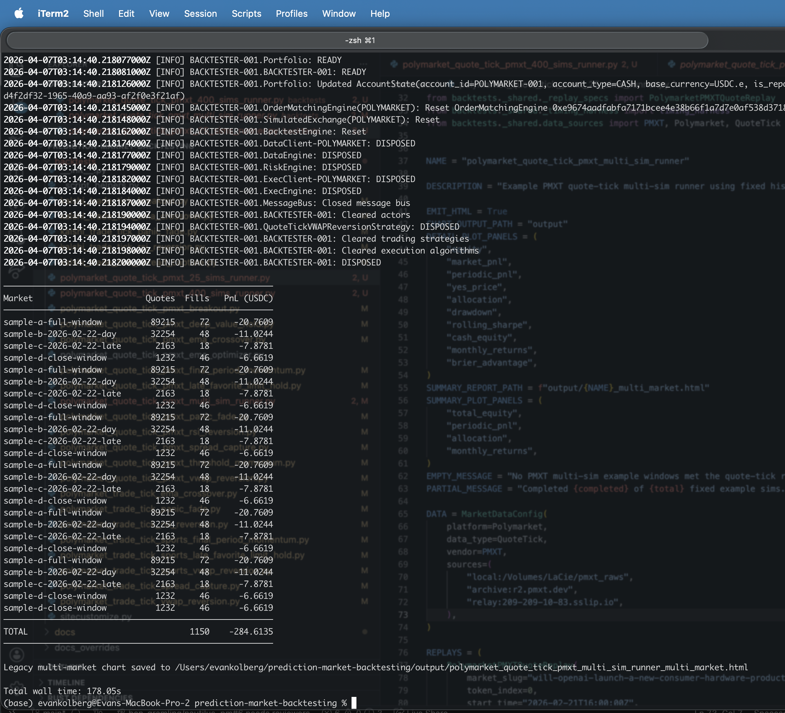

# Plotting

Single-market plotting is built into the shared runner flow used by the public
prediction-market backtests.

The repo-layer plotting contract has two surfaces:

- one detail HTML file per loaded replay or labeled sim
- one aggregate summary HTML file for the whole basket when the runner asks for it

Use the detail HTML when the question is "what happened in this one replay?"
Use the summary report when the question is "how did this basket behave
overall?"

Every public runner now exposes explicit plotting controls at top level:

- `EMIT_HTML` turns per-run HTML generation on or off in the file itself
- `CHART_OUTPUT_PATH` keeps the destination explicit instead of hiding it in
  shared defaults
- `DETAIL_PLOT_PANELS` chooses which per-sim panels render and in what order
- `SUMMARY_PLOT_PANELS` chooses which aggregate multi-market panels render and
  in what order when a runner emits a summary report

Good examples:

- [`backtests/polymarket_trade_tick_vwap_reversion.py`](https://github.com/evan-kolberg/prediction-market-backtesting/blob/v2/backtests/polymarket_trade_tick_vwap_reversion.py)
- [`backtests/polymarket_quote_tick_ema_crossover.py`](https://github.com/evan-kolberg/prediction-market-backtesting/blob/v2/backtests/polymarket_quote_tick_ema_crossover.py)
- [`backtests/polymarket_quote_tick_joint_portfolio_runner.py`](https://github.com/evan-kolberg/prediction-market-backtesting/blob/v2/backtests/polymarket_quote_tick_joint_portfolio_runner.py)
- [`backtests/polymarket_quote_tick_independent_multi_replay_runner.py`](https://github.com/evan-kolberg/prediction-market-backtesting/blob/v2/backtests/polymarket_quote_tick_independent_multi_replay_runner.py)
- [`backtests/polymarket_trade_tick_joint_portfolio_runner.py`](https://github.com/evan-kolberg/prediction-market-backtesting/blob/v2/backtests/polymarket_trade_tick_joint_portfolio_runner.py)
- [`backtests/polymarket_trade_tick_independent_multi_replay_runner.py`](https://github.com/evan-kolberg/prediction-market-backtesting/blob/v2/backtests/polymarket_trade_tick_independent_multi_replay_runner.py)
- [`backtests/polymarket_quote_tick_ema_optimizer.py`](https://github.com/evan-kolberg/prediction-market-backtesting/blob/v2/backtests/polymarket_quote_tick_ema_optimizer.py)

## Scaling Model

Think about plotting in terms of overview versus drilldown:

- single-market run:
  one detail HTML file is the whole story, so showing fills, execution, price,
  and market-level PnL on that one run is reasonable
- midsize basket, such as 10 to 30 sims:
  one detail HTML per sim still works well, and one aggregate summary chart is
  still a useful shared overview
- large basket, such as 100s of sims:
  the same contract still holds, but the summary report becomes the primary
  overview surface while detailed inspection happens by opening the individual
  per-sim HTML files on demand

The repo does not promise one mega-page with every panel from every replay
inlined together. That would scale poorly and hide the useful signal in noise.
The current split keeps dense execution detail inside the replay that produced
it and keeps the basket summary focused on panels that still mean something
when many sims are present.

Inside the summary report there is another important split:

- `total_equity`, `total_drawdown`, `total_rolling_sharpe`,
  `total_cash_equity`, `total_brier_advantage`, `periodic_pnl`, and
  `monthly_returns` collapse the basket into one aggregate series, so they stay
  readable even when the basket gets large
- `equity`, `allocation`, `drawdown`, `rolling_sharpe`, `cash_equity`, and
  `brier_advantage` keep one line per market or sim, so they are best when you
  still want cross-market comparison inside the same report
- `market_pnl` and `yes_price` are detail-heavy panels; they are usually better
  in per-sim charts because they get noisy quickly once the summary report
  would need one line or one marker stream per replay

The shared default summary panel set is intentionally conservative. Some public
runners deliberately opt `market_pnl` and `yes_price` into summary reports for
smaller curated baskets, and that can be useful, but it is not the right
default once the basket size grows.

On dense single-sim `yes_price` panels, fill markers are still preserved, but
the adapter may sample them down to a readable marker budget instead of
drawing every single point.

## Downsampling

The plotting layer automatically downsamples equity curves that exceed 5 000
data points before Bokeh serialization. This keeps HTML file sizes bounded
regardless of how long the replay window is:

| Input bars | Output bars | HTML size |
| ---------- | ----------- | --------- |
| 500        | 500         | ~0.5 MB   |
| 10 000     | ~5 000      | ~0.9 MB   |
| 100 000    | ~5 000      | ~0.9 MB   |
| 446 000    | ~5 000      | ~0.9 MB   |

The downsampler uses stride-based selection with important-point preservation:

- fill bars are always kept so trade markers remain accurate
- the equity peak and max-drawdown bar are always kept
- the first and last bars are always kept
- remaining budget is filled with evenly spaced bars

Market price DataFrames, allocation DataFrames, and fill bar indices are all
remapped in sync so panels stay consistent after reduction.

Without downsampling a 446 K-bar backtest produced a 31 MB HTML file. With
downsampling the same data produces under 1 MB. The `test_downsample_html_size`
test suite enforces that a 100 K-bar backtest stays under 5 MB and that
doubling bar count does not meaningfully increase file size.

When building summary series for multi-market reports, the artifact pipeline
also downsamples price points to 5 000 before constructing dense equity curves.
This avoids rebuilding full-resolution portfolio timelines (often 300K–600K
points per market) that would be downsampled again in the chart layer anyway.
This early downsampling reduces artifact build time from minutes to seconds on
large baskets.

Summary reports built by the aggregate and joint-portfolio report paths also
skip serializing per-market price series, fill events, and overlay curves when
the selected `SUMMARY_PLOT_PANELS` do not include panels that render them.

## Output Types

There are two distinct HTML/report modes in the repo layer:

- per-sim legacy chart:
  enabled by `EMIT_HTML = True` and written under `CHART_OUTPUT_PATH`
- aggregate multi-market report:
  enabled by `REPORT.summary_report=True` plus `SUMMARY_REPORT_PATH`; this is a
  true aggregate report built from summary series, not a pasted-together page

Typical public-runner combinations:

- single-market runner:
  `EMIT_HTML=True`, `CHART_OUTPUT_PATH`, and `DETAIL_PLOT_PANELS`
- joint-portfolio basket runner:
  `EMIT_HTML=False` (no per-replay detail charts), summary-only via
  `SUMMARY_REPORT_PATH` and `multi_replay_mode="joint_portfolio"`
- independent basket runner:
  `EMIT_HTML=False` (no per-replay detail charts), summary-only via
  `SUMMARY_REPORT_PATH` and `multi_replay_mode="independent"`

Multi-market runners default to `EMIT_HTML=False` because per-replay detail
charts are expensive to generate and rarely needed when the summary report is
the primary output. Set `EMIT_HTML=True` on a multi-market runner if you need
per-replay drilldown charts.

This gives users a fast, focused artifact:

- the basket summary stays readable because it is built from summary-series data
- single-market runners keep rich, execution-focused detail charts
- if per-replay drilldown is needed on a multi-market runner, re-enable
  `EMIT_HTML=True` for that run

Important runtime details:

- `SUMMARY_REPORT_PATH` depends on summary-series data being returned from the
  backtest, so runners that use it also set `return_summary_series=True` in the
  experiment config
- `DETAIL_PLOT_PANELS` and `SUMMARY_PLOT_PANELS` are ordered tuples of stable
  panel ids, so the runner chooses both inclusion and vertical stacking order
- `SUMMARY_PLOT_PANELS` does not have to match `DETAIL_PLOT_PANELS`; many good
  runners keep the summary report simpler than the per-sim charts

If you are unsure which panels belong where, use `DETAIL_PLOT_PANELS` for
single-replay inspection and keep `SUMMARY_PLOT_PANELS` focused on either
portfolio-wide panels or a small number of comparison panels. The runner
contract details live in [`backtests.md`](backtests.md#html-and-report-modes).

## Output Paths

Public runners now spell the default destination out as
`CHART_OUTPUT_PATH="output"`. The shared runner layer resolves that relative
path from the repo root, so it consistently lands in this repo's `output/`
directory instead of depending on the shell's current working directory.

That means direct script execution still writes to the repo-local `output/`
directory:

```bash
uv run python backtests/polymarket_quote_tick_ema_crossover.py
```

The generated HTML lands under `prediction-market-backtesting/output/`, not
under whichever directory you launched the command from.

The shared runner layer still accepts `CHART_OUTPUT_PATH=None` as a legacy
shorthand for the same repo-root `output/` destination, but public runner files
should be explicit.

If you want to override that, set:

- `CHART_OUTPUT_PATH="output/custom.html"` for one explicit file path
- `CHART_OUTPUT_PATH="output/charts"` for one explicit directory
- `CHART_OUTPUT_PATH="output/{name}_{market_id}.html"` for an explicit template
- `CHART_OUTPUT_PATH="/absolute/path/to/charts"` for a true absolute path

Only `{name}` and `{market_id}` are valid template placeholders.

When a shared runner points at a single file path, it appends the market id
before the suffix. The PMXT multi-sim helper also preserves unique per-sim
names when multiple labeled sims reuse the same underlying market slug.

Charts are written to `output/`, typically with names like:

- `output/<backtest>_<market>_legacy.html`
- `output/polymarket_quote_tick_ema_crossover_<market>_legacy.html`
- `output/polymarket_quote_tick_joint_portfolio_runner_joint_portfolio.html`
- `output/polymarket_quote_tick_independent_multi_replay_runner_independent_aggregate.html`
- `output/polymarket_quote_tick_ema_optimizer_leaderboard.csv`
- `output/polymarket_quote_tick_ema_optimizer_summary.json`

The default naming rules are:

- `CHART_OUTPUT_PATH="output"`:
  `output/<runner_name>_<market_or_sim_label>_legacy.html`
- `SUMMARY_REPORT_PATH="output/<runner_name>_joint_portfolio.html"`:
  one shared-account report spanning the whole basket
- `SUMMARY_REPORT_PATH="output/<runner_name>_independent_aggregate.html"`:
  one stitched aggregate report spanning isolated per-replay runs

The supported panel ids are:

- `total_equity`
- `total_drawdown`
- `total_rolling_sharpe`
- `total_cash_equity`
- `total_brier_advantage`
- `equity`
- `market_pnl`
- `periodic_pnl`
- `yes_price`
- `allocation`
- `drawdown`
- `rolling_sharpe`
- `cash_equity`
- `monthly_returns`
- `brier_advantage`

## Example Summary Output

The PMXT basket runners output below are the intended large-basket workflow:
the terminal prints the per-replay summary table, each replay can still emit
its own detail chart, and the basket summary report is written as one separate
HTML artifact whose filename tells you whether it is joint-portfolio or
independent aggregate output.



## Multi-Market References

The clearest multi-market plotting runner files:

- [`backtests/kalshi_trade_tick_joint_portfolio_runner.py`](https://github.com/evan-kolberg/prediction-market-backtesting/blob/v2/backtests/kalshi_trade_tick_joint_portfolio_runner.py)
- [`backtests/kalshi_trade_tick_independent_multi_replay_runner.py`](https://github.com/evan-kolberg/prediction-market-backtesting/blob/v2/backtests/kalshi_trade_tick_independent_multi_replay_runner.py)
- [`backtests/polymarket_trade_tick_joint_portfolio_runner.py`](https://github.com/evan-kolberg/prediction-market-backtesting/blob/v2/backtests/polymarket_trade_tick_joint_portfolio_runner.py)
- [`backtests/polymarket_trade_tick_independent_multi_replay_runner.py`](https://github.com/evan-kolberg/prediction-market-backtesting/blob/v2/backtests/polymarket_trade_tick_independent_multi_replay_runner.py)
- [`backtests/polymarket_quote_tick_joint_portfolio_runner.py`](https://github.com/evan-kolberg/prediction-market-backtesting/blob/v2/backtests/polymarket_quote_tick_joint_portfolio_runner.py)
- [`backtests/polymarket_quote_tick_independent_multi_replay_runner.py`](https://github.com/evan-kolberg/prediction-market-backtesting/blob/v2/backtests/polymarket_quote_tick_independent_multi_replay_runner.py)
- [`backtests/polymarket_quote_tick_independent_25_replay_runner.py`](https://github.com/evan-kolberg/prediction-market-backtesting/blob/v2/backtests/polymarket_quote_tick_independent_25_replay_runner.py)

Those runners now write one basket summary chart under `output/` (per-replay
detail charts are off by default via `EMIT_HTML=False`):

- `output/kalshi_trade_tick_joint_portfolio_runner_joint_portfolio.html`
- `output/polymarket_trade_tick_independent_multi_replay_runner_independent_aggregate.html`

The PMXT basket example runners write one summary chart:

- `output/polymarket_quote_tick_joint_portfolio_runner_joint_portfolio.html`
