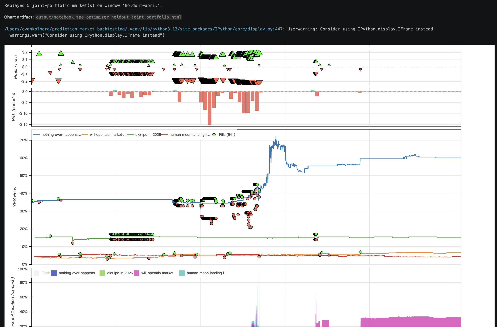
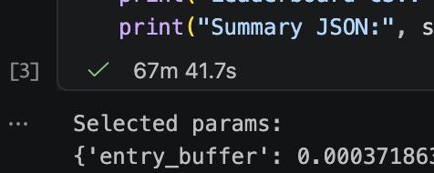

# Research

This page describes the optimizer methodology used by the research notebooks in `backtests/`.

Treat the current notebook and optimizer flow as an attempt at a useful
research scaffold, not as a fully mathematically verified framework. The
interfaces and examples are meant to be templates for future abstractions and
future research, and users should independently validate the assumptions before
trusting results.

## Overview

The repo treats strategy hyperparameter search as a walk-forward experiment:

1. Define one or more **training windows** on historical prediction-market data.
2. Evaluate candidate parameterizations on every training window.
3. Rank candidates by a **risk-adjusted score** (see below).
4. Replay the top candidate(s) on a held-out window for an honest out-of-sample read.

Each trial runs in an isolated subprocess so a crashing strategy cannot poison the driver process. Artifacts (leaderboard CSV, summary JSON, Bokeh HTML chart) land under `output/`.

## Warm PMXT Cache Before Notebook Runs

Run the notebook optimizer's market slugs and timestamps once through a regular
runner before launching a long notebook sweep. The normal runner prints PMXT
source and downloader progress while it fills the local filtered cache, making
the `cache` / local raw / `archive:r2v2.pmxt.dev` / `archive:r2.pmxt.dev` path
visible. The notebook optimizer mostly surfaces trial-level output, so a cold
archive fill can look quiet for a long time.

The warmup strategy does not need to match the notebook strategy; cache warming
is about PMXT quote-tick market, token, and hour coverage. The slugs below are
only bundled examples. For real research, replace them with the markets and
time windows you actually want to study, then warm those exact slugs before
scaling the notebook run.

If you plan to run backtests across many markets, download PMXT raw dumps to a
local directory first:

```bash
make download-pmxt-raws DESTINATION=/path/to/pmxt_raws
```

Keeping the raw hours on disk makes cross-market research faster because the
loader can reuse local dumps instead of refetching the same hours from R2 for
each new market.

For `backtests/generic_tpe_research.ipynb`, first run:

```bash
uv run python backtests/polymarket_quote_tick_joint_portfolio_runner.py
```

That runner warms the same PMXT quote-tick envelope used by the current example
TPE notebook:
`2026-03-01T00:00:00Z` through `2026-04-11T23:59:59Z` for these markets:

- `human-moon-landing-in-2026`
- `new-coronavirus-pandemic-in-2026`
- `will-openais-market-cap-be-between-750b-and-1t-at-market-close-on-ipo-day`
- `okx-ipo-in-2026`
- `nothing-ever-happens-2026`

For the current `backtests/generic_optimizer_research.ipynb` example, warm a
regular PMXT quote-tick runner over `nothing-ever-happens-2026` from
`2026-03-01T00:00:00Z` through `2026-04-11T23:59:59Z` before scaling the random
grid. The TPE warmup runner above also covers that market, so it is a safe
superset when you are preparing both notebooks.

## Scoring

Per-window score:

    score = pnl − 0.5 · max_drawdown_currency

Penalties are applied per window for early termination, insufficient market
coverage, and trials that fail to meet `min_fills_per_window`. The leaderboard
is ranked by the median of those per-window scores across training windows; if
holdout windows are configured, the top-k candidates are replayed and re-ranked
by median holdout score.

## Joint-portfolio mode

When `ParameterSearchConfig.base_replays` contains more than one market, every trial evaluates the **same parameter set** across all replays simultaneously. PnL and fill counts are summed across markets; drawdown is computed on the **summed equity curve** (union of timestamps, forward-filled, then summed); requested-coverage ratio is averaged across markets so one stale feed does not nuke every trial. This rewards diversification — anti-correlated markets produce a smaller joint drawdown than the sum of per-market drawdowns, which is the point of running a portfolio.

Single-market mode is preserved via the legacy `base_replay` field.

## Samplers

### Random grid (`sampler="random"`)

Draws up to `max_trials` unique combinations uniformly at random from the Cartesian product of `parameter_grid`. Memoryless, unbiased, and cannot express continuous or log-scale ranges. Good baseline; the default when you do not need anything smarter.

Notebook: `backtests/generic_optimizer_research.ipynb`.

### TPE (`sampler="tpe"`)

Tree-structured Parzen Estimator via [Optuna](https://optuna.org/). Fits two density estimators — one over "good" trials and one over "bad" — and proposes the next trial where the ratio is highest. Runs sequentially via Optuna's ask/tell API so each trial sees prior results.

Accepts a `parameter_space` of arbitrary specs instead of (or alongside) `parameter_grid`:

- `{"type": "int", "low": int, "high": int, "log": bool}`
- `{"type": "float", "low": float, "high": float, "log": bool}`
- `{"type": "categorical", "choices": [...]}`

Log-uniform sampling is strongly recommended for parameters that span orders of magnitude (entry thresholds, stop-loss fractions). TPE's advantage over random grows with trial count; budgets under ~20 often tie with random, so prefer `max_trials >= 50`.

Notebook: `backtests/generic_tpe_research.ipynb`.

## Caveats

- **This is a research template, not a proof.** The scoring objective,
  walk-forward setup, samplers, and portfolio aggregation rules are practical
  attempts to make experiments more honest, but they have not been fully
  mathematically verified.
- **Overfitting is the default outcome** of any parameter search. Inspect holdout score, not just train score, and be suspicious of large train/holdout gaps.
- **Reproducibility** is seeded via `random_seed`, but subprocess nondeterminism in the backtest engine can introduce small score jitter. Run the same seed twice to confirm.
- **Parallel TPE is deferred.** TPE benefits from seeing prior results before proposing the next trial, so trials run sequentially. Parallel ask/tell is a follow-on.
- **Continuous is not always better.** Only use a continuous range when the strategy is actually smooth in that dimension; some parameters are inherently discrete (mode flags, window counts).

## Notebook output persistence

The notebooks embed Bokeh chart HTML inline using an `<iframe srcdoc="...">` wrapper. Jupyter stores `text/html` outputs as text in the `.ipynb` JSON, and iframes execute scripts in `srcdoc` every time they attach to the DOM — so the chart renders immediately on notebook reopen without re-running any cells. Charts larger than 8 MB fall back to raw embedding with a warning.

Example of an embedded Bokeh chart rendered from a persisted notebook output (joint-portfolio holdout replay):




