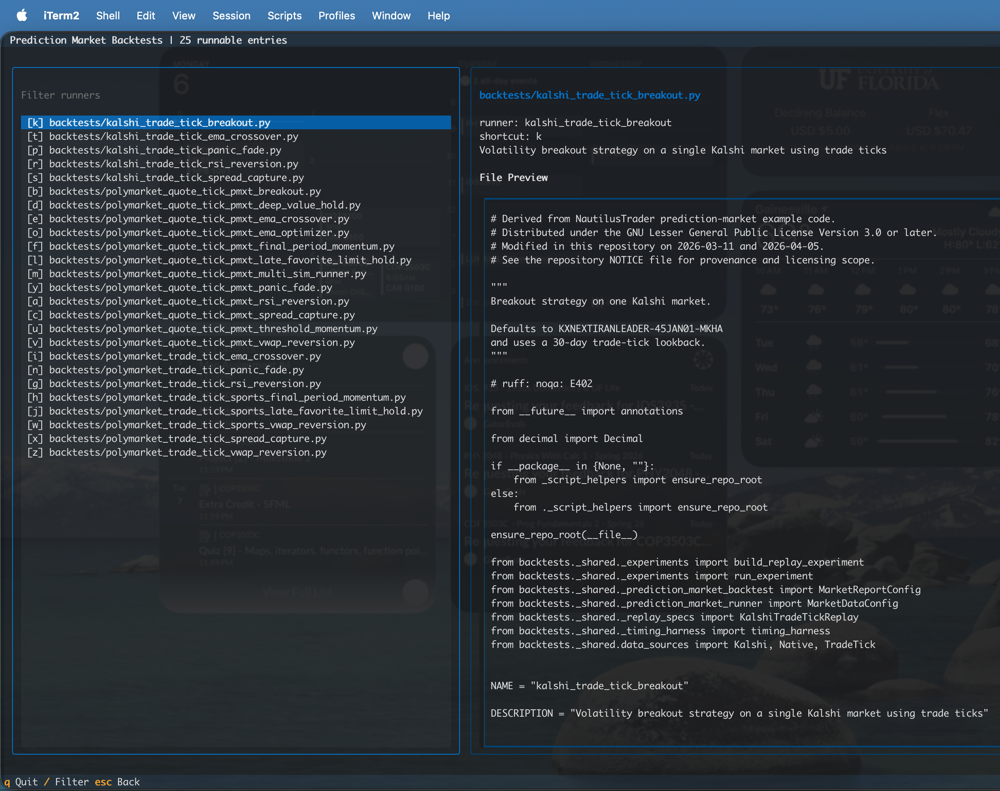

# Setup

## Prerequisites

- Python 3.12+ (`3.13` recommended)
- [uv](https://docs.astral.sh/uv/getting-started/installation/)

## Install

```bash
git clone https://github.com/evan-kolberg/prediction-market-backtesting.git
cd prediction-market-backtesting

# conda's linker flags can conflict with the venv
unset CONDA_PREFIX

uv venv --python 3.13
uv pip install "nautilus_trader[polymarket,visualization]==1.225.0" bokeh plotly numpy py-clob-client duckdb textual nbformat nbclient ipykernel optuna python-dotenv
```

If you want to build the docs locally, also install the MkDocs theme used by
this repo:

```bash
uv pip install mkdocs-shadcn
```

You can also use:

```bash
make install
```

After setup, run commands with `uv run ...`. No manual
`source .venv/bin/activate` step is required.

## First Run

Interactive backtest menu:

```bash
make backtest
```

The interactive menu uses `Textual` with a left-side runner list, a right-side
details/preview pane, single-letter shortcuts, and search via `/`. Arrow keys
move the selection, `Enter` runs the highlighted runner, and `Esc` clears the
current filter and returns focus to the list. The preview pane now shows the
full runner file contents rather than an excerpt.



What that view is telling you:

- the left pane only shows flat runner entrypoints under `backtests/` and
  `backtests/private/`
- the right pane shows the exact file path, runner metadata, and current file
  contents for the highlighted entry
- shortcuts are assigned per visible runner, so filtering changes the set of
  hotkeys you can use immediately

Direct entrypoint:

```bash
uv run python main.py
```

Flat notebook runners are launched from that menu path rather than via
`uv run python some_notebook.ipynb`. After a notebook-backed run completes, the
runner rewrites one autogenerated markdown cell in the notebook to embed the
primary HTML artifact from that run and link any additional HTML reports.

Direct runner files also work:

```bash
uv run python backtests/kalshi_trade_tick_breakout.py
uv run python backtests/polymarket_trade_tick_vwap_reversion.py
uv run python backtests/polymarket_quote_tick_ema_crossover.py
uv run python backtests/polymarket_quote_tick_joint_portfolio_runner.py
uv run python backtests/polymarket_quote_tick_independent_multi_replay_runner.py
```

Those direct runs write HTML artifacts into the repo-local `output/` directory
when the runner keeps `chart_output_path="output"`.

For a research-oriented notebook example, select
`backtests/generic_optimizer_research.ipynb` from the menu. It targets any
optimizer runner exposing `OPTIMIZER`; today's public parameter-search runners
also publish `PARAMETER_SEARCH` and the older `OPTIMIZATION` alias for
compatibility. Set `OPTIMIZER_MODULE`, run the compact search, then it replays
one selected window with the winning parameters and embeds the generated HTML
back into the notebook.

Public runner files carry their market, source, and execution assumptions in
code. PMXT quote-tick runners pin absolute sample windows, and the public
Kalshi trade-tick runners pin `end_time` to a known-good close window so the
direct script path stays deterministic. Native trade-tick runners without an
explicit `end_time` still use rolling lookbacks unless you set
`default_end_time` in the experiment. To use a different local PMXT mirror path
or a different market, edit the runner file directly or copy it into
`backtests/private/`. If you already have mirrored PMXT raw hours locally, add
`local:/path/to/raw-hours` to the runner's `DATA.sources`.

Repo-layer source syntax is explicit on purpose:

- Kalshi native trade-tick runners use `rest:...`
- Polymarket native trade-tick runners use `gamma:...`, `trades:...`, and `clob:...`
- PMXT quote-tick runners use `local:...` and `archive:...`
- Telonex quote-tick runners use `local:...` and `api:...`

To mirror PMXT raw archive hours locally, run:

```bash
make download-pmxt-raws DESTINATION=/path/to/pmxt_raws
```

The download is long-running, walks direct hourly filenames from
`2026-02-21T16:00:00Z` through the current floored UTC hour newest-first, probes
`r2v2.pmxt.dev` and `r2.pmxt.dev`, and keeps the larger archive object when both
exist for the same hour. It prints per-hour completion lines plus the currently
active transfer.
The final JSON summary includes `archive_listed_hours` for the number of direct
hours attempted, `archive_missing_hours` for hours missing from all configured
sources, and `missing_local_hours` for requested hours still absent on disk.
Existing local files are refreshed when they are empty or when an upstream
source advertises a larger object. Example output:

```text
PMXT raw source: direct hour probes (archive best-of https://r2v2.pmxt.dev, https://r2.pmxt.dev)
Downloading PMXT raw hours to /path/to/pmxt_raws (requested_hours=3, window_start=2026-02-27T11, window_end=2026-02-27T13)...
  2026-02-27T13  12.431s   445.9 MiB  archive
  2026-02-27T12   0.000s    existing  skip
Downloading raw hours (2/3 done, 1 active):  67%|████████████████████████████████████████████████████████████▏                              | [00:41<00:20]active: archive 2026-02-27T11 392.0/445.9 MiB 14.8s
```

The counts, hour labels, source label, and byte totals vary with the current
archive and the window you are mirroring.

To mirror a small Telonex runner window locally, include the full-depth book
channel:

```bash
TELONEX_API_KEY=... make download-telonex-data TELONEX_DOWNLOAD_FLAGS='\
  --market-slug us-recession-by-end-of-2026 \
  --outcome-id 0 \
  --channels quotes book_snapshot_full \
  --start-date 2026-01-19 \
  --end-date 2026-02-01'
```

To download the full Telonex Polymarket mirror into Hive-partitioned
Parquet files (`<destination>/data/channel=.../year=.../month=.../part-*.parquet`)
with a DuckDB manifest at `<destination>/telonex.duckdb`, run:

```bash
uv run python scripts/telonex_download_data.py \
  --destination /Volumes/LaCie/telonex_data \
  --all-markets \
  --channels quotes trades book_snapshot_full onchain_fills
```

`book_snapshot_full` is the canonical full-depth book snapshot channel. Do not
also mirror `book_snapshot_5` and `book_snapshot_25` unless you intentionally
want the shallow vendor files too; 5-level and 25-level views can be derived
from the full-depth snapshots.

The default destination is `/Volumes/LaCie/telonex_data`, matching the
`local:/Volumes/LaCie/telonex_data` source in the public Telonex runner.
The downloader uses a shared async `httpx` pool with `--workers 128`
in-flight coroutines by default. The hot path decodes day Parquet payloads
directly into Arrow tables and writes them into consolidated blob parts that
roll around 512 MiB on disk, 64 GiB of Arrow data, or 10,000 pending manifest
days; it does not create millions of tiny day files or keep one huge manifest
batch in RAM until shutdown. On a fast host, benchmark
`--workers 64`, `128`, and `256` before scaling up; higher worker counts can
hit socket/file-descriptor pressure or outrun the single consolidated Parquet
writer. `--parse-workers` controls the bounded Arrow decode pool (default:
`min(8, cpu_count)`, also configurable with `TELONEX_PARSE_WORKERS`). Transient
`408/425/429/5xx` responses are retried with exponential backoff, and
SIGINT/SIGTERM stop the loop gracefully. The downloader reports progress while
it loads the markets dataset, plans market/channel/outcome/day work, and
streams day-files directly into the local store. Each run fetches the current
Telonex markets catalog, so newly listed markets and later channel windows are
picked up on resume.
Cached 404 day markers are rechecked after 7 days by default; use
`--recheck-empty-after-days 0` to recheck 404s every run, or
`--recheck-empty-after-days -1` to keep 404s forever unless `--overwrite` is
used.
The downloader rolls ~1 GB Parquet parts; no intermediate per-day files touch
disk.

The run is **crash-safe and resumable**: completed days and 404-empty days
are tracked in `completed_days` / `empty_days` tables inside the DuckDB
manifest, and orphan Parquet parts from hard kills are swept on startup.
Hit `Ctrl-C` once to stop gracefully — in-flight downloads
finish, pending rows flush, then the process exits. Five interrupt signals are
required to force-exit before that graceful drain completes. Re-run the same
command to skip everything already recorded and pick up where you left
off. If a batch fails mid-ingest, the writer logs it and keeps running —
those days simply retry on the next invocation.

If you want to see the full loader and reporting flow in one place, the PMXT
basket output below is representative of the current repo-layer behavior:
Nautilus logs stay visible, the summary table is printed in-terminal, and the
per-replay detail HTML paths plus the basket summary HTML path are printed
after the run.

## Timing And Cache Defaults

- timing output is on by default in `make backtest`, `uv run python main.py`,
  and direct script runners that opt into `@timing_harness`
- `BACKTEST_ENABLE_TIMING=0` is the explicit quiet opt-out
- PMXT filtered cache is enabled by default at
  `~/.cache/nautilus_trader/pmxt`
- public PMXT runners pin `local:/Volumes/LaCie/pmxt_raws` first,
  `archive:r2v2.pmxt.dev` + `archive:r2.pmxt.dev` next (v2 tried first, v1 is
  the historical fallback)
- PMXT `DATA.sources` entries are explicit and prefix-driven: `local:`,
  `archive:`
- Telonex API-day cache is enabled by default at
  `~/.cache/nautilus_trader/telonex`; `make clear-telonex-cache` clears only
  that cache root and refuses configured local data stores
- Telonex timing is daily-file based and reports active `telonex local`,
  `telonex cache`, or `telonex api` loads through the same `@timing_harness`
- normal Nautilus logs are still printed; the timing harness is additive

## Extension Architecture

This repo no longer vendors NautilusTrader in-tree. Runtime code comes from
upstream `nautilus_trader==1.225.0`, and local Nautilus-derived extensions live
under `prediction_market_extensions/` in their own namespace.

Extensions import from and subclass upstream base classes (`FeeModel`,
`InstrumentProvider`, `LiveMarketDataClient`, etc.) rather than shadowing
upstream modules. The only startup hook is `install_commission_patch()` which
monkey-patches a corrected fee formula into the upstream parsing module.

Do not try to install a local Nautilus fork from this repo. Normal setup is the
upstream PyPI package plus this checkout.

When you need to inspect provenance or compare earlier vendored behavior, use
git history from commits before vendored-tree removal. When you need to port a
new upstream Nautilus release, diff the extension files under
`prediction_market_extensions/` against the new upstream package and keep
validation on the repo-side runners.
